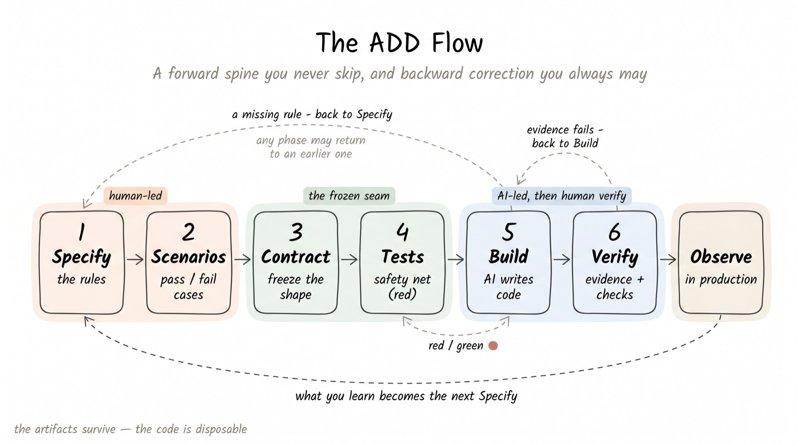
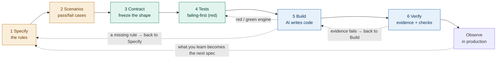

# 02 · The flow, and what is disposable

[← 01 Core principles](./01-principles.md) · [Contents](./README.md) · Next: [03 Step 1 Specify →](./03-step-1-specify.md)

---

## The flow

AIDD is one repeatable flow of **seven steps**: six build the feature — Specify → Scenarios → Contract → Tests → Build → Verify — and the seventh, **Observe**, feeds what production teaches back into the next Specify. In the default flow the AI drafts the specification bundle (steps 1–4) and a person approves it **once**, at the contract freeze; the AI performs the Build; and Verify is resolved on evidence under `autonomy: auto`, with a person owning any residue. (See [11 Governance](./11-governance.md) for the autonomy level and the one-approval decision point.)





> **Solid arrows are the primary flow** — you never start a phase before its input exists (forward-skip forbidden). **Dashed arrows are backward correction** — any phase may return to an earlier one to repair its artifact (the long loop, Observe → Specify, is the same rule at milestone scale). The tight Tests ⇄ Build cycle is the per-feature red/green engine.

```text
  human-led ─────────────────►│◄─────────── machine-led ──► human verify
  1 Specify → 2 Scenarios → 3 Contract → 4 Tests ⇄ 5 Build → 6 Verify
       ▲                        (freeze)   └red/green┘  (AI)     (people)
       ╎                                                            │
       ╎╴╴ backward correction (dashed): any phase may return to ╴╴╴┤
       ╎    an earlier one — e.g. Build exposes a missing rule      │
       │                                                            │
       │                  observe in production  ◄──────────────────┘
       │                         │
       └─────────────────────────┘  becomes the next Specify
```

The shape is deliberate: the human-led steps establish direction, a frozen contract forms the decision point in the middle, and the AI-led build runs fast and safely on the far side because everything it needs is already fixed.

> **What changed in v7 (the diagrams above show the structural flow, which is unchanged).** The *steps* and their order are exactly as drawn — only **who resolves them** moved. The AI now drafts the whole specification bundle (steps 1–4) and a person approves it **once**, at the contract freeze (not a sign-off at each step); and **Verify is auto-gated on evidence** under `autonomy: auto` (the default), escalating security — always a `HARD-STOP` — and other residue to a person. Lower the autonomy level to `conservative` to keep a human at the Verify gate. See [11 Governance](./11-governance.md).

## Why the order is the order

Each step produces exactly one artifact, and each artifact is the input to the next step. The order is not a preference; it is a dependency chain.

| Step | Produces | Which is needed by |
|------|----------|--------------------|
| 1 Specify | the rules | scenarios, and everything after |
| 2 Scenarios | pass/fail cases | the tests |
| 3 Contract | the fixed shape | the tests and the build |
| 4 Tests | the failing-first suite | the build and the verification |
| 5 Build | the code | the verification |
| 6 Verify | a trusted, releasable change | the release and the next loop |

The single rule of discipline follows directly: **do not begin a step until the previous artifact exists.** Skipping forward means the AI builds against a guess.

The flow runs in two directions under two rules that never conflict. **Backward correction is always allowed:** any phase may send you back to an earlier one to repair its artifact — a failing Build that exposes a missing rule sends you back to Specify, and that is the loop working ([principle 4](./01-principles.md)), not a failure. **Forward-skipping is forbidden:** you never start a phase before its input artifact exists. Correct backward freely; never skip forward.

**`done` is terminal — except via the recorded reopen.** Backward correction moves a *live* task; a task at `done` has already passed its gate. The one way back from `done` is the recorded `reopen` action (`add.py reopen <task> --to <phase> --reason "..."`): it returns the task to an earlier phase, resets the gate, and writes down *why* — so a done verdict is never quietly un-done. This is the same backward-correction rule, made explicit at the one state where it would otherwise be bypassed silently.

## Who does what

| Step | Person's job | AI's job |
|------|--------------|----------|
| 1 Specify | confirm the rules (part of the one approval) | draft; list assumptions to confirm |
| 2 Scenarios | confirm what "correct" looks like (part of the one approval) | draft scenarios |
| 3 Contract | **approve & freeze the whole bundle (§1–§4) once — the decision point** | draft the contract and mocks |
| 4 Tests | confirm the targets (part of the one approval) | draft the failing tests |
| 5 Build | direct in small batches | implement until tests pass |
| 6 Verify | own the residue (security · concurrency · architecture); approve when `conservative` | gather evidence; **auto-PASS on complete evidence** under `autonomy: auto` |
| 7 Observe | read the signal; consolidate confirmed deltas into PROJECT.md | run behind a flag; emit lessons learned |

**What the human sees when it is their turn — the decision arc.** Whenever the flow stops for the human — the baseline approval that ends setup, the contract-freeze decision point and an escalated verify gate within each task, and the wider decision points of the loop (intake · scope · milestone close · stage graduation) — the AI opens its report with the **decision arc**: three engine-sourced lines — `goal:` the milestone goal the work serves · `done:` the proven progress toward it · `plan:` what comes next. The arc renders first, above the report's summary, so the human confirms with sight of the whole trajectory rather than a local snapshot. It is presentation only — it never adds a gate or changes an outcome. See [Appendix C](./appendix-c-glossary.md).

## What survives, and what is disposable

This is the idea that most distinguishes AIDD from older practice.

**The artifacts are the durable asset.** The specification, the scenarios, the contract, and the tests capture decisions and meaning. They are what you protect, version, and carry forward.

**The code is disposable.** It is one implementation that satisfies the artifacts. If a better approach appears, or the AI model improves, the code can be regenerated against the same artifacts without loss.

A practical test of whether a team has absorbed this: ask what they would be upset to lose. If the answer is "the code," they are still working the old way. If the answer is "the contracts and the tests," they are working in AIDD.

> **Do:** invest in clear, stable specs, contracts, and tests.
> **Don't:** measure progress by how much code was generated or reused — that counts the cheap, disposable thing.

## How the rest of Part II is organized

Each of the next seven chapters takes one step (and then the loop) and gives it the same treatment: its purpose, who does it, the artifact it produces, the AI prompt that drives it, the exit check that says it is done, and what to do when that check fails. The running example continues throughout.
