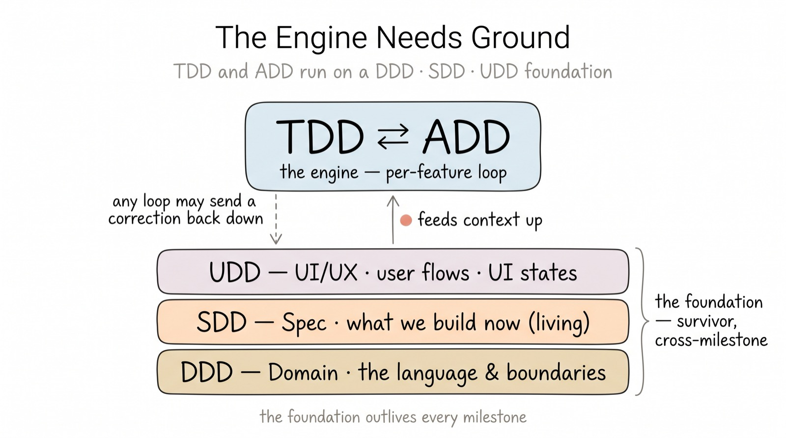
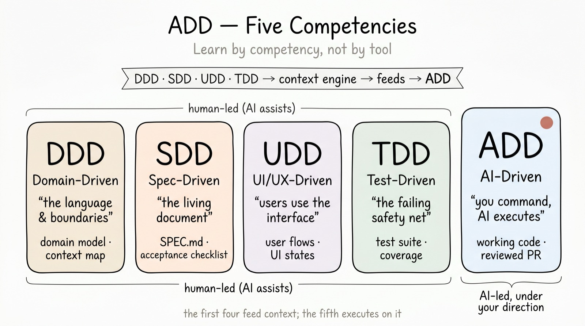
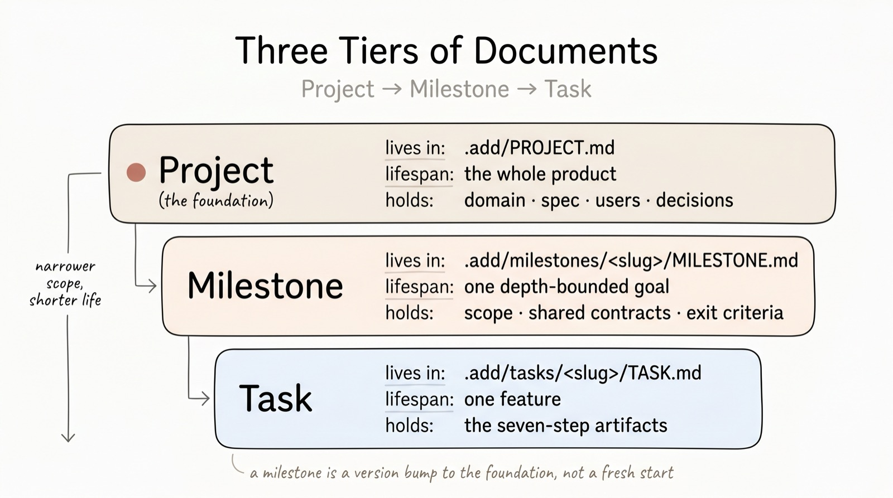

# 14 · The foundation: project context across milestones

[← 13 Adoption](./13-adoption.md) · [Contents](./README.md) · Next: [15 Foundations & Lineage →](./15-foundations-and-lineage.md)

---

## The engine needs ground

The flow in [Part II](./02-the-flow.md) is the *engine*: Specify → Scenarios →
Contract → Tests → Build → Verify, run as a tight loop. TDD and ADD turn inside
that engine — write the failing test, let the AI generate code, repeat.

But an engine needs something to stand on. Every loop quietly assumes context that
no single task owns: *what the words mean*, *what we are building right now*, and
*how its users experience it*. When that context lives only in someone's head, each new session —
and each new milestone — starts cold, and the AI fills the gap with plausible
guesses. That is the same failure the method exists to prevent ([00](./00-introduction.md)),
one level up.

The **foundation** is the layer that holds this context and *outlives every
milestone*. It is not new ceremony; it is the [living documentation](./appendix-f-requirements-matrix.md)
the method already names, made explicit as three concerns.

## Three concerns, one foundation



- **DDD — Domain.** The shared, precise language and the boundaries it lives in:
  the core concepts, the modules/contexts they belong to, and the invariants that
  must always hold — the domain model and context map behind the names. One name
  per concept — the same names the spec, the contract, and the code all use. (The
  [GLOSSARY](./appendix-c-glossary.md) holds the full term list; the foundation
  holds the model those terms describe.)

- **SDD — Spec.** *The living document.* What is being built right now and what is
  settled versus still open. This is not a frozen plan written once — it is the
  layer that changes as the loop learns ([01](./01-principles.md)). In ADD it does
  not duplicate the work; it **points** to the active milestone and the frozen
  contracts that other tasks build against.

- **UDD — UI/UX.** *Users use the interface, not the spec.* The experience designed
  before code: the **user flows** (happy and alternative paths), the **UI states**
  every screen must handle (loading · empty · error · success), and a design source
  of truth — a `DESIGN.md` or clickable prototype. The AI can generate a prototype
  from a design system; a person owns the empathy — what the user is trying to do,
  and what "good" feels like from their side. The scenarios ([04](./04-step-2-scenarios.md))
  test that behaviour; the foundation keeps the design intent that makes a screen
  worth building.

When a milestone has screens, UDD is not only a static `DESIGN.md` — it runs a
**design-definition loop** that turns the domain into a screen the human has *seen
and confirmed before build*. Its four beats are `review-domain → research-components
→ wireframe → render-capture-confirm`: read the domain into screens and regions,
research and reuse components before inventing them, wireframe the structure low-fi,
then render a real screen and **capture** it. That capture is the **design-confirm**
evidence — a real image the person approves *before* implementation, so the build
matches the layout instead of discovering it. The book keeps the *why*; the
operational recipe (the wireframe format, the token-bound mock, the capture engines)
lives in the `add` skill's `design.md` and `udd-wireframe.md`.

These three foundation competencies, together with the **TDD ⇄ ADD** engine of
[Part II](./02-the-flow.md), are ADD's five. The first four feed context to the
fifth, where the AI executes on it:



> The diagram's foundation (DDD · SDD · UDD) and the method's own words — living
> documentation · the foundation document · ubiquitous language — name the same three ideas. This
> chapter is where the diagram and the text finally meet.

## One file, not three

A foundation that takes a week to write is a foundation no one keeps current. So
ADD realizes all three concerns as **one living document — `PROJECT.md`** — with
one short section each, plus an append-only record of key decisions:

```
.add/PROJECT.md
  ## Domain (DDD)                — concepts · contexts · invariants
  ## Spec / Living Document (SDD)— → active milestone + frozen contracts
  ## Users (UDD)                 — UI/UX: user flows · states · DESIGN.md / prototype
  ## Key Decisions               — append-only: date · decision · why · outcome
```

Keep it to one screen. If a section wants to grow into a manual, that is a signal
the detail belongs in a milestone or a contract, not the foundation. The foundation
is the *thin, durable* context the engine reads first — not a place to relocate the
work. And you do not hand-write it: at setup the AI **drafts** all four sections —
silently from an existing codebase, or from a short four-lens interview on a
greenfield repo — and a single human **baseline approval** freezes that draft as committed
direction (the setup-level analog of a contract freeze).

## How it feeds the engine — and takes feedback back

The arrow runs both ways, which is the whole point of a re-entrant method:

- **Down → up.** At the start of any session or milestone, read `PROJECT.md`
  before touching a task. It is the cheapest way to point the AI in the right
  direction. `add.py status` prints a pointer to it for exactly this reason.
- **Up → down.** When a loop reveals that the domain model was wrong, the spec
  stance has shifted, or a user assumption did not survive contact with reality,
  you **stop and update the foundation** — then come forward again. A passing test
  built on a broken foundation is still the wrong software, fast.

## Where it sits in the hierarchy

The foundation is the **Project tier** of the document hierarchy
([Appendix F](./appendix-f-requirements-matrix.md)) — created once, kept for the
life of the product, owned above any single milestone.



| Tier | Lives in | Lifespan | Holds |
|------|----------|----------|-------|
| **Project** (foundation) | `.add/PROJECT.md` + living-doc files | whole product | domain, spec stance, users, decisions |
| **Milestone** | `.add/milestones/<slug>/MILESTONE.md` | one depth-bounded goal | scope, shared contracts, exit criteria |
| **Task** | `.add/tasks/<slug>/TASK.md` | one feature | the seven-step artifacts |

A milestone is a *version bump* to the foundation, not a fresh start: when it
closes, consolidate what it validated into `PROJECT.md` (a decision, a settled domain
term, a confirmed user journey) and open the next one against the same, now-richer,
ground. The consolidation is not informal: each loop emits **lessons learned** (tagged
`DDD · SDD · UDD · TDD · ADD`) in its Observe step, and at milestone close a person
gathers the open ones and consolidates them — append-only, with the `foundation-version:`
bumped — into the foundation. See [09 · The loop](./09-the-loop.md#lessons-learned-and-the-retrospective-consolidation)
for the grammar, the ritual, and the tooling (`add.py deltas`, `add.py check`).

## In the tooling

- `add.py init` scaffolds `PROJECT.md` as a living-doc file; the AI then drafts its
  content and a single human **baseline approval** (`add.py lock`) freezes it. Like every
  living-doc file, `init` **never overwrites a hand-edited one**.
- `add.py status` shows a one-line pointer to the foundation, so a fresh session
  re-orients on context before code.
- The guideline block written into `CLAUDE.md` / `AGENTS.md` tells any agent the
  same thing: run `status`, read the foundation, then work the loop.

> **The thesis, one level up.** The engine builds the thing right; the foundation
> keeps the engine pointed at the right thing — across every milestone, not just
> the current one.
