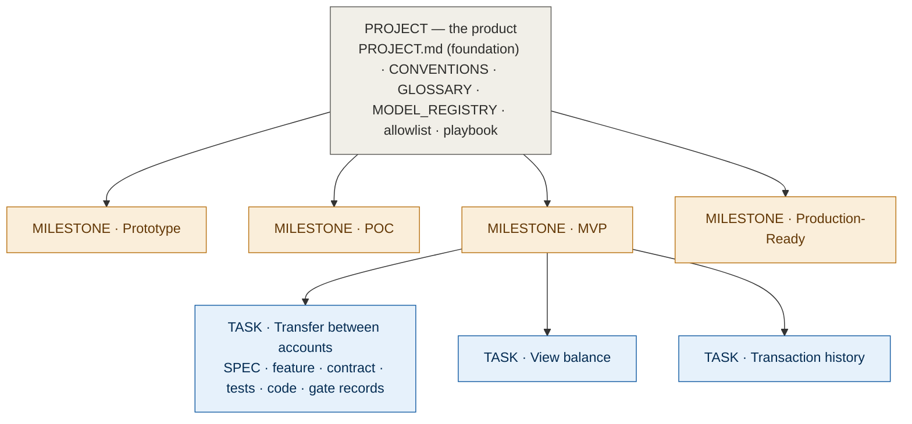

# Appendix F · Document requirements matrix (Project → Milestone → Task)

[← Appendix E Checklists](./appendix-e-checklists.md) · [Contents](./README.md)

This appendix maps every AIDD document to a three-level project hierarchy, so that at any level a team can answer three questions: **which documents must exist, who owns them, and what proves the level is complete.** It is the traceability backbone of the method — read it alongside the stage-depth matrix in [10 Setup and stages](./10-setup-and-stages.md), which covers *step* depth; this appendix covers *document* requirements.

---

## The three levels

| Level | What it is | AIDD meaning | Spans |
|-------|-----------|--------------|-------|
| **Project** | the whole product or engagement | the living documentation — documents created once and kept for the life of the product | all milestones |
| **Milestone** | a stage or release | one pass of the flow at a chosen depth: Prototype, POC, MVP, or Production-Ready; groups many tasks | many tasks |
| **Task** | one feature through the flow | a single pass of Specify → … → Verify → Observe; the smallest unit with its own gate records | the seven steps |

A **project** sets up the living documentation once. A **milestone** is a depth-bounded goal that groups tasks and has its own entry and exit document gates. A **task** is one feature, and it produces the per-feature artifacts.

## How the hierarchy decomposes



---

## Matrix 1 — Documents by level (ownership and lifespan)

Which document lives at which level, who is accountable for it, and how long it lasts.

| Document | Level | Created | Lifespan | Accountable owner |
|----------|:-----:|---------|----------|-------------------|
| `PROJECT.md` (foundation: domain · spec · UI/UX) | Project | setup, grows | whole project | Product / Architect |
| `CONVENTIONS.md` | Project | setup | whole project | Architect / Lead |
| `GLOSSARY.md` | Project | setup, grows | whole project | Product / Domain |
| `MODEL_REGISTRY.md` | Project | setup | whole project | Architect / Lead |
| `dependencies.allowlist` | Project | setup | whole project | Security |
| `playbook/*.md` (prompts) | Project | setup, versioned | whole project | Eng Lead |
| Stage plan / roadmap | Milestone | per milestone | the milestone | EM / Delivery |
| Milestone exit report | Milestone | milestone end | the milestone | EM / Delivery |
| `SLO.md` (objectives) | Milestone (MVP+) | from MVP | from MVP onward | DevOps / SRE |
| `SPEC.md` | Task | per feature | living | Product / Domain |
| `features/*.feature` | Task | per feature | living | QA / Test |
| `contracts/*.md` | Task → **Project** | per feature, then frozen | living doc (promoted to project) | Architect / Lead |
| `tests/*` | Task | per feature | living | QA / Engineer |
| Source code | Task | per feature | **disposable** | Engineer |
| Gate outcome records | Task | per step | kept for audit | the reviewer |

> Note the one promotion: a **contract** is authored at task level but, once frozen, becomes part of the project's living documentation — other tasks depend on it. That promotion is why a contract change is a project-level change request, not a task-local edit.

---

## Matrix 2 — Documents required by milestone

Which documents must exist, and at what depth, to **exit** each milestone. Depth: **Deep** · **Core** · **Light** · **—** (not required).

| Document | Prototype | POC | MVP | Production-Ready |
|----------|:---------:|:---:|:---:|:----------------:|
| `CONVENTIONS.md` | Light | Core | Required | Required |
| `GLOSSARY.md` | seed | Core | Required | Required |
| `MODEL_REGISTRY.md` | Required | Required | Required | Required |
| `dependencies.allowlist` | optional | Required | Required | Required |
| `playbook/*.md` | Required | Required | Required | Required |
| `SPEC.md` | Light | Deep (risky slice) | Required (full) | Required (full) |
| Design: flows + screen states | **Deep** | Light | Core | Deep |
| `features/*.feature` | — | Core | Required | Exhaustive |
| `contracts/*.md` (frozen) | — | Core (risky slice) | Required (frozen) | Required (versioned) |
| `tests/*` | — | Core | Core | Full coverage |
| `SLO.md` | — | — | Light | Required |
| Gate outcome records | — | Core | Required | Required (all `HARD-STOP`) |
| Operate / observe report | — | — | Light | Required |
| Milestone exit report | Light | Core | Required | Required |

**Reading it:** a Prototype exits on a deep design and little else; a POC adds a deep spec, core scenarios/contract/tests on the risky slice; an MVP requires the full per-feature document set plus light operations; Production requires everything at full depth with operations and audit-grade gate records.

---

## Matrix 3 — Documents required per task (the seven steps)

Every task, regardless of milestone, produces this artifact chain. The depth varies by milestone (Matrix 2); the *sequence and exit gate* do not.

| Step | Required document | Exit gate (the proof) | Detail |
|------|-------------------|------------------------|--------|
| 1 Specify | `SPEC.md` | rules + named rejections, assumptions ranked lowest-confidence first (biggest risk ⚠-flagged) | [03](./03-step-1-specify.md) |
| 2 Scenarios | `features/<task>.feature` | one scenario per rule | [04](./04-step-2-scenarios.md) |
| 3 Contract | `contracts/<task>.md` | frozen + contract tests green | [05](./05-step-3-contract.md) |
| 4 Tests | `tests/<task>_*` | one test per scenario, red first | [06](./06-step-4-tests.md) |
| 5 Build | source code + evidence bundle | all tests green, nothing weakened | [07](./07-step-5-build.md) |
| 6 Verify | gate outcome record | `PASS` / `RISK-ACCEPTED` / `HARD-STOP` (auto-resolved on evidence under `autonomy: auto`; security always escalates) | [08](./08-step-6-verify.md) |
| 7 Observe | `TASK.md` §7 OBSERVE block | released behind a flag; scenario-monitors live; spec delta + lessons learned captured | [09](./09-the-loop.md) |

A task is **done** when the build's documents exist and the Verify record reads `PASS` (or a signed `RISK-ACCEPTED`); the seventh step — **Observe** (§7) — then runs in production and feeds the next loop's Specify. See the master shippable checklist in [Appendix E](./appendix-e-checklists.md).

---

## Matrix 4 — Executable proofs (the claims the engine enforces)

The rows above are the method's *promises*. A promise a tool quietly breaks is worse than none — so the `add` engine ships a proof-harness: each invariant below is pinned by an automated test that fails loudly if the **Story** (this book) and the **State** (the engine) drift apart. This table is the coverage *so far*, not a completeness claim — but the minimalism-and-coverage audit has now run once over Matrices 1–3 (see **Sweep findings** below); what it could cheaply prove, it added; what it deliberately left unenforced, it recorded.

| Claim (where it lives) | The engine enforces | Proof test |
|------------------------|---------------------|------------|
| No silent skips (principle 7) · "done only when Verify reads `PASS`" (Matrix 3) | `gate PASS` is **refused** unless the task has reached `verify` | `test_gate_pass_refused_before_verify` |
| A passed task is genuinely done | `gate PASS` at `verify` advances to `done` | `test_gate_pass_at_verify_reaches_done` |
| Deliberate ≠ silent | the explicit `phase` command is a logged escape hatch the guardrail does not block | `test_phase_override_escape_hatch` |
| "A security finding is ALWAYS `HARD-STOP`" | `HARD-STOP` is recordable from any phase and never forces `done` | `test_hardstop_recordable_mid_build` |
| "done … or a signed `RISK-ACCEPTED`" (Matrix 3) | `gate RISK-ACCEPTED` at `verify` advances to `done` (same guard as `PASS`) | `test_risk_accepted_complete_reaches_done` |
| A waived task **can complete its milestone** (the point of the waiver) | the completeness predicate counts a signed `RISK-ACCEPTED` as done, so `milestone-done` / `ready` / `check` / `archive` accept it — it does not silently block | `test_milestone_done_accepts_a_waived_task` · `test_check_tolerates_a_recorded_waiver` |
| A waiver is **signed** (owner · ticket · expiry) | `gate RISK-ACCEPTED` is refused without all three; they are stored in state | `test_risk_accepted_requires_waiver` · `test_risk_accepted_partial_waiver_refused` |
| A waiver can **expire** — a lapsed one is caught, not trusted forever | `check` **FAILS** a `RISK-ACCEPTED` task whose stored `expires` is before today; fail-closed on a missing/unparseable date (`waiver_expired`) | `test_check_flags_expired_waiver` · `test_check_passes_unexpired_waiver` · `test_check_failclosed_on_unparseable_expires` |
| **The Story is never auto-loaded** (principle 9, the *Minimal* pillar) | **no** command reads a `docs/` chapter at runtime — and the spy runs *every* subcommand the parser exposes, so "no command" is universal, not a subset; a project with **no** `docs/` runs the whole lifecycle | `test_full_lifecycle_runs_with_no_story` · `test_no_command_reads_a_docs_chapter` · `test_every_subcommand_is_covered` |
| The book's gate outcomes are the engine's | `PASS` · `RISK-ACCEPTED` · `HARD-STOP` exist in both prose and `GATES` | `test_book_gate_outcomes_match_engine` |

The tests are the source of truth; this table is their index. If a row here is ever unproven, that is a gap in the method, not a detail — the proof-harness exists to make such gaps fail loudly. (Tests: `add-method/tooling/test_proof_harness.py`, `test_waiver.py`.)

**Now closed:** an earlier version of this table flagged a `RISK-ACCEPTED` gap — the engine advanced only `PASS` to `done`, so a waived task could not complete its milestone, and the waiver fields were uncaptured. The `RISK-ACCEPTED` rows above close it: a signed waiver (owner · ticket · expiry) now completes a verify-phase task and is stored in state for a later `check` to expire. Closing it took *two* edits, not one — advancing the gate to `done` was necessary but not sufficient, because the shared completeness predicate (`milestone-done` / `ready` / `check` / `archive` all read it) still counted only `PASS`; a waived task reached `done` yet silently blocked its milestone until that predicate was taught to count a signed `RISK-ACCEPTED` too. The end-to-end row above is what catches that class of half-fix — proving the *task* completes is not proving the *milestone* can. The pattern that found it — book-claim → engine-enforces → named test — is the standing way to audit the remaining rows.

**Sweep findings (minimalism-and-coverage audit, v2):** the audit walked Matrices 1–3 for claims the engine *could* enforce but did not yet prove.

- **Proved and added** (rows above): the *Minimal* pillar's headline — "the Story is never auto-loaded" (principle 9) — was written but unproven; it is now pinned behaviorally (the engine runs the whole lifecycle with no `docs/` present, and a read-spy over *every* subcommand confirms none reads a chapter at runtime). And waiver **expiry**, which Matrix 4 already promised the state captured "for a later `check` to expire," is now enforced.
- **Recorded, deliberately *not* enforced:** Matrix 3 says a task is done only when "all six documents exist." The engine checks that `TASK.md` *exists* and that its phase marker matches state — it does **not** parse the file to confirm each of the seven sections is filled. Teaching it to grade section completeness would push the engine toward reading and judging the Story it is supposed to keep off the runtime path — an anti-minimal move. The reviewer owns section completeness at the Verify gate (the human-led half of the method); the engine owns the cheap structural invariants. This is a chosen boundary, not an oversight.
- **Lean check:** the audit confirmed `state.json` carries no redundant per-task fields — `title`, `phase`, `gate`, `milestone`, `depends_on`, the two timestamps, and a `waiver` only once one is signed; nothing to trim. A clean bill is a finding too.

---

## Worked example — the hierarchy filled in

- **Project:** *Mobile Banking App.* Living documentation: `CONVENTIONS.md`, `GLOSSARY.md` (defines *account*, *balance*, *transfer*), `MODEL_REGISTRY.md`, `dependencies.allowlist`, `playbook/`.
- **Milestone:** *MVP — core money movement.* Exit requires the full per-feature document set for each task below, plus a light `SLO.md` and a milestone exit report.
  - **Task:** *Transfer between own accounts* → `SPEC.md`, `features/transfer.feature`, `contracts/transfer.md` (frozen at v1), `tests/transfer_test.py`, code, and a `PASS` gate record. (The full set is in [Appendix D](./appendix-d-worked-example.md).)
  - **Task:** *View balance* → its own SPEC, feature, contract, tests, code, record.
  - **Task:** *Transaction history* → its own set.

When all three tasks read `PASS` and the milestone documents exist, the MVP milestone exits — and the frozen `transfer` contract is now a project-level living-documentation artifact the next milestone builds on.

---

## Traceability chain

The hierarchy gives a clean line of evidence from a business goal down to a passing test — which is what makes an AIDD project auditable:

```
PROJECT goal           "let customers move their own money safely"
  └─ MILESTONE (MVP)    "core money movement"
       └─ TASK          "transfer between own accounts"
            └─ SPEC rule        "source must have enough balance"
                 └─ SCENARIO    "insufficient funds -> rejected, no change"
                      └─ TEST   test_insufficient_funds (was red, now green)
                           └─ VERIFY record   PASS (atomicity checked)
```

Every level points down to the evidence beneath it and up to the goal above it. To audit any claim — "we handle insufficient funds correctly" — you follow the chain to a specific test and a specific gate record. Nothing rests on assertion.

---

*This matrix is the requirements view of the method. The flow ([Part II](./02-the-flow.md)) tells you the order; the stages ([10](./10-setup-and-stages.md)) tell you the depth; this appendix tells you, at each level of the project, exactly which documents must exist and who owns them.*

---

*End of book. AIDD is one repeatable loop — Specify → Scenarios → Contract → Tests → Build → Verify → observe, then repeat. People own direction and verification; the AI owns the build; the artifacts are the asset and the code is disposable.*
