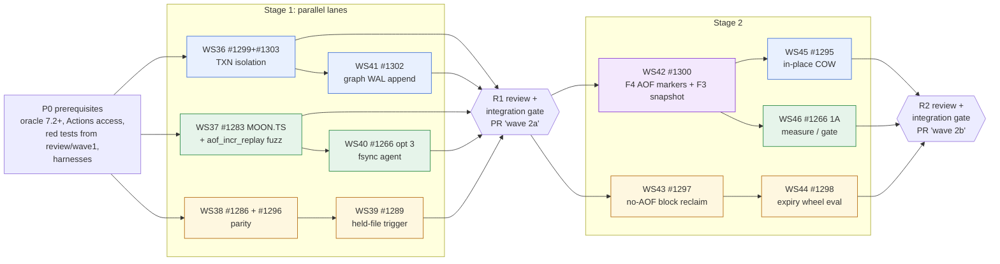

# Wave 1 review and wave 2 plan (DAG)

Base for wave 2: main `cf6fa65` (PR #1305). All results cited are from the Linux container
(4 vCPU x86_64, io_uring available), **not the merge bar**, unless a hosted run is named.

---

## Part 1: what the 2026-09 round delivered

### 1.1 Delivery at a glance

| PR | merged | commits | diff | issues closed |
|---|---|---|---|---|
| #1292 round 1 | `ce65400` | 43 | 123 files, +12,879 / −1,206 | #1281 #1279 #1272 #1276 #1280 #1265 #1269 |
| #1301 wave 1 | `9d72003` | 64 | 101 files, +12,595 / −2,613 | #1285 #1293 #1291 #1290 #1294 #1288; #1287 partly (SSCAN only) |
| #1305 wave-1 follow-up | `cf6fa65` | 6 | 13 files, +474 / −87 | (review fixes to #1285 / #1293) |

**Hosted CI on the final heads:** Lint, Check (clippy plus tokio nextest), MSRV 1.94, memory steady-state, cargo deny and cargo audit were green.

**Never run on these PRs:**
- Windows, macOS, the monoio self-hosted leg, the console leg and client-compat were skipped.
- `crash-matrix.yml` could not be dispatched: Actions write access returned 403.
- The self-hosted runner (moon-dev VM) was offline.

### 1.2 Wave 1: what changed, by issue

| issue | outcome | key evidence |
|---|---|---|
| #1285 TXN.ABORT durable (option b, all engines) | Fixed | The abort logs compensating `DEL` / `RESTORE … REPLACE ABSTTL` + `HPEXPIREAT`. Pre-images go into BGSAVE by move. Vector/text documents are rebuilt. Graph rollback is WAL-logged with 3 new records and a `graph_wal_replay` fuzz target. Aborted writes no longer come back after kill -9 on either runtime, and replicas converge. |
| — Lua writes inside a TXN (review) | Fixed | EVAL, EVALSHA and FCALL writes are undo-captured. Writes the undo log cannot express (FLUSHDB/ALL, SWAPDB, second-db, keyless) are refused and poison the TXN. A routed read-write script is refused. |
| — Graph rollback WAL drop (review) | Fixed (rollback side) | The checked append answers `MOONERR WAL backpressure` instead of `+OK`, and `txn_rollback_wal_dropped` counts the refusals. The forward path is still open in #1302. |
| — FLUSHDB/FLUSHALL on the connection inside a TXN (#1305) | Fixed | These are refused with `ERR TXN cannot roll back … (whole-database write)` and poison the TXN. |
| #1293 AOF generation boot window | Fixed | Heads are fsynced before the manifest commits (`UncommittedGeneration`). This took 88–167 resurrected probes per run to 0. Every new data, offload or AOF directory entry is now fsynced too. A filesystem without directory fsync is tolerated; EIO is fatal. |
| #1291 graves with fewer `--databases` / failed spill commit | Fixed | This took 129–173 resurrected probes per run to 0. |
| #1290 no-AOF tiering plain drops | Fixed | Evicted keys are now tiered durably: 1.4–5.4K of 16K keys lost → 0. Batches are 1024 entries with a 1 MiB floor. See the throughput cost in the next table. |
| #1294 eviction reason-DEL stall | Fixed | One budget per eviction run. A stall of 21.5–45.1 s → 0.52 s. |
| #1288 active expiry backlog | Fixed | A 25% duty token bucket, 1 ms per tick. 1.84M expired keys clear in ~5–6 s instead of ~4 min; redis 7.0.15 takes 3.8 s. |
| #1287 HSCAN/SSCAN O(N log N) | SSCAN fixed; HSCAN open (waits on #1171) | A position cursor with rewrite detection (hasher tag). A full scan of 1M members went from ~9 min to ~2.4 s; redis takes ~3 s. Blind spot: a copy of the set moved back onto itself. |

**Measured costs, interleaved same-host A/B:**

| change | before | after |
|---|---|---|
| No-AOF write flood over maxmemory (#1290), s4 | 185–389K rps, drops 55–69K keys | 127–161K rps, drops nothing |
| No-AOF write flood over maxmemory (#1290), s1 | 395–602K rps, drops keys | 116–141K rps, drops nothing |
| TXN.ABORT of a 200k-field hash | — | +~11 ms (the DUMP) |
| GET p99 while an expiry backlog drains | — | +0.2–0.25 ms |
| Captured script write inside a TXN | — | ~0.7 µs each |

The memory steady-state gate went red once. A same-host A/B measured +0.6% RSS (median), well inside the 4% spread across the base binary's own runs. It was runner noise, and the gate passed on the next head.

### 1.3 What the review rounds found

Each round reviewed the integrated tree, and each finding was checked red→green.

| round | found | outcome |
|---|---|---|
| WS30, wave-1 adversarial | 5 MAJOR | The 2 in wave-1 code were fixed: SSCAN rewrite, routed-script plain drop. The 3 pre-existing ones were filed as #1299 (F5) and #1300 (F3/F4). |
| CodeRabbit on #1301 | 2 MAJOR: graph rollback WAL drop; Lua writes in a TXN not undone | Fixed in WS31. The graph forward path was filed as #1302. |
| Round 2 (WS32) | 3 MINOR, 1 a data-loss bug: an inert script write captured `args[0]`; an arity-short argv poisoned the TXN; a no-writes FCALL was refused | Fixed. `no-writes` is now enforced under plain FCALL, as in redis. |
| Round 3 (WS34) + CodeRabbit | Over-long argv captured; error replies kept captures; read-only SORT/GEORADIUS captured; pcall could not catch the read-only refusal; embedded dir fsync; filesystems without directory fsync | Fixed. |
| Round 4 (WS35) + CodeRabbit | Over-capture shapes: LMPOP/ZMPOP candidates, connection error replies, no-op writes, 2 key-walker corners. Also connection FLUSHDB in a TXN, an EINVAL boot regression, and `resolve_dir` booting past EIO | The fixes shipped in #1305. The over-capture shapes were deferred to #1299 / #1303 as acceptance cases. |

**The main lesson.** Rounds 2–4 kept finding new over-capture shapes. They share one root cause: a TXN takes its undo capture before the write, and other clients can still write the same key. Each new shape could make `TXN.ABORT` overwrite another client's write. Chasing the shapes one by one did not converge. **#1299 (lock the keys an open TXN holds) is the structural fix**, which is why it heads the wave-2 critical path.

### 1.4 Still open from wave 1

| issue | what |
|---|---|
| #1299 | TXN isolation: block other writers. Holds the acceptance cases from rounds 2–4. |
| #1300 | TXN crash atomicity: F4 AOF markers; F3 a pre-TXN snapshot image; the RESTORE+HPEXPIREAT window |
| #1302 | Graph writes past the 4096-slot WAL channel are acked but lost. Adds the rollback side (free-capacity limit, replica divergence). |
| #1303 | A connection write that answers an error keeps its undo capture |
| #1287 | HSCAN, after #1171 |
| #1295, #1297, #1298, #1283, #1266, #1286, #1289, #1296 | the scope the maintainer set for wave 2 |

### 1.5 Process lessons carried into wave 2

- **Shared `CARGO_TARGET_DIR` aliasing is real.** Either give each worktree its own target, or `touch src/lib.rs`, copy binaries out in the same command, and verify with `strings`. Two runs this round produced byte-identical "different" builds.
- **Integration suites need `--include-ignored`.** A whole gate run once reported green with 0 real-server tests executed.
- **This box has ~6% free disk**, so every real-server run needs `MOON_DISK_FREE_MIN_PCT=0`. The first memory A/B measured nothing because moon refused every write with `diskfull`.
- **Three tokio replica tests always fail here**, because tokio has no master-side PSYNC:
  - `script_move_copy_db_replica_agrees_{1,4}_shard_master`
  - `script_effects_in_exec_reach_the_replica_in_order`
  
  Report them as known failures, not as green.
- **Agents stop mid-task during tool-safety outages.** Keep each agent's partial work in its worktree, and resume that agent rather than respawning it.
- **Review rounds scale with the size of the change.** Plan one adversarial round per stage on the integrated tree, not per branch.

---

## Part 2: wave 2 plan

### 2.1 Workstreams (DAG nodes)

| node | issues | size | lane | depends on | owner persona |
|---|---|---|---|---|---|
| **P0** Prerequisites | — | S | orchestrator | — | orchestrator |
| **WS36** TXN isolation | #1299 + #1303 | L | A | P0 | concurrency / transaction |
| **WS37** AOF record stream, part 1 | #1283 (`MOON.TS`), plus the shared `aof_incr_replay` fuzz target and pseudo-command intercept | M–L | B | P0 | storage-durability |
| **WS38** Parity quick wins | #1286, #1296 | S+S | C | P0 (#1296 needs the 7.2+ oracle) | redis-parity |
| **WS39** Cold held-file trigger | #1289 | M | C | WS38 (lane slot) | storage-durability |
| **WS40** everysec fsync agent (Option 3) | #1266 Option 3 | M | B | WS37 | runtime-latency |
| **WS41** Graph WAL append | #1302 (scope to confirm, Q1) | M–L | A | WS36 | storage-durability |
| **WS42** TXN crash atomicity | #1300: F4 AOF markers, F3 pre-TXN snapshot image | XL | A+B (one owner) | WS36, WS37, WS41 | storage-durability |
| **WS43** No-AOF block reclaim | #1297 | L–XL | C | WS39 | storage-durability |
| **WS44** Expiry wheel, evaluate only | #1298 | L | C | WS38 (#1286), WS43 (lane slot) | performance |
| **WS45** In-place COW streaming | #1295 | L–XL | A | WS42 (reuses #1299's per-key gate; shares `snapshot_cow` with F3) | performance |
| **WS46** Measure the 1A single-write path | #1266 1A | L (measure; adopt only if it passes the gate) | B | WS40, WS42 (F4 marker emission must move with it) | runtime-latency |
| **R1 / R2** Adversarial review plus integration gates | — | — | orchestrator | end of stage 1 / stage 2 | reviewer |

### 2.2 DAG

**Critical path:** P0 → WS36 → WS41 → R1 → WS42 → WS45 → R2. WS42 (XL) and WS45 (L–XL) are the long poles.

### 2.3 Why the edges are where they are

- **WS36 comes before everything else in the TXN area.**
  - #1300's correctness depends on it. Without the lock, a foreign write mixed into a rolled-back TXN's records is a dirty read. F3's "pre-TXN image = undo before-image" is exact only if no one else can write a held key.
  - #1295's "key write-locked while streaming" is the same per-key gate: build it once in WS36 and reuse it.
  - WS36 also makes the deferred over-capture shapes from rounds 2–4 harmless.
- **#1303 goes into WS36, not its own node.** It edits the same capture block (`handler_monoio/mod.rs` ~3644-3740, `handler_sharded/mod.rs` ~2741-2767). Under the lock, a stale capture would also cause false conflicts.
- **WS41 comes after WS36 and before WS42.**
  - It shares `handler_*/{txn,write}.rs`, `transaction/abort.rs` and `server/conn/txn_abort.rs` with both.
  - Its fix for replication ordering in `abort_logged` has to be in place before WS42 wraps the compensation records in markers.
- **The AOF stream runs WS37 → WS42 (F4) → WS46.** All three change `AofMessage`, `writer_task.rs` and `pool.rs`, and the replay intercept. So:
  - WS37 builds the pseudo-command intercept and the single `aof_incr_replay` fuzz target, which both `MOON.TS` and `MOON.TXN` use.
  - WS46 moves framing to the shard thread, so it has to carry the TS and TXN-marker emission with it. It runs last.
- **WS40 (Option 3) can follow WS37 straight away.** It only changes `writer_task.rs` internals: the fsync agent, the tail flush and the poll step.
- **The cold lane runs WS39 → WS43.** They share `cold_reclaim.rs`, `cold_reclaim_tick.rs`, `auto_save.rs` and the holds. Both add a "request a snapshot" trigger, which should be built once in WS39.
- **The expiry lane runs #1286 (in WS38) before WS44.** They share `server/expiration.rs` and `storage/db/kv_ops.rs`. WS44 comes last because it is evaluate-only and needs a quiet box for benchmarks.
- **Lane C is serial.** TEAM-RULES allows about 3 concurrent workstreams on 4 vCPU.

### 2.4 P0: prerequisites (orchestrator, before any lane starts)

1. **Branch base.** Branch `claude/gifted-mendel-e9wiz5` from main `cf6fa65`. Each lane gets its own worktree **and its own `CARGO_TARGET_DIR`**. Disk is 11–15 GB free and a target is about 4 GB, so give each lane a budget and delete its target when the node is done.
2. **Reviewer red tests.** Cherry-pick `tests/review_w1_txn_abort_no_aof_snapshot_1285.rs` from `review/wave1` (commits 00463f5, 42ecaa6, 3029f72) into the WS36 and WS42 branches. They are the #1299/#1300 acceptance tests.
3. **Oracle.** Install a redis **7.2+ or 8.x** oracle next to 7.0.15, if the network allows. #1296 needs it. The consistency suite then drops its ~80 known 7.0 diffs.
4. **Actions access.** The maintainer re-grants Actions write, so the orchestrator can dispatch `ci.yml` (Windows) and `crash-matrix.yml` through the GitHub API. `gh` is not installed.
5. **Harnesses.** Recreate the missing harnesses as repo tests or scripts:
   - #1295: a 5M-field hash, `MOON_TEST_SNAPSHOT_HOLD_FILE`, a PING-gap loop;
   - #1283: the `touchback` probe, as a Rust integration test.
6. **File-size policy.** Several hot files are over the 1500-line cap: `handler_monoio/mod.rs` 5154, `server/conn/shared.rs` 6417, `spsc_handler.rs` 5010, `handler_sharded/mod.rs` 3897, `aof/pool.rs` 3314. **Do not split them mid-wave**, because every lane would conflict. Rule: no lane grows them by more than a small delta; new logic goes into new modules. Splitting them is a separate PR after wave 2, or a P0 pre-step if the maintainer prefers (Q5).

### 2.5 Per-node acceptance (red→green, both runtimes, `--shards` 1 and 4 unless noted)

**WS36 (#1299 + #1303)**
- **Lock:** another client's write to a held key is refused with a distinct error (`-TXNCONFLICT …`), and the abort restores `orig`. A foreign FLUSHDB, FLUSHALL or SWAPDB on a db with open intents is refused. Replica apply bypasses the lock.
- **Round 2–4 cases:** each over-capture shape (LMPOP/ZMPOP candidates, no-op writes, the `GEORADIUSBYMEMBER … STORE` member, `XGROUP HELP x`, a connection write that errors) gets a test proving that another client's write is either refused or kept, never overwritten.
- **#1303:** `SET k v BADOPT`, then B writes `k`, then abort: B's value survives. Use the undo mark / truncate pattern and restore the previous intent.
- **Hot path:** zero cost with no TXN open. A/B `bench-compare.sh` SET, INCR and HSET at p1 and p16, shards 1 and 4, plus a `perf stat` instruction-count check.
- **Loom:** a loom model only if the guard becomes cross-thread. A per-shard plain field needs none.

**WS37 (#1283)**
- **Record:** `MOON.TS <ms>` is emitted when the shard clock changes, and at each generation head. Replay uses the last TS it saw, and falls back to the file mtime until a file's first TS.
- **Tests:** the `touchback` probe fails on base (today monoio gets 27/40 wrong, tokio 36/40) and passes after. Add a mixed old/new generation test and a downgrade-read test. `moon_1277_*` stays green.
- **Fuzz:** a new `aof_incr_replay` fuzz target in both `fuzz.yml` matrices, plus the fuzz lint check.
- **Docs:** STORAGE-FORMAT §3.3.
- **Bench:** AOF write path, everysec and always, p1 and p16. Also check the size growth of `AofMessage`.

**WS38 (#1286, #1296)**
- **#1286:** 50 × `PX 20` gives `expired_keys` = 50, on the 7.0 oracle too. Count the active cycle, lazy reap and cold sweep, and replica expiry per oracle behaviour. Do not count hash-field expiry. Add a consistency row.
- **#1296:** keep ACL rules in insertion order (`IndexSet`), and keep the bare-before-`cmd|arg` fail-open guard. The consistency rows must be deterministic against 7.2+. Add a CHANGELOG note that ACL files re-save differently.

**WS39 (#1289)**
- Held files reach 0 with no manual BGREWRITEAOF or BGSAVE, with and without an AOF, in the 1067 shape.
- The steady state is unchanged: fold and snapshot trigger counts are the same before and after.
- Use `runtime::interval` / `Cadence` only.

**WS40 (#1266 Option 3)**
- The everysec fsync runs on an agent thread, the tokio tail is flushed every batch, and the post-idle poll is shorter.
- `always` still acks only after the fsync.
- Durability leg: 10,000 acked SETs, kill -9, 20 reps. Report the measured loss bound.
- Correct `README.md:280` (the "kill-9-lossless" claim) and document redis's 2 s postpone.
- Add a loom model if the agent handoff is a new atomic protocol.

**WS41 (#1302)**
- Records are batched per command and appended checked, or appended inline on the owning shard thread (the preferred option b, Q1).
- Tests:
  - a 6000-node CREATE either survives kill -9 or answers an error;
  - 2,500 pipelined ADDNODE plus ABORT gives `+OK`, and no node returns;
  - at s1, master and replica agree after a refused rollback.
- The tokio leg is gated on `graph`. No on-disk format change.

**WS42 (#1300)**
- **F4:** `MOON.TXN BEGIN/END <id>` pseudo-commands, with `lsn=0`. Recovery skips an unterminated block.
- **One marked block:** the RESTORE + HPEXPIREAT compensation records sit inside a single marked block. A crash hook between them must never bring a field back without its deadline.
- **Other cases:** a torn log; a TXN spanning a rewrite fold; a replica full sync while a TXN is open.
- **F3:** the snapshot serializes the pre-TXN image for held keys.
- **Tests:** the reviewer's red tests pass.
- **Fuzz:** extend `aof_incr_replay` to cover the markers.
- **Bench:**
  - The AOF write path with no TXN must show zero added records.
  - TXN latency.
  - BGSAVE duration while a TXN is open.

**WS43 (#1297)**
- Kill -9 at each point: after compaction, before adoption, between listing and unlink, and during the snapshot. Each must end with 0 resurrected and 0 lost keys.
- The graves trailer must be exact: forget F's graves and carry F′'s.
- Disk held under a no-AOF flood drops, and #1290's rps gain is kept.
- Any new decoder gets a fuzz target.

**WS44 (#1298), evaluate only**
- Behind a switch. Measure `INFO memory` per 1M TTL keys, `SET … EX` at p1 and p16, the drain rate (base 300–370K keys/s; redis 477K), and `volatile-ttl` correctness.
- **Ship only on a clear memory win with no throughput loss.** Otherwise record the numbers and close as "not adopted".

**WS45 (#1295)**
- Recreate the #1269 harness: a 5M-field hash, the save held mid-walk, HSET one field.
- Report the max PING gap and the RSS peak, and check HLEN is 5M after restart. Use at least 3 interleaved reps on `--shards 1`, and rotate ports.
- Reuse WS36's per-key gate.
- Chunked encoding only with an `rdb_load` fuzz update and a STORAGE-FORMAT entry.

**WS46 (#1266 1A)**
- One `write(2)` per loop iteration on the shard thread.
- **Adoption gate:**

  | cell | median rps vs base |
  |---|---|
  | P16 | ≥ −3% |
  | P1 c50 | ≥ −3% |
  | P1 c1 | ≥ −8% |

  p99 must be no worse than +10%, and the durability leg must lose 0.
- **Otherwise** record the numbers and keep Option 3.

### 2.6 Integration gates and delivery

- **R1 and R2**, each run on the integrated tree:
  - One adversarial review round, plus one fix round if needed; loop until no finding is above NIT.
  - The full local gate: fmt; clippy on both feature sets; fuzz check; lib tests on both runtimes; all touched integration suites with `--include-ignored` and `MOON_BIN` pinned per runtime; a consistency-suite diff against base.
  - Hosted `ci.yml`, plus `crash-matrix.yml` for R2.
- **Delivery:** two PRs, "wave 2a" after R1 and "wave 2b" after R2. The alternative is one PR for the whole wave (Q4). Each PR has per-issue commits, CHANGELOG entries and a SUMMARY per workstream.
- **Benchmarks** run only on a quiet box. Lanes pause builds while a benchmark runs, and the orchestrator schedules benchmark windows.

### 2.7 Decisions needed before starting

| # | question | recommendation |
|---|---|---|
| Q1 | Is #1302 (graph WAL append) in wave-2 scope? It is not in NEXT-ROUND's list, but review round 4 filed it as durability-critical. | Yes, as WS41, with option (b): inline append on the owning shard thread. |
| Q2 | #1289: which release trigger — (1) raise pressure after T seconds or K sweeps with no fold, (2) a rate-limited snapshot without an AOF, or (3) count held bytes toward ledger pressure? | (2) without an AOF, since it is the same "request snapshot" trigger #1297 needs, plus (1) with an AOF. |
| Q3 | #1299 policy details: an idle-TXN timeout? Do active expiry, eviction, cross-shard legs, MULTI bodies and blocking wakers treat a held key as locked? What is the error text? | Eviction and active expiry skip held keys (lazy expiry defers to COMMIT). No timeout this wave; add an INFO gauge of open TXNs and the age of the oldest. Error: `-TXNCONFLICT key held by an open transaction`. |
| Q4 | One PR per stage (2a/2b), or one PR for the wave? | Per stage. Wave 1's single PR reached 101 files and took 4 review rounds. |
| Q5 | Split the over-cap files as a P0 pre-step, or after wave 2? | After wave 2: a split mid-wave conflicts with every lane. |
| Q6 | For #1283 and #1300 together: does a skipped (unterminated) TXN block still advance the `MOON.TS` replay clock? | Yes. TS records are clock observations, not data, so replay applies them even inside a skipped block. |

### 2.8 Risks

- **WS42 is XL and crosses two lanes.** It has one owner and starts only after R1.
- **Disk budget.** About 3 lane targets at ~4 GB each is tight on 11–15 GB free. Delete a lane's target at the end of each node.
- **Hosted coverage.** If Actions access is not restored, Windows, the crash matrix and the monoio self-hosted leg stay unrun. Each PR has to say so plainly.
- **Box noise.** Performance gates (#1266 1A, #1298, #1295, the #1299 no-TXN cost) need quiet windows. Interleaved A/B with at least 3 reps is mandatory.
