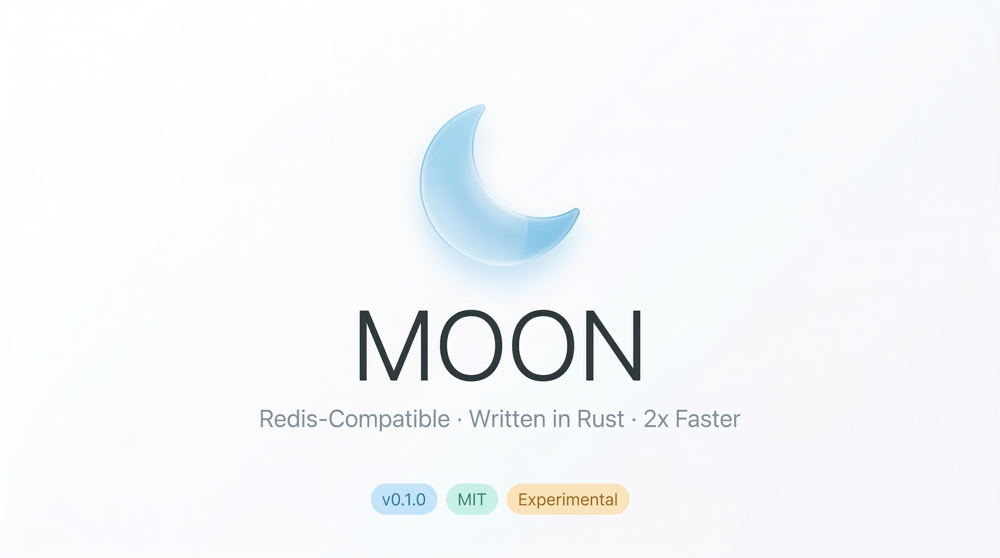
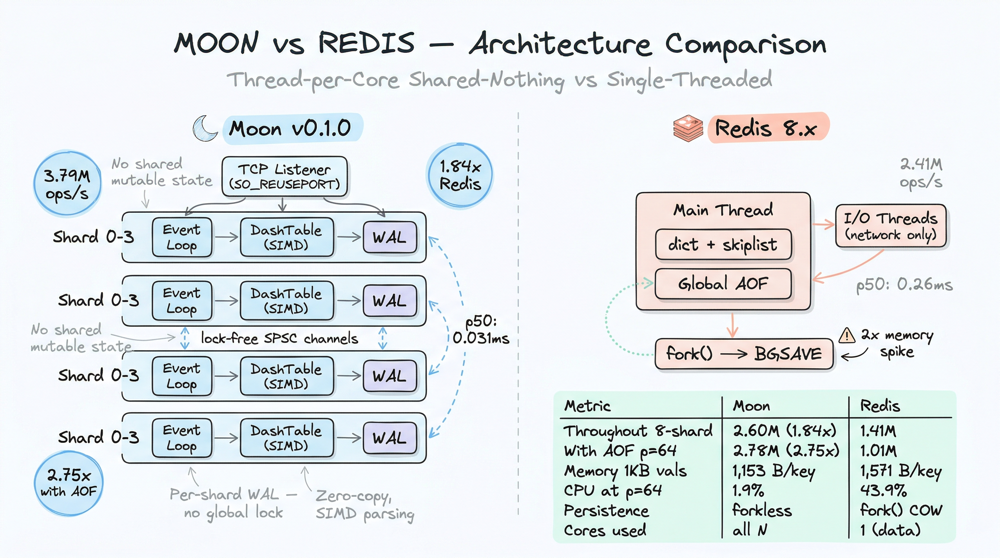
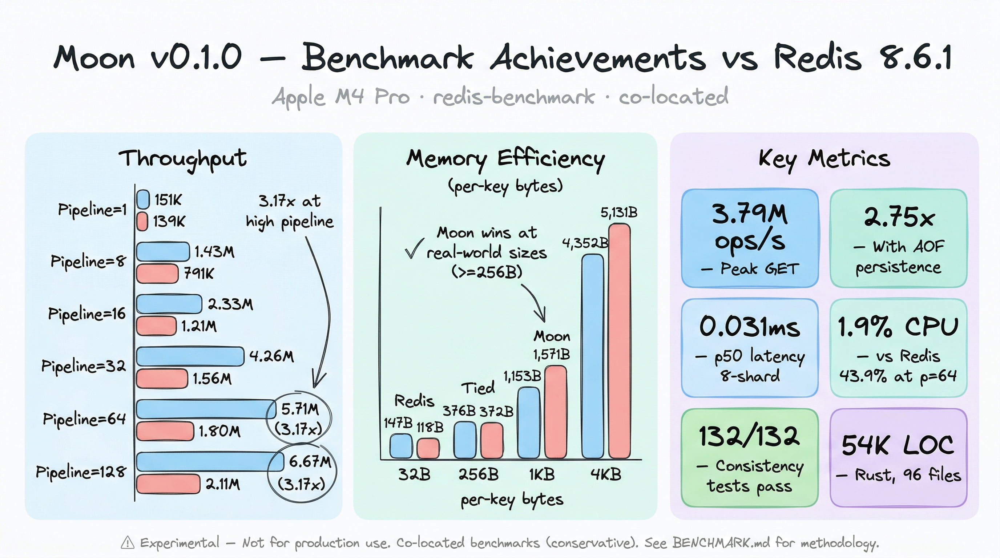
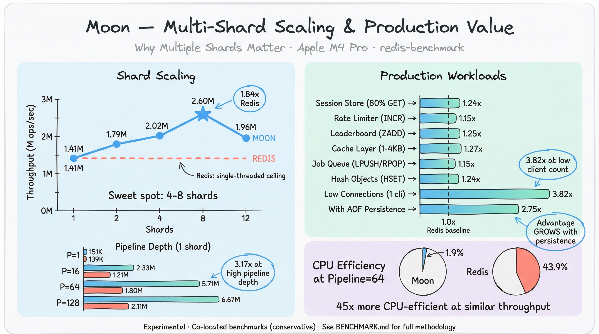

<p align="center">
  
</p>

<p align="center">
  <strong>A high-performance, Redis-compatible in-memory data store written in Rust from scratch.</strong>
</p>

<p align="center">
  <a href="https://github.com/pilotspace/moon/releases/tag/v0.1.0"></a>
  <a href="LICENSE"></a>
  <a href="https://github.com/pilotspace/moon/releases/tag/v0.1.0"></a>
  
  
</p>

<p align="center">
  <a href="#quick-start">Quick Start</a> &bull;
  <a href="#features">Features</a> &bull;
  <a href="#architecture">Architecture</a> &bull;
  <a href="#configuration">Configuration</a> &bull;
  <a href="#command-reference">Commands</a> &bull;
  <a href="#benchmarking">Benchmarks</a> &bull;
  <a href="CHANGELOG.md">Changelog</a>
</p>

---

> **Warning**
> This project is **experimental** and under active development. It is NOT recommended for production use. APIs, storage formats, and configuration options may change without notice between releases. Use at your own risk. If you encounter issues, please [open an issue](https://github.com/pilotspace/moon/issues).

---

Moon implements 200+ Redis commands with a thread-per-core shared-nothing architecture, dual-runtime support (Tokio + Monoio), SIMD-accelerated parsing, forkless persistence, and memory-optimized data structures. It consistently outperforms Redis 8.x by **1.5-3x** on throughput while using **27-35% less memory** for real-world value sizes.

## Moon vs Redis Architecture

<p align="center">
  
</p>

## Benchmark Achievements

<p align="center">
  
</p>

### Multi-Shard Scaling & Production Value

<p align="center">
  
</p>

> **Note:** All benchmarks are run on **ARM64** hardware — Apple M4 Pro (macOS) and OrbStack Linux VM (aarch64). x86_64 results may differ due to architectural differences in io_uring, memory subsystem, and SIMD paths.

#### macOS ARM64 (Apple M4 Pro, co-located, Redis 8.6.1)

| Metric | Moon vs Redis | Conditions |
|--------|:------------:|------------|
| Peak GET throughput | **3.79M ops/sec** | 4 shards, pipeline=64 |
| Peak SET with AOF | **2.78M ops/sec** | AOF everysec, pipeline=64 |
| Throughput (pipeline=64) | **3.17x faster** | 1 shard, SET |
| Throughput (8 shards) | **1.84-1.99x faster** | GET/SET, pipeline=16 |
| With AOF persistence | **2.75x faster** | Per-shard WAL vs global fsync |
| Memory (1KB+ values) | **27-35% less** | Per-key RSS measurement |
| p50 latency (8 shards) | **8-10x lower** | 0.031ms vs 0.26ms |
| CPU efficiency (p=64) | **45x better** | 1.9% vs 43.9% CPU |

#### Linux ARM64 (OrbStack aarch64, Ubuntu 25.10, Redis 8.0.2, monoio io_uring)

| Metric | Moon vs Redis | Conditions |
|--------|:------------:|------------|
| Peak GET throughput | **11.7M ops/sec** | 1 shard, pipeline=64 |
| Peak SET throughput | **5.4M ops/sec** | 1 shard, pipeline=64 |
| SET with AOF (p=64) | **2.15x faster** | Per-shard WAL, appendfsync=everysec |
| GET with AOF (p=64) | **2.17x faster** | io_uring batched submission |
| SET with AOF (p=16) | **2.06x faster** | Per-shard WAL eliminates global bottleneck |
| Crash recovery | **100%** | 38/38 consistency checks, all data types |
| RDB load speed | **5.9M keys/sec** | 632K keys in 107ms |
| AOF compaction | **1.16x Redis** | Multi-part AOF (base.rdb + incr.aof) |

See [BENCHMARK.md](BENCHMARK.md) for full methodology and results, or [BENCHMARK-PRODUCTION.md](BENCHMARK-PRODUCTION.md) for production workload patterns.

## Features

### Data Types
- **Strings** - GET, SET, MGET, MSET, INCR/DECR, APPEND, GETRANGE, SETRANGE, GETEX, GETDEL, and more
- **Lists** - LPUSH, RPUSH, LPOP, RPOP, LRANGE, LINSERT, LPOS, blocking BLPOP/BRPOP/BLMOVE
- **Hashes** - HSET, HGET, HGETALL, HINCRBY, HSCAN, and all hash operations
- **Sets** - SADD, SREM, SINTER, SUNION, SDIFF, SRANDMEMBER, SPOP, SSCAN
- **Sorted Sets** - ZADD, ZRANGE, ZRANGEBYSCORE, ZRANK, ZINCRBY, ZPOPMIN/MAX, blocking BZPOPMIN/MAX
- **Streams** - XADD, XREAD, XRANGE, XLEN, XGROUP, XREADGROUP, XACK, XPENDING, XCLAIM, XAUTOCLAIM

### Architecture
- **Thread-per-core** shared-nothing design with per-shard event loops
- **Dual runtime** - Tokio (all platforms) + Monoio (Linux io_uring / macOS kqueue)
- **DashTable** - Segmented hash table with Swiss Table SIMD probing
- **SIMD parsing** - memchr-accelerated CRLF scanning, atoi fast integer parsing
- **Lock-free channels** - Custom oneshot channels replacing tokio::oneshot (12% CPU reduction)

### Persistence
- **Multi-part AOF** - Inspired by Redis 7+ design: `moon.aof.<seq>.base.rdb` + `moon.aof.<seq>.incr.aof` + `moon.aof.manifest` in `appendonlydir/`. Note: Moon's AOF format is **not compatible** with Redis — file naming, manifest format, and RDB encoding differ. Direct migration between Moon and Redis AOF files is not supported.
- **BGREWRITEAOF** - RDB preamble compaction, automatic old file cleanup, 100% crash recovery
- **RDB snapshots** - Forkless compartmentalized snapshots (no COW memory spike)
- **Per-shard WAL** - CRC32-checksummed block frames, configurable everysec/always/no fsync
- **Fast RDB loader** - Significantly faster bulk loading than Redis (pre-sized hash tables, direct deserialization, skipped duplicate checks during restore)

### Networking & Protocol
- **RESP2/RESP3** - Full protocol support with HELLO negotiation
- **TLS 1.3** - Via [rustls](https://github.com/rustls/rustls) + [aws-lc-rs](https://github.com/aws/aws-lc-rs), dual-port (plaintext + TLS), mTLS support
- **Pipelining** - Adaptive batch dispatch with response freezing
- **Client-side caching** - Invalidation hints via RESP3 Push frames

### Clustering & Replication
- **Replication** - PSYNC2-compatible, per-shard WAL streaming, partial resync
- **Cluster mode** - 16,384 hash slots, gossip protocol, MOVED/ASK redirections, live slot migration
- **Failover** - Majority consensus election, automatic promotion

### Scripting & Security
- **Lua scripting** - Embedded Lua 5.4 via [mlua](https://github.com/mlua-rs/mlua), EVAL/EVALSHA, sandboxed with Redis API bindings
- **ACL system** - Per-user permissions, command/key/channel restrictions
- **Protected mode** - Rejects non-loopback connections when no password is set

### Memory Optimization
- **CompactKey** - 23-byte inline SSO, eliminates heap allocation for short keys
- **HeapString** - No Arc overhead for non-shared values
- **CompactValue** - 16-byte SSO struct with embedded TTL delta
- **B+ tree sorted sets** - Cache-friendly replacement for BTreeMap
- **Arena allocation** - Per-request [bumpalo](https://github.com/fitzgen/bumpalo) arenas, per-connection reuse

## Quick Start

### Prerequisites

- [Rust](https://rustup.rs/) stable toolchain (edition 2024)
- cmake (required by aws-lc-rs for TLS)

### Install from source

```bash
git clone https://github.com/pilotspace/moon.git
cd moon
cargo build --release
```

### Run

```bash
# Default: binds to 127.0.0.1:6379, auto-detects CPU count for shards
./target/release/moon

# With specific options
./target/release/moon --port 6380 --shards 4 --requirepass mysecret
```

### Connect

Any Redis client works out of the box:

```bash
redis-cli -p 6379
127.0.0.1:6379> PING
PONG
127.0.0.1:6379> SET hello world
OK
127.0.0.1:6379> GET hello
"world"
127.0.0.1:6379> HSET user:1 name "Alice" age 30
(integer) 2
127.0.0.1:6379> HGETALL user:1
1) "name"
2) "Alice"
3) "age"
4) "30"
```

### Docker

Moon ships a multi-stage Dockerfile with [cargo-chef](https://github.com/LukeMathWalker/cargo-chef) dependency caching and a [distroless](https://github.com/GoogleContainerTools/distroless) runtime (~41MB final image).

```bash
# Build (default: monoio runtime + jemalloc)
docker build -t moon .

# Build with tokio runtime
docker build --build-arg FEATURES=runtime-tokio,jemalloc -t moon .

# Multi-platform build (amd64 + arm64)
docker buildx build --platform linux/amd64,linux/arm64 -t moon .

# Run
docker run -d -p 6379:6379 moon

# Run with persistence
docker run -d -p 6379:6379 -v moon-data:/data moon \
  moon --bind 0.0.0.0 --appendonly yes --appendfsync everysec

# Run with TLS
docker run -d -p 6379:6379 -p 6443:6443 -v /path/to/certs:/data moon \
  moon --bind 0.0.0.0 --tls-port 6443 \
  --tls-cert-file /data/cert.pem --tls-key-file /data/key.pem
```

Or use Docker Compose:

```bash
docker compose up -d       # Start
docker compose logs -f     # Follow logs
docker compose down        # Stop
```

## Configuration

All options are available as command-line flags. See `--help` for the full list.

### Server

| Flag | Default | Description |
|------|---------|-------------|
| `--bind` | `127.0.0.1` | Bind address |
| `--port` / `-p` | `6379` | Port to listen on |
| `--shards` | `0` (auto) | Number of shards (0 = CPU count) |
| `--databases` | `16` | Number of databases |
| `--requirepass` | *(none)* | Require password authentication |
| `--protected-mode` | `yes` | Reject non-loopback when no password set |

### Persistence

| Flag | Default | Description |
|------|---------|-------------|
| `--appendonly` | `no` | Enable AOF persistence (`yes`/`no`) |
| `--appendfsync` | `everysec` | AOF fsync policy (`always`/`everysec`/`no`) |
| `--appendfilename` | `appendonly.aof` | AOF filename |
| `--save` | *(none)* | RDB auto-save rules (e.g., `"3600 1 300 100"`) |
| `--dir` | `.` | Directory for persistence files |
| `--dbfilename` | `dump.rdb` | RDB snapshot filename |

### Memory & Eviction

| Flag | Default | Description |
|------|---------|-------------|
| `--maxmemory` | `0` | Max memory in bytes (0 = unlimited) |
| `--maxmemory-policy` | `noeviction` | Eviction policy |
| `--maxmemory-samples` | `5` | Keys to sample for eviction |

**Eviction policies:** `noeviction`, `allkeys-lru`, `allkeys-lfu`, `allkeys-random`, `volatile-lru`, `volatile-lfu`, `volatile-random`, `volatile-ttl`

### TLS

| Flag | Default | Description |
|------|---------|-------------|
| `--tls-port` | `0` (disabled) | TLS listener port |
| `--tls-cert-file` | *(none)* | PEM certificate file |
| `--tls-key-file` | *(none)* | PEM private key file |
| `--tls-ca-cert-file` | *(none)* | CA cert for mTLS client auth |
| `--tls-ciphersuites` | *(default)* | TLS 1.3 cipher suites |

### Cluster

| Flag | Default | Description |
|------|---------|-------------|
| `--cluster-enabled` | `false` | Enable cluster mode |
| `--cluster-node-timeout` | `15000` | Node timeout in ms |

### ACL

| Flag | Default | Description |
|------|---------|-------------|
| `--aclfile` | *(none)* | Path to ACL file (Redis-compatible format) |
| `--acllog-max-len` | `128` | Max ACL log entries |

### Example: Production Configuration

```bash
./target/release/moon \
  --bind 0.0.0.0 \
  --port 6379 \
  --tls-port 6380 \
  --tls-cert-file /etc/moon/server.crt \
  --tls-key-file /etc/moon/server.key \
  --shards 8 \
  --requirepass "$REDIS_PASSWORD" \
  --appendonly yes \
  --appendfsync everysec \
  --dir /var/lib/moon \
  --maxmemory 8589934592 \
  --maxmemory-policy allkeys-lfu \
  --aclfile /etc/moon/users.acl
```

## Architecture

```
                    Client Connections
                           |
                    TCP / TLS Listener
                           |
                  ┌────────┴────────┐
                  │  Shard Router    │  (hash(key) % N)
                  └────────┬────────┘
           ┌───────┬───────┼───────┬───────┐
        Shard 0  Shard 1  ...   Shard N-1
           │       │               │
      ┌────┴────┐  │          ┌────┴────┐
      │DashTable│  │          │DashTable│  Swiss Table SIMD
      │  (data) │  │          │  (data) │
      └────┬────┘  │          └────┬────┘
           │       │               │
        Per-Shard WAL          Per-Shard WAL   (batched fsync)
```

Each shard runs on its own thread with:
- Independent event loop (Tokio `current_thread` or Monoio `LocalExecutor`)
- Own DashTable with segmented hash table and SIMD probing
- Own WAL writer for persistence (no global lock)
- Own PubSub registry with cross-shard fan-out via SPSC channels
- Own Lua VM instance for script execution

**Key design choices:**
- **No shared mutable state** between shards — all cross-shard communication via message passing
- **Forkless snapshots** — iterate DashTable segments asynchronously, no COW memory spike
- **CompactKey SSO** — keys up to 23 bytes stored inline (no heap allocation)
- **Lock-free oneshot** — custom channels replace tokio::oneshot for 12% CPU reduction
- **CachedClock** — thread-local timestamp cache avoids syscall per operation

## Benchmarking

```bash
# Quick throughput comparison vs Redis
./scripts/bench-production.sh

# Memory and CPU efficiency benchmark
./scripts/bench-resources.sh

# Cargo micro-benchmarks
RUSTFLAGS="-C target-cpu=native" cargo bench

# Run data consistency tests (132 tests across 1/4/12 shard configs)
./scripts/test-consistency.sh
```

See [BENCHMARK.md](BENCHMARK.md) for detailed methodology and [BENCHMARK-RESOURCES.md](BENCHMARK-RESOURCES.md) for memory/CPU profiling data.

## Testing

```bash
# Unit tests (1,067 tests)
cargo test --lib

# With logging
RUST_LOG=moon=debug cargo test --lib

# Data consistency tests (132 tests vs Redis as ground truth)
./scripts/test-consistency.sh
```

## Command Reference

<details>
<summary><strong>200+ supported commands</strong> (click to expand)</summary>

### Connection (7)
PING, ECHO, QUIT, SELECT, COMMAND, INFO, AUTH

### Strings (21)
GET, SET, MGET, MSET, MSETNX, INCR, DECR, INCRBY, DECRBY, INCRBYFLOAT, APPEND, STRLEN, GETRANGE, SETRANGE, SUBSTR, SETNX, SETEX, PSETEX, GETSET, GETDEL, GETEX

### Keys (15)
DEL, EXISTS, EXPIRE, PEXPIRE, EXPIREAT, PEXPIREAT, TTL, PTTL, PERSIST, TYPE, UNLINK, SCAN, KEYS, RENAME, RENAMENX

### Hashes (14)
HSET, HGET, HDEL, HMSET, HMGET, HGETALL, HEXISTS, HLEN, HKEYS, HVALS, HINCRBY, HINCRBYFLOAT, HSETNX, HSCAN

### Lists (16)
LPUSH, RPUSH, LPOP, RPOP, LLEN, LRANGE, LINDEX, LSET, LINSERT, LREM, LTRIM, LPOS, LMOVE, BLPOP, BRPOP, BLMOVE

### Sets (15)
SADD, SREM, SMEMBERS, SCARD, SISMEMBER, SMISMEMBER, SINTER, SUNION, SDIFF, SINTERSTORE, SUNIONSTORE, SDIFFSTORE, SRANDMEMBER, SPOP, SSCAN

### Sorted Sets (21)
ZADD, ZREM, ZSCORE, ZCARD, ZINCRBY, ZRANK, ZREVRANK, ZPOPMIN, ZPOPMAX, ZSCAN, ZRANGE, ZREVRANGE, ZRANGEBYSCORE, ZREVRANGEBYSCORE, ZRANGEBYLEX, ZCOUNT, ZLEXCOUNT, ZUNIONSTORE, ZINTERSTORE, BZPOPMIN, BZPOPMAX

### Streams (14)
XADD, XLEN, XRANGE, XREVRANGE, XREAD, XTRIM, XDEL, XGROUP, XREADGROUP, XACK, XPENDING, XCLAIM, XAUTOCLAIM, XINFO

### Pub/Sub (5)
SUBSCRIBE, UNSUBSCRIBE, PSUBSCRIBE, PUNSUBSCRIBE, PUBLISH

### Transactions (5)
MULTI, EXEC, DISCARD, WATCH, UNWATCH

### Scripting (5)
EVAL, EVALSHA, SCRIPT LOAD, SCRIPT EXISTS, SCRIPT FLUSH

### Persistence (2)
BGSAVE, BGREWRITEAOF

### Replication (5)
REPLICAOF, SLAVEOF, REPLCONF, PSYNC, WAIT

### Cluster (9)
CLUSTER INFO, CLUSTER NODES, CLUSTER SLOTS, CLUSTER MEET, CLUSTER ADDSLOTS, CLUSTER DELSLOTS, CLUSTER SETSLOT, CLUSTER FAILOVER, CLUSTER MYID

### ACL (8)
ACL SETUSER, ACL GETUSER, ACL DELUSER, ACL LIST, ACL WHOAMI, ACL LOG, ACL SAVE, ACL LOAD

### Server (12)
CONFIG GET, CONFIG SET, DBSIZE, FLUSHDB, FLUSHALL, HELLO, CLIENT, OBJECT, DEBUG, SLOWLOG, WAIT, COMMAND DOCS

</details>

## Project Structure

```
src/
  main.rs              # Entry point, CLI args, server bootstrap
  config.rs            # Runtime configuration
  tls.rs               # TLS acceptor (rustls + aws-lc-rs)
  lib.rs               # Library root, module declarations
  protocol/            # RESP2/RESP3 parser, serializer, codec
  server/              # TCP listener, connection handler, shard router
  storage/             # DashTable, CompactKey, CompactValue, expiration, eviction
  command/             # Command implementations (string, hash, list, set, etc.)
  persistence/         # RDB snapshots, AOF writer, WAL v2
  shard/               # Per-shard event loop, message dispatch
  cluster/             # Hash slots, gossip protocol, failover, migration
  replication/         # PSYNC2, backlog, replica streaming
  scripting/           # Lua VM, script cache, Redis API bridge
  acl/                 # ACL user permissions, rule parser
  pubsub/              # Pub/Sub registry, pattern matching
  blocking/            # Blocking command wakeup (BLPOP, BRPOP, etc.)
  tracking/            # Client-side caching invalidation
  runtime/             # Runtime abstraction (Tokio/Monoio traits)
  io/                  # io_uring driver, buffer management
```

## References

### Design Inspirations

- [Dragonfly](https://github.com/dragonflydb/dragonfly) — shared-nothing thread-per-core Redis alternative (C++); validated the architecture Moon follows
- [Dash: Scalable Hashing on Persistent Memory (VLDB 2020)](https://www.vldb.org/pvldb/vol13/p1147-lu.pdf) — segmented hash table design that DashTable is based on
- [Swiss Table / Abseil](https://abseil.io/about/design/swisstables) — SIMD control-byte probing used within DashTable segments
- [VLL: Very Lightweight Locking (VLDB 2012)](https://www.vldb.org/pvldb/vol6/p145-ren.pdf) — multi-key coordination across shards without heavy locks
- [ScyllaDB / Seastar](https://github.com/scylladb/seastar) — pioneered thread-per-core shared-nothing for databases
- [KeyDB](https://github.com/Snapchat/KeyDB) — multi-threaded Redis fork; demonstrated spinlock ceiling at ~4 threads
- [Garnet (Microsoft Research)](https://github.com/microsoft/garnet) — .NET Redis alternative with Tsavorite log-structured store

### Protocol & Compatibility

- [Redis Protocol Specification (RESP2/RESP3)](https://redis.io/docs/latest/develop/reference/protocol-spec/) — wire protocol Moon implements
- [Redis Commands Reference](https://redis.io/docs/latest/commands/) — command semantics Moon follows
- [Redis Cluster Specification](https://redis.io/docs/latest/operate/oss_and_stack/reference/cluster-spec/) — 16,384 hash slots, gossip, failover protocol
- [PSYNC2 Replication](https://redis.io/docs/latest/operate/oss_and_stack/management/replication/) — partial resync protocol Moon implements

### Core Dependencies

| Crate | Purpose | Why chosen |
|-------|---------|-----------|
| [monoio](https://github.com/bytedance/monoio) | Thread-per-core async runtime | io_uring on Linux, kqueue on macOS; [ByteDance production-proven](https://github.com/bytedance/monoio#production-users) |
| [tokio](https://github.com/tokio-rs/tokio) | Fallback async runtime | Broad ecosystem, cross-platform; used as portable alternative |
| [tikv-jemallocator](https://github.com/tikv/jemallocator) | Memory allocator | Reduced fragmentation for long-running servers; [TiKV production-proven](https://github.com/tikv/tikv) |
| [rustls](https://github.com/rustls/rustls) | TLS implementation | Pure Rust, no OpenSSL dependency, async-native |
| [aws-lc-rs](https://github.com/aws/aws-lc-rs) | Cryptographic backend | FIPS-capable, high-performance AES-GCM and ChaCha20 |
| [mlua](https://github.com/mlua-rs/mlua) | Lua 5.4 VM | Redis EVAL/EVALSHA compatibility with safe Rust bindings |
| [memchr](https://github.com/BurntSushi/memchr) | SIMD byte search | [6.5x faster](https://github.com/BurntSushi/memchr#benchmarks) CRLF scanning than std; SSE2/AVX2/NEON |
| [bumpalo](https://github.com/fitzgen/bumpalo) | Bump allocation arenas | ~2ns allocation; O(1) bulk deallocation per request |
| [bytes](https://github.com/tokio-rs/bytes) | Zero-copy buffers | `Bytes::freeze()` for shared response data without copying |
| [xxhash-rust](https://github.com/DoumanAsh/xxhash-rust) | Non-cryptographic hashing | Fast key hashing for DashTable segment routing |
| [crossbeam-utils](https://github.com/crossbeam-rs/crossbeam) | Concurrency primitives | `CachePadded<T>` for false-sharing prevention |
| [ringbuf](https://github.com/agerasev/ringbuf) | SPSC ring buffer | Lock-free cross-shard message passing |

### Research & Benchmarking Methodology

- [Redis vs Dragonfly Performance (Redis blog)](https://redis.io/blog/diving-into-dragonfly/) — fair comparison methodology: same cores, cluster vs single-process
- [memtier_benchmark](https://github.com/RedisLabs/memtier_benchmark) — industry-standard Redis benchmarking tool
- [io_uring and Networking (Alibaba Cloud)](https://www.alibabacloud.com/blog/io_uring-vs-epoll-in-high-performance-networking_599367) — io_uring advantages for request-response workloads
- [Coordinated Omission (Gil Tene)](https://www.scylladb.com/2021/04/22/on-coordinated-omission/) — why open-loop benchmarking matters for tail latency

## License

[Apache License 2.0](LICENSE)
