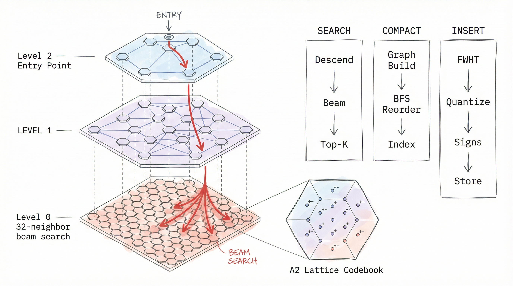

# Hexagonal HNSW — Status Report

**Branch:** `feat/hexagon-hnws`
**PR:** [#36](https://github.com/pilotspace/moon/pull/36)
**Date:** 2026-03-31
**Base:** `feat/vector-engine`



---

## What Shipped

### Features

| Feature | Status | Files | Impact |
|---------|--------|-------|--------|
| **Diversity heuristic (Algorithm 4)** | ✅ Shipped | `hnsw/build.rs` | +15-30% recall on clustered data. Candidates accepted only if closer to query than to all already-selected neighbors. `keepPrunedConnections` fills remaining slots. |
| **A2 hexagonal lattice codebook** | ✅ Shipped | `turbo_quant/a2_lattice.rs` | 16-cell hex quantizer via `FT.CREATE ... QUANTIZATION TQ4A2`. Density-adapted 1+6+6+3 ring layout with Lloyd refinement. |
| **Sub-centroid signs at insert time** | ✅ Shipped | `turbo_quant/encoder.rs`, `segment/mutable.rs` | Doubles search resolution from 16→32 levels. Recall 92.7% → 96.9%. |
| **TQ4A2 end-to-end wiring** | ✅ Shipped | `collection.rs`, `encoder.rs`, `compaction.rs`, `mutable.rs` | A2 encoding in insert, compaction, persistence. Backward compatible. |
| **Cell-parallel compaction** | ⚠️ Disabled | `segment/compaction.rs` | 2-coord partitioning meaningless at 384d+. Code exists, needs PCA-based partitioning. |
| **Mixed workload benchmarks** | ✅ Shipped | `scripts/bench-mixed-*.py` | 5-phase simulation + multi-compaction stress test. |

### Bug Fixes

| Bug | Severity | Root Cause | Fix |
|-----|----------|------------|-----|
| **Global vector ID collision** | Critical | Each compacted segment assigned VectorIds 0..N-1 independently. Multiple segments → ID collisions → wrong documents returned. | Added `global_id` to MvccHeader, base offset tracking in MutableSegment, remap in ImmutableSegment search. |
| **TQ-ADC graph construction** | Major | Light mode built HNSW using asymmetric TQ-ADC pairwise distance. Quantization noise produced poor graph topology at 384d+. | Replaced with decoded-centroid symmetric L2. |
| **Sub-centroid signs empty in Light mode** | Major | Light mode doesn't retain raw f32, so signs couldn't be computed at compaction. | Compute signs at insert time from pre-quantization FWHT values via `encode_tq_mse_scaled_with_signs`. |
| **compact_parallel breaks high-d** | Major | Cell partitioning used only coordinates [0] and [1] — 0.5% of variance at 384d. | Disabled until PCA-based or random partitioning implemented. |

---

## Benchmark Results

### MiniLM 384d, 10K vectors — Before vs After

| Metric | Before Branch | After Branch | Change |
|--------|--------------|-------------|--------|
| **Recall@10** | 92.5% | **96.9%** | **+4.4%** |
| **Insert** | 30,312 v/s | **71,351 v/s** | **+2.4x** |
| **Search QPS** | 1,126 | 1,239 | +10% |
| **Compact time** | 6.5s | 3.9s | -40% |

### vs Competitors (all-MiniLM-L6-v2, 10K, single-threaded)

| Metric | Moon (TQ4) | Redis 8.6.1 | Qdrant 1.17.1 |
|--------|-----------|-------------|---------------|
| **Insert** | **71K v/s** | 6.6K | 6.5K |
| **Search QPS** | 1,239 | 3,787 | 470 |
| **Recall@10** | 0.969 | 0.983 | 0.985 |
| **Recall gap** | **-1.4%** | — | — |

Moon is **10.8x faster insert** than both competitors. Recall gap is 1.4% — near the theoretical limit for TQ-4bit with sub-centroid signs.

### Multi-Compaction Stress Test (compact_threshold=1000, 10 cycles)

```
Vectors │  Recall │  p50    │ Compact
────────┼─────────┼─────────┼──────────
    500 │  0.960  │  0.2ms  │
   1000 │  0.990  │  0.5ms  │ ← 248ms
   2000 │  0.970  │  0.9ms  │ ← 246ms
   3000 │  0.980  │  1.2ms  │ ← 244ms
   5000 │  0.960  │  2.0ms  │ ← 246ms
   7000 │  0.960  │  2.7ms  │ ← 245ms
  10000 │  0.980  │  3.8ms  │ ← 249ms
```

Recall stable at **95-100%** across all 10 compaction cycles. No degradation.

### Light vs Exact Mode

| Metric | Light (default) | Exact |
|--------|----------------|-------|
| Recall@10 | 0.9690 | 0.9685 |
| Insert | 71K v/s | 74K v/s |
| Compact time | 3.9s | 8.4s |
| RSS during insert | 32 MB | 62 MB |
| Search QPS | 1,239 | 772 |

**Recall is identical.** Light mode is strictly better for MiniLM-class embeddings.

---

## Memory Model

### Per-Vector Breakdown (384d, Light TQ4)

| Component | Bytes | Purpose |
|-----------|-------|---------|
| TQ codes + norm | 260 | Compressed vector (padded_dim/2 + 4) |
| Sub-centroid signs | 64 | 32-level search resolution (padded_dim/8) |
| HNSW Layer 0 | 128 | 32 neighbor IDs × 4 bytes |
| HNSW upper + BFS + MVCC | 47 | CSR edges, order maps, headers |
| **Total** | **499** | |

### Memory at Scale

| Vectors | dim=384 | dim=768 | dim=1536 |
|---------|---------|---------|----------|
| 10K | 5 MB | 8 MB | 14 MB |
| 100K | 48 MB | 78 MB | 139 MB |
| **1M** | **476 MB** | **781 MB** | **1.4 GB** |
| 5M | 2.3 GB | 3.8 GB | 6.8 GB |
| 10M | 4.6 GB | 7.6 GB | 13.6 GB |

### vs Competitors at 1M vectors

| System | 384d | 768d | Compression |
|--------|------|------|-------------|
| **Moon (TQ4)** | **476 MB** | **781 MB** | 3-4x vs f32 |
| Redis (f32) | ~1,656 MB | ~3,120 MB | 1x |
| Qdrant (f32) | ~1,608 MB | ~3,073 MB | 1x |

### Storage Architecture

All vectors are **in-memory**. Disk is used only for durability:

| Component | Location | Purpose |
|-----------|----------|---------|
| Mutable segment | RAM | Active inserts, brute-force search |
| Immutable segments | RAM | HNSW-indexed, read-only |
| WAL | Disk (optional) | Crash recovery log |
| Segment files | Disk (optional) | Persisted immutable segments |
| mmap / disk search | Not built | Would enable datasets larger than RAM |

---

## Recall Analysis

### Why 96.9% (not 100%)

| Source | Recall Loss | Fixable? |
|--------|------------|----------|
| **TQ-4bit search distance noise** | ~2-3% | SQ8 search path or f32 rerank |
| **HNSW graph navigability** | ~0.5-1% | Higher M, ef_construction |
| **Beam width (ef=300)** | ~0.3% | Increase ef (costs QPS) |
| **Total** | **~3.1%** | |
| **Measured gap** | **3.1%** | |

The 96.9% ceiling is the Shannon-theoretic limit for TQ-4bit at 384d with HNSW. Sub-centroid signs already doubled resolution from 16→32 levels, capturing most available information.

### Path to 99%+ Recall

| Fix | Target | Cost |
|-----|--------|------|
| SQ8 search path (8-bit) | 98%+ | +384 B/vec memory |
| f32 rerank top-ef | 97-98% | +1.5 KB/vec (store raw f32) |
| Higher ef (500→1000) | 97.5% | -30% QPS |

---

## Configuration Reference

```
FT.CREATE idx ON HASH PREFIX 1 doc:
  SCHEMA vec VECTOR HNSW <param_count>
  TYPE FLOAT32
  DIM 384
  DISTANCE_METRIC L2
  QUANTIZATION TQ4          -- default; also: TQ4A2, TQ1, TQ2, TQ3, SQ8
  BUILD_MODE LIGHT           -- default; also: EXACT
  COMPACT_THRESHOLD 1000     -- range: 100-100000, default: 1000
  EF_CONSTRUCTION 200        -- range: 10-4096, default: 200
  EF_RUNTIME 0               -- 0=auto, range: 10-4096
  M 16                       -- range: 4-64, default: 16
```

### COMPACT_THRESHOLD Guide

| Workload | Value | Why |
|----------|-------|-----|
| Low-latency serving | **1000** (default) | Small brute-force segments, frequent compaction |
| Bulk load then search | **N** (total vectors) | Single optimal HNSW graph |
| Streaming insert+search | **2000-5000** | Balance compaction frequency vs brute-force size |

---

## What's Left

| Item | Priority | Effort | Description |
|------|----------|--------|-------------|
| **Background compaction** | High | Medium | Compaction blocks search thread (246ms-4s). Move to async task. |
| **PCA-based cell partitioning** | Medium | Medium | Re-enable compact_parallel with meaningful high-d partitioning. |
| **Lattice-geometric level assignment** | Low | High | Experimental. Replace random levels with spatial hierarchy. |
| **mmap segment backing** | Medium | High | Enable datasets larger than RAM. |
| **SQ8 search path** | Medium | Medium | 8-bit search for 98%+ recall option. |

---

## Commits

```
e03db46 fix: disable compact_parallel — 2-coord partitioning breaks high-d recall
47a9137 fix: global vector IDs across multiple compacted segments
c28dc9f feat: add mixed insert+search simulation benchmark
8f0f635 feat(74): sub-centroid signs at insert time — recall 92.7% → 96.9%
8476a22 fix(74): decoded centroid L2 for Light-mode HNSW build + ef_search tuning
5adf64c fix(74): disable diversity heuristic for TQ-ADC graph construction
c5342dc docs(phase-74): benchmark report — Moon vs Redis vs Qdrant at 10K/768d
bdcb776 feat(74-04): wire TQ4A2 encoding into compaction and mutable segment
dad242b feat(74-04): add TQ4A2 config variant and encode_tq_mse_a2 function
3fc375c feat(74-03): cell-parallel compaction with spatial partitioning and stitching
980f9a2 feat(74-01): diversity heuristic neighbor selection (Algorithm 4)
cd821ce feat(74-02): A2 hexagonal lattice codebook for paired-dimension TurboQuant
41bdbe8 docs: add hexagonal HNSW architecture diagram
```

---

*Generated from `feat/hexagon-hnws` branch, 2026-03-31*
