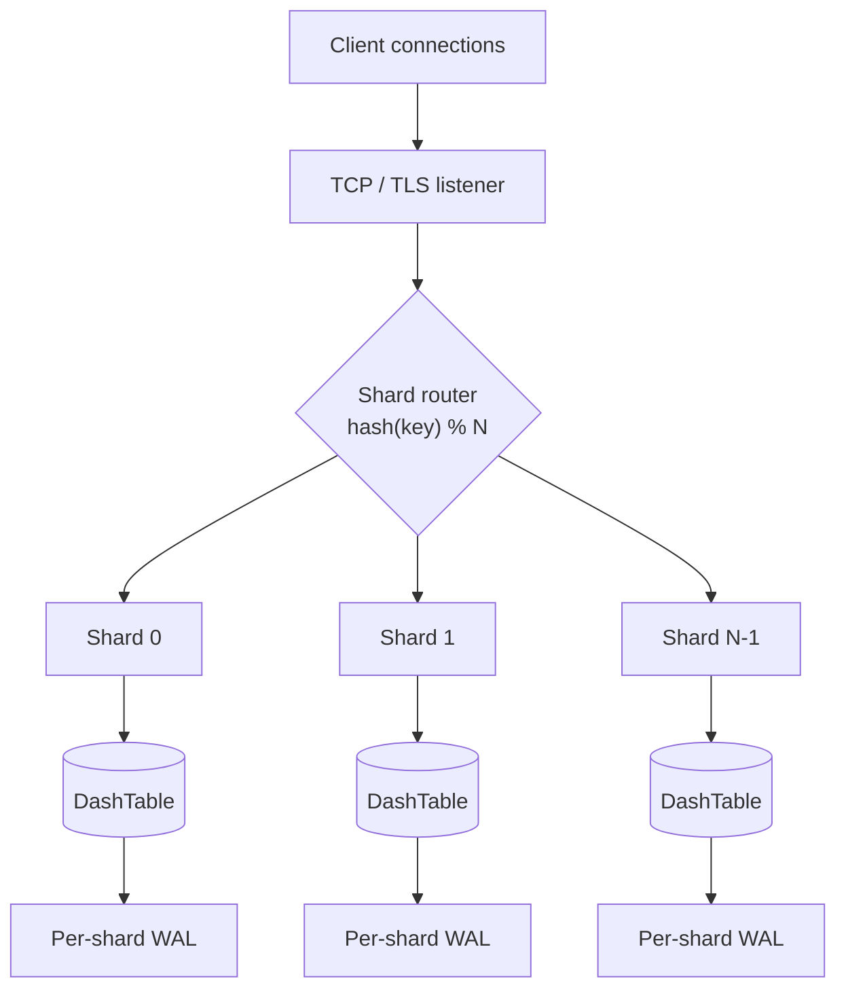
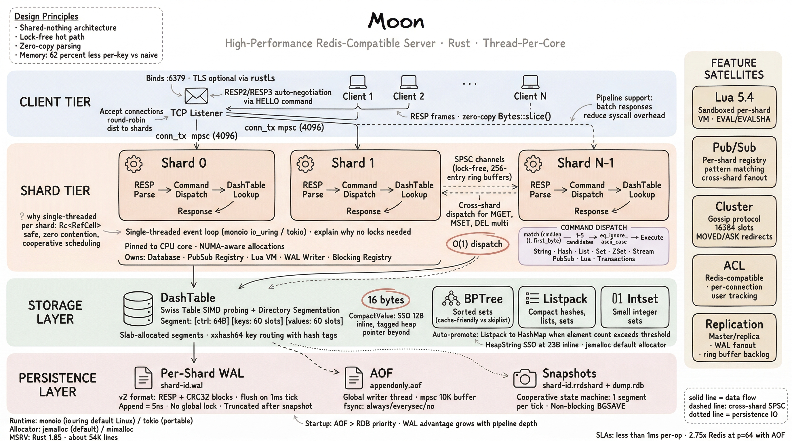
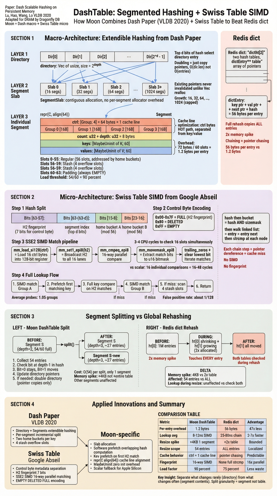
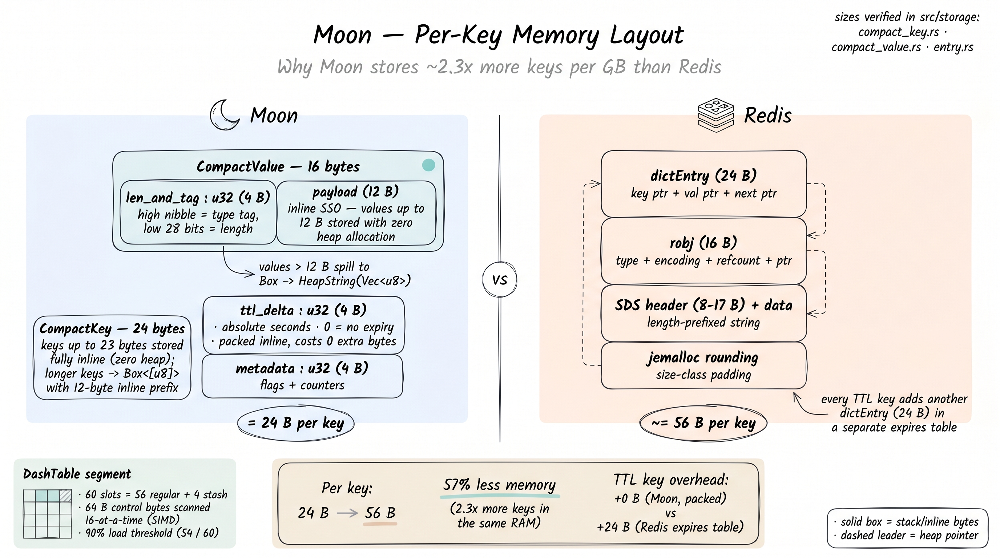
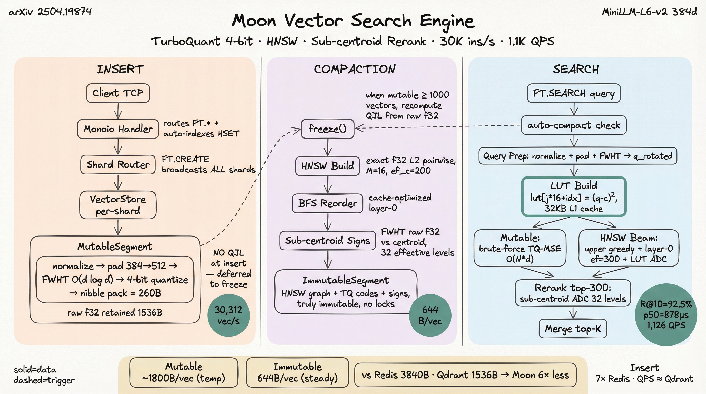
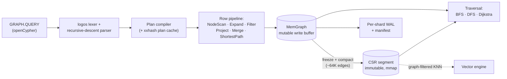
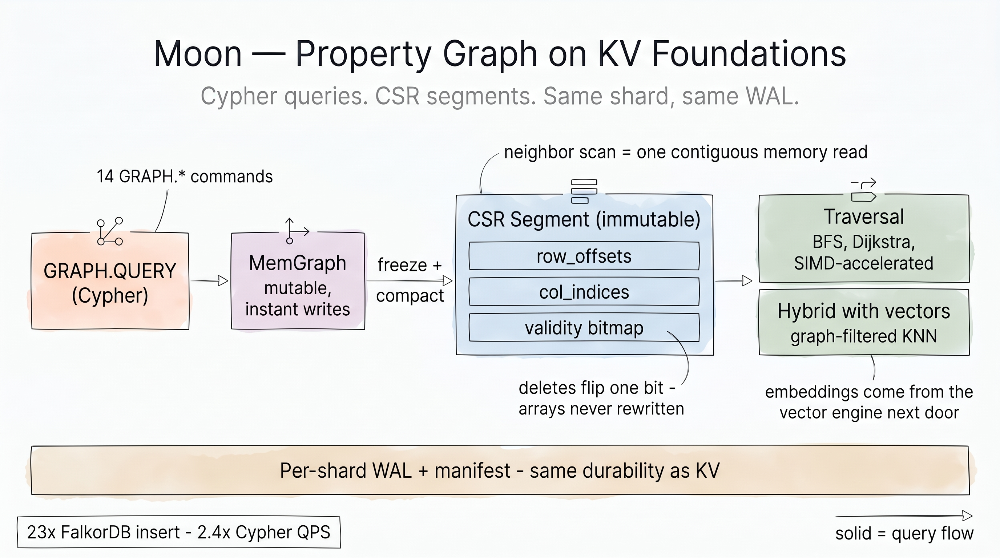

# Architecture

Moon uses a thread-per-core shared-nothing architecture where each shard runs independently on its own thread with no shared mutable state.



The full picture — request path, shard internals, storage layer, persistence, and the
feature satellites (Lua, PubSub, cluster, ACL, replication) — is shown below:

{ loading=lazy }

## Per-shard components

Each shard runs on its own thread with:

- **Event loop** — Tokio `current_thread` or Monoio `FusionDriver` runtime (io_uring on Linux, kqueue on macOS)
- **DashTable** — Segmented hash table with SIMD probing
- **WAL writer** — Per-shard persistence with no global lock
- **PubSub registry** — Cross-shard fan-out via flume (MPSC) channels
- **Lua VM** — Lazy-initialized on first EVAL command

All cross-shard communication uses lock-free message passing. No mutexes on the hot path.

## DashTable

The primary key-value engine is a segmented Swiss-table hash map with SIMD probing. Each segment holds 60 slots with a 90% load threshold.

| Property | Value |
|----------|-------|
| Segment size | ~3 KB (64B ctrl + 8B meta + 60 slots) |
| Load threshold | 90% (54/60 slots) |
| Average fill | ~67% |
| Probe method | 16-way SIMD parallel match (SSE2/NEON) |

Keys are routed to segments via xxhash. Within a segment, SIMD control-byte matching finds the target slot in a single instruction.

{ loading=lazy }

## Memory layout

Moon uses specialized compact types to minimize per-key overhead:

{ loading=lazy }

| Struct | Size | Description |
|--------|------|-------------|
| CompactKey | 24 B | Inline keys up to 23 bytes (zero heap allocation) |
| CompactEntry | 24 B | CompactValue (16B) + TTL delta (4B) + metadata (4B) |
| CompactValue | 16 B | SSO for values up to 12 bytes inline |
| HeapString | 24 B | `Vec<u8>` with no Arc overhead for non-shared values |

### Why Moon uses less memory at larger values

```
Moon:  CompactValue(16B) → Box<HeapString> → Vec<u8>(24B) → data
       Total overhead: 48 bytes + data

Redis: dictEntry(24B) → robj(16B) → SDS(8-17B + data) + jemalloc rounding
       Total overhead: ~64-80 bytes + data
```

TTL is packed as a 4-byte delta inside `CompactEntry`, costing zero extra bytes per expiring key. Redis maintains a separate `expires` hash table with a full `dictEntry` (24 bytes) per expiring key.

## Dual runtime

Moon supports two async runtimes:

| Runtime | Platform | Use case |
|---------|----------|----------|
| **Monoio** (default) | Linux (io_uring), macOS (kqueue) | Peak performance, production |
| **Tokio** | All platforms | Portability, CI, GitHub Actions |

Monoio's thread-per-core model avoids work-stealing overhead. On Linux, io_uring batch I/O amortizes syscall costs across multiple commands.

## Key optimizations

| Optimization | Impact | Component |
|-------------|--------|-----------|
| SIMD probing | 16-way parallel key match | DashTable segments |
| Lock-free oneshot | 12% CPU reduction | Cross-shard dispatch |
| CachedClock | 4% throughput gain | Per-shard event loop |
| Lazy Lua VM | -18 MB baseline | Shard startup |
| Lazy replication backlog | -12 MB baseline | Shard startup |
| Per-shard WAL | Linear scaling with shards | Persistence |
| io_uring batch I/O | Amortized syscalls | Network layer |
| Software prefetch | Overlapped fetch + hash | DashTable lookup |
| Zero-copy argument slicing | Eliminates parse buffer copies | RESP parser |
| Direct GET serialization | Bypasses Frame allocation | Response path |

## Vector search engine

Moon ships an in-process vector search engine accessed via Redis-compatible
`FT.CREATE` / `FT.SEARCH` commands. It uses **TurboQuant 4-bit quantization**
to compress f32 vectors to ~4 bits per dimension while preserving rank-order
similarity.

{ loading=lazy }

*The diagram's insert rate (~30K vec/s) measures raw mutable-segment append (brute-force, before indexing). End-to-end insert throughput including HNSW build and compaction is ~10K vec/s — see the [Performance vs Qdrant](#performance-vs-qdrant) table below.*

### Tiered segment architecture

| Segment | Backing | Search algorithm | Use case |
|---------|---------|------------------|----------|
| **Mutable** | RAM, append-only | Brute-force TQ-ADC | Active inserts |
| **Immutable** | RAM, frozen | HNSW + TQ-ADC | Hot data, post-compact |
| **Warm** | mmap'd .mpf files | HNSW + TQ-ADC | Aged-out data |
| **Cold** | DiskANN | Vamana + PQ | Massive datasets |

`HSET key field <f32_blob>` automatically encodes + indexes vectors. When the
mutable segment hits `COMPACT_THRESHOLD`, the next `FT.SEARCH` triggers
asynchronous compaction into a frozen HNSW immutable segment. Explicit
`FT.COMPACT` forces unconditional compaction (e.g., end of bulk load).

### TurboQuant 4-bit ADC

The search hot path uses **Asymmetric Distance Computation** (ADC) with a
per-query lookup table:

1. Query vector is FWHT-rotated and normalized once per query
2. A 16-entry LUT (or 32-entry with sub-centroid signs) is built per coordinate
3. HNSW beam search computes per-candidate distance via 192 nibble-indexed
   LUT lookups (for 384d) instead of 384 f32 multiply-adds
4. Distance kernel is **8-way ILP unrolled** with `unsafe` pointer arithmetic
   and 8 independent f32 accumulators (verified via objdump: 8 parallel
   `vaddss` into xmm3-xmm8 on x86)

The LUT is pre-allocated in `SearchScratch` (zero alloc per query). Sub-centroid
sign bits provide 2× quantization resolution at zero memory cost in the search
path.

### Performance vs Qdrant (10K MiniLM, 384d, real semantic embeddings) { #performance-vs-qdrant }

| | Moon ARM64 | Moon x86 | Qdrant FP32 x86 |
|---|---:|---:|---:|
| Recall@10 | 0.967 | 0.967 | ~0.95 |
| Search QPS | 843 | **1,296** | 507 |
| Search p50 | 1.20 ms | **0.78 ms** | 1.79 ms |
| Insert | 9,950 v/s | 11,270 v/s | ~2,600 v/s |

Moon beats Qdrant on QPS (2.56×), latency (2.3× lower), recall (+1.7%),
insert throughput (4.3×), and memory (~20% less per vector via TQ4).

## Graph engine

Moon ships an in-process property-graph engine queried with openCypher via
`GRAPH.QUERY` / `GRAPH.RO_QUERY`. It reuses the same per-shard, thread-per-core
foundations as the key-value and vector engines: a graph lives inside the shard
that owns it, mutates through the per-shard WAL, and snapshots to immutable
segments — no global lock, no separate process.



{ loading=lazy }

### Two-tier storage

Like the vector engine, the graph uses a mutable write buffer that freezes into
immutable read-optimized segments.

| Tier | Backing | Writes | Reads |
|------|---------|--------|-------|
| **MemGraph** | RAM, generational `SlotMap` + inline bidirectional adjacency | O(1) append, instant | adjacency-list walk |
| **CSR segment** | RAM heap or mmap'd `.csr` | frozen at ~64K edges, then read-only | contiguous neighbor scan + minimal-perfect-hash node lookup |

Nodes and edges carry properties **inline** (`SmallVec<[(u16, PropertyValue)]>`);
labels and relationship types are dictionary-encoded to `u16`. Immutable segments
store edges in **Compressed Sparse Row** form (`row_offsets` + `col_indices`), so a
neighbor scan is one contiguous memory read. Deletes flip a bit in a Roaring
**validity bitmap** — the CSR arrays are never rewritten until compaction merges
segments and drops tombstones.

The segment list is swapped with `ArcSwap`, so reads are a single lock-free atomic
load and in-flight traversals keep old segments alive across compaction.

### Cypher surface

The query path is a `logos` lexer → recursive-descent parser → linear physical-plan
compiler (with a per-graph xxhash **plan cache**) → row-based execution pipeline.
Supported clauses include `MATCH` / `WHERE` / `RETURN` (with `DISTINCT`, `ORDER BY`,
`LIMIT`, `SKIP`), `CREATE`, `MERGE` (with `ON CREATE` / `ON MATCH`), `SET`,
`DELETE` / `DETACH DELETE`, `WITH`, `UNWIND`, variable-length paths, and
`shortestPath()` (Dijkstra).

Fourteen `GRAPH.*` commands are exposed: `CREATE`, `ADDNODE`, `ADDEDGE`, `DELETE`,
`DROP`, `QUERY`, `RO_QUERY`, `EXPLAIN`, `PROFILE`, `NEIGHBORS`, `INFO`, `LIST`,
`VSEARCH`, and `HYBRID`. The last two bridge to the vector engine for
graph-filtered KNN, vector-guided walks, and graph-constrained re-ranking.

### Persistence & consistency

Mutations append to the **per-shard WAL** as RESP records and replay on recovery.
Frozen segments are written as CRC-checked `.csr` files tracked by a JSON manifest;
recovery loads the manifest, maps the CSR files, then replays the WAL tail. Every
node and edge carries **MVCC** version stamps plus **bi-temporal** `valid_from` /
`valid_to`, and `TXN.ABORT` rolls back `CREATE` / `SET` / `DELETE` / `MERGE` via an
undo log. Cross-shard traversal uses SPSC scatter-gather across shards.

!!! note "Implemented scope"

    The engine is production-grade for property-graph storage and the Cypher subset
    above (well covered by ~9K lines of integration tests). Tracked gaps, each marked
    with a phase number in the source: aggregation (`count` / `collect` are currently
    per-row no-ops), `OPTIONAL MATCH` left-join semantics, regex match (`=~`),
    multi-hop edge-variable binding (`[r*2..5]`), and wiring the label index into
    `NodeScan` (label scans are currently linear over the write buffer).

## Design inspirations

- [Dragonfly](https://github.com/dragonflydb/dragonfly) — shared-nothing thread-per-core architecture (C++)
- [Dash (VLDB 2020)](https://www.vldb.org/pvldb/vol13/p1147-lu.pdf) — segmented hash table design
- [Swiss Table / Abseil](https://abseil.io/about/design/swisstables) — SIMD control-byte probing
- [VLL (VLDB 2012)](https://www.vldb.org/pvldb/vol6/p145-ren.pdf) — lightweight multi-key coordination
- [ScyllaDB / Seastar](https://github.com/scylladb/seastar) — thread-per-core for databases
