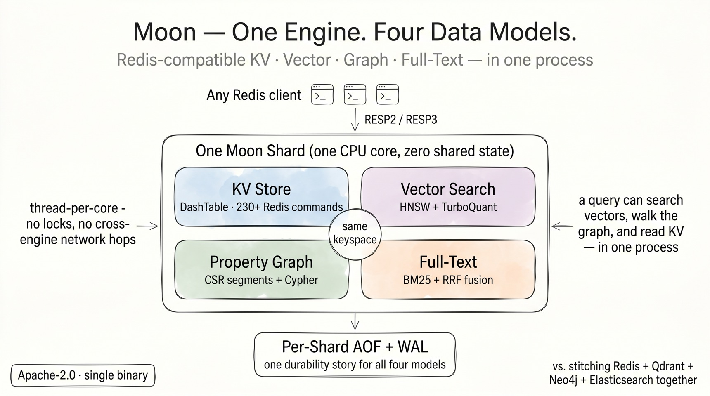
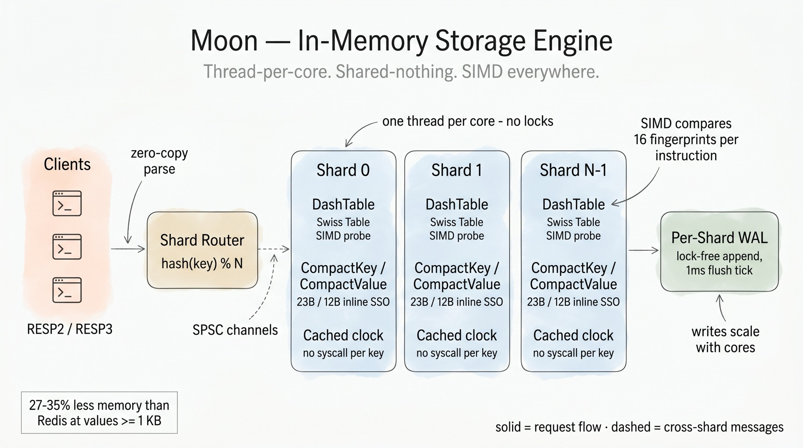
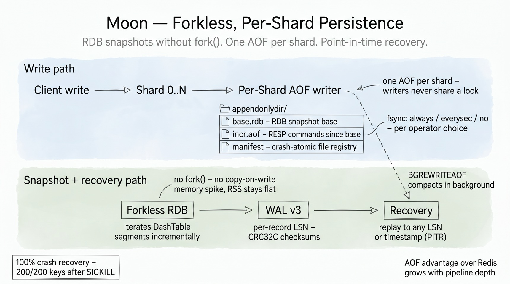
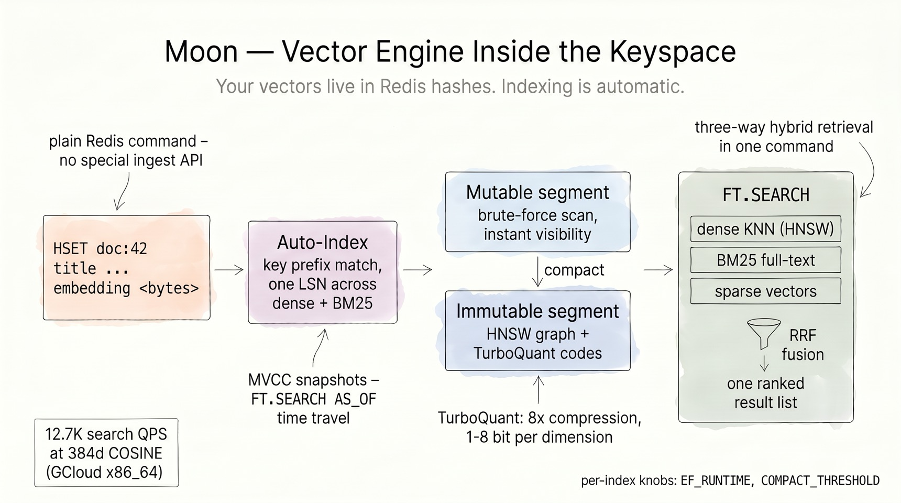
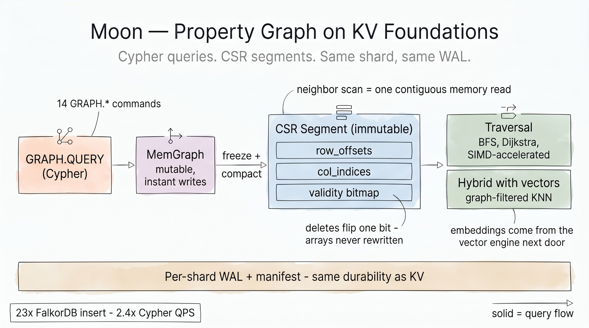
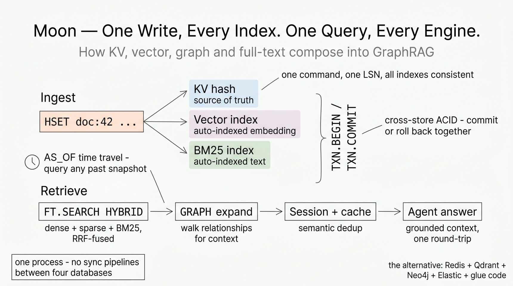
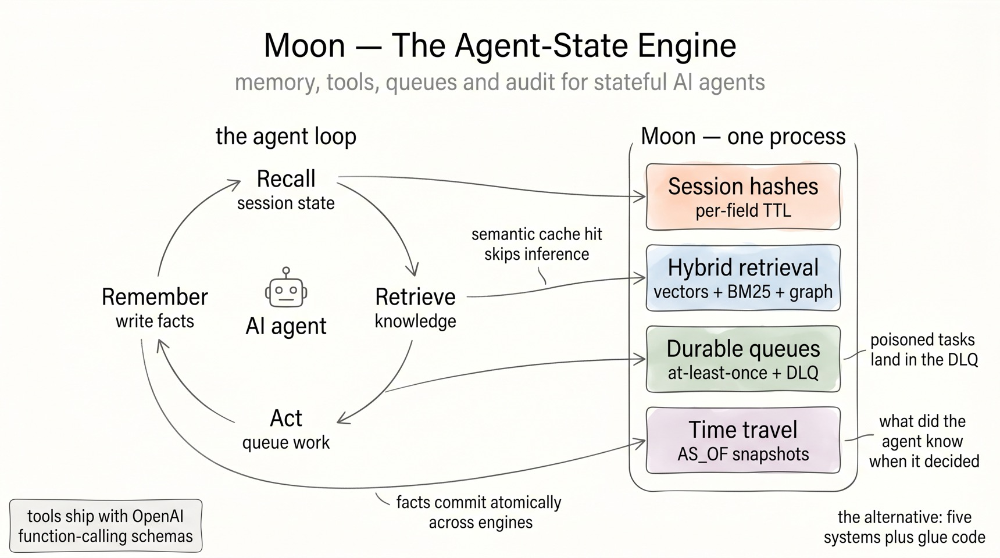

# Design Advantages

Moon is built on one architectural bet: **AI workloads — and the agents that drive
them — need KV, vectors, graphs, and full-text in the same process** — not four
databases stitched together with sync pipelines. Every section below maps to real code in the repository, with the honest
trade-offs stated alongside the wins.

## Why one engine for KV + vector + graph + text

The standard AI stack is Redis (cache) + Qdrant (vectors) + Neo4j (graph) +
Elasticsearch (text), glued together with ETL jobs that drift, double-write bugs, and
four operational surfaces. Moon collapses that into one binary because all four engines
share the same foundation:

- **One ownership model.** Each shard thread *owns* its `Database`, `VectorStore`,
  `GraphStore`, and `TextStore` outright — no `Arc`, no `Mutex`, no cross-engine
  locks. The vector store docs say it plainly: *"No Arc, no Mutex — fully owned by
  shard thread."* The text store *"mirrors the VectorStore pattern."* Adding an engine
  doesn't add contention; it adds a field on the shard.
- **One keyspace.** Vectors and text fields live inside ordinary Redis hashes. Graph
  nodes reference the same keys. There is no "sync the vector DB with the cache"
  problem because there is nothing to sync.
- **One durability story.** Every engine writes through the same per-shard
  WAL/AOF machinery with the same LSN spine, so crash recovery, point-in-time
  queries, and cross-store transactions compose instead of conflicting.
- **One wire protocol.** RESP2/RESP3 — any Redis client gains vector search, Cypher,
  and BM25 without a new driver.

The differentiator is not parity with any single specialist database. It's the
queries that only work when the engines are roommates: search vectors, walk the
graph for context, check the semantic cache, and read source-of-truth KV — in one
process, one round-trip.

## In-memory storage: thread-per-core, SIMD everywhere

Moon's hot path is engineered around three rules: never take a global lock, never
copy what you can borrow, and never make a syscall per key.

**DashTable — Swiss Table SIMD inside Dragonfly's macro-layout.** The core hash
table combines Dragonfly's directory → segments → buckets architecture with
hashbrown's Swiss Table micro-optimization. Each segment packs 64 control bytes plus
60 key/value slots; a lookup computes H1 (segment + bucket selection) and H2 (a 7-bit
fingerprint), then compares **16 fingerprints per instruction** — SSE2 on x86_64,
NEON on aarch64, with a scalar fallback. Incremental segment-split growth means no
stop-the-world rehash.

**Compact keys and values.** `CompactKey` stores keys up to 23 bytes inline (no heap
allocation); `CompactValue` is a 16-byte representation that keeps strings ≤ 12 bytes
inline and uses tagged pointers for collections. Small collections use dense
encodings — listpack, intset, B+ trees for sorted sets — just like Redis, but with
Rust's layout control. Net effect, measured: **27–35% less resident memory than Redis
at values ≥ 1 KB** (below ~64 B, Redis/Valkey small-string encodings are tighter —
stated in the README benchmarks too).

**No hidden costs per operation.** Protocol parsing is zero-copy (`Bytes` slices off
the read buffer), expiry checks read a shard-cached timestamp instead of calling
`Instant::now()` per key, and cross-shard dispatch rides lock-free `flume` SPSC
channels. Responses serialize directly into the connection's codec buffer.

**Tiered disk offload.** Under `maxmemory` pressure, cold keys spill to NVMe with
async writes and transparent read-through, instead of being evicted outright —
with crash recovery across both tiers. Under skewed load, a hot shard borrows
idle siblings' unused memory headroom (elastic per-shard budgets), so one busy
tenant uses the memory you actually configured instead of 1/N of it.

!!! note "Honest scaling note"
    A single shard already delivers peak non-pipelined throughput.
    Multi-shard pays off for pipelined (depth ≥ 16) and AOF-heavy workloads, with
    clients ≥ 25× shards, and `{tag}` hash-tag co-location for multi-key operations.
    This is documented operator guidance, not small print.

## Persistence: forkless snapshots, per-shard AOF, time travel

Redis persistence has two famous pain points: `fork()`-based snapshots that spike
memory via copy-on-write, and a single AOF that serializes all writes through one
file. Moon removes both.

**Forkless RDB.** Snapshots iterate DashTable segments incrementally inside the
shard's own event loop — no `fork()`, no COW page explosion, RSS stays flat while
the snapshot streams out.

**Per-shard AOF (multi-part).** Every shard appends to its own AOF — writers never
share a lock, so AOF throughput scales with shards instead of bottlenecking on one
file. On disk, each AOF is a *multi-part* directory in the same spirit as Redis 7:
an RDB **base** snapshot, an **incremental** RESP tail, and a crash-atomic
**manifest** that registers both (every rename is followed by a directory fsync, so
a power cut can't lose the new file name). Background `BGREWRITEAOF` compacts the
incremental tail per shard. Three fsync policies (`always` / `everysec` / `no`) and
the documented behavior that **Moon's AOF advantage over Redis grows with pipeline
depth** — the per-shard design removes the global serialization point.

**WAL v3 and point-in-time recovery.** Beneath the AOF surface, Moon's WAL v3
records carry per-record LSNs and CRC32C checksums in segmented files, with replay
*to any LSN or timestamp* — the same LSN spine that powers `FT.SEARCH AS_OF` and
`GRAPH.QUERY VALID_AT` temporal queries.

**Verified recovery.** The crash-matrix test suite SIGKILLs a live server mid-write
and requires byte-perfect recovery — 200/200 keys, on both runtimes.

## The vector engine lives inside the keyspace

Most vector databases make you run a second ingestion pipeline. In Moon, **a vector
is a field in a Redis hash**, and indexing is a side effect of `HSET`:

**Auto-indexing with transactional semantics.** When an `HSET` key matches an
index's prefix, Moon extracts the embedding (and text fields) and indexes them —
allocating **one monotonic LSN shared across the dense and BM25 paths**, so MVCC
snapshot isolation holds across both. `FT.SEARCH AS_OF` time-travels consistently;
uncommitted `TXN.*` writes stay invisible until commit.

**Segment lifecycle: fast writes, fast reads, no compromise.** Fresh vectors land in
a *mutable segment* (brute-force scanned — instantly visible, zero index-build
latency). When the segment crosses `COMPACT_THRESHOLD`, it compacts into an
*immutable segment*: an HNSW graph over TurboQuant-compressed codes. The HNSW
build runs on a background worker pool — searches keep answering from the
brute-force mutable segment while the graph builds, so compaction never stalls
the shard. Reads merge both transparently. Immutable segments are never lossily
re-encoded — a measured design decision (re-quantization collapses recall).

**TurboQuant compression.** Moon implements the TurboQuant algorithm
(arXiv 2504.19874): normalize → pad → randomized fast Walsh-Hadamard transform →
Lloyd-Max codebook → nibble-pack. **8× compression at ≤ 0.009 MSE** for unit
vectors, with 1–8 bit-per-dimension configurations, QJL-based residual correction,
and a LUT-based ADC distance path. Pick SQ8 (per-vector affine scalar 8-bit) or
FP32-HNSW for ≤ 384d workloads, TQ4 for 768d+ — the docs tell you which, instead
of pretending one setting fits all.

**Hybrid retrieval is native.** One `FT.SEARCH` can fuse dense KNN, sparse vectors,
and BM25 full-text with three-way weighted Reciprocal Rank Fusion — plus payload
filters, multi-vector fields (up to 8 named vectors per index), and per-index
`EF_RUNTIME` recall/latency tuning. Measured: **12.7K search QPS at 384d COSINE**
on GCloud x86_64 — while the same process serves your cache traffic.

## The graph engine: CSR speed on KV foundations

Moon's property graph follows the same recipe as the vector engine: a mutable
front, an immutable compact back, per-shard ownership, WAL durability.

**MemGraph → CSR segments.** Writes go to a SlotMap-backed mutable graph with
instant visibility. Compaction freezes it into a **Compressed Sparse Row segment**:
neighbor iteration becomes one contiguous memory scan (`col_indices[row_offsets[v]
.. row_offsets[v+1]]`) — the most cache-friendly layout known for graph traversal.
Edge deletions flip a bit in a Roaring validity bitmap; the CSR arrays are never
rewritten. Segments can be memory-mapped, so graphs larger than RAM stay queryable.
Node lookup uses a minimal-perfect-hash index; labels and edge types get dedicated
indexes.

**Cypher + traversal toolkit.** 14 `GRAPH.*` commands with a Cypher subset
(`MATCH`, `WHERE`, parameterized queries, `EXPLAIN`/`PROFILE`), bounded BFS/DFS,
Dijkstra with pluggable cost functions (including temporal-decay scoring for
agent-memory use cases), and SIMD-accelerated traversal kernels with
recursion-depth guards sized for worker stacks.

**Durability is shared, not bolted on.** The graph WAL, manifest, and recovery
path reuse the persistence machinery — graph mutations replay on crash exactly like
KV writes. Measured: **23× FalkorDB insert throughput, 2.4× Cypher QPS** (see
README benchmark methodology).

**Hybrid graph + vector queries** ship as four built-in patterns: graph-filtered
vector search (traverse N hops, then KNN over candidates), vector-to-graph
expansion (KNN, then expand context), vector-guided beam walk, and automatic
strategy selection by candidate-set size. These exist because `GraphStore` and
`VectorStore` are fields on the same shard — the hybrid module passes plain
references, no RPC.

## How it all composes: GraphRAG in one round-trip

Put the pieces together and the workflow that takes four databases plus glue code
elsewhere becomes one connection:

1. **Ingest:** `HSET doc:42 title "..." body "..." embedding <bytes>` — the hash is
   your source of truth; the dense index and the BM25 index update automatically
   under one LSN.
2. **Retrieve:** `FT.SEARCH ... HYBRID` fuses dense + sparse + BM25 with RRF;
   `EXPAND GRAPH` / `FT.EXPAND` walks relationships for multi-hop context;
   `FT.CACHESEARCH` answers repeated questions from the semantic cache.
3. **Trust:** `TXN.BEGIN … TXN.COMMIT` gives **cross-store ACID** — KV, vector, and
   graph writes commit or roll back together via undo logs. `FT.SEARCH AS_OF` and
   `GRAPH.QUERY VALID_AT` query any past snapshot through the bi-temporal LSN
   registry.
4. **Operate:** workspaces give multi-tenant key isolation (hash-tag routed to one
   shard), durable `MQ.*` queues feed agent pipelines with at-least-once delivery
   and dead-letter queues, and the embedded web console ships in the same binary.

Every layer of this stack — the SIMD hash table, the per-shard WAL, the segment
lifecycles, the LSN spine — exists so that the last section is possible. That's the
design advantage: **not four engines in one box, but one architecture that happens
to speak four data models.**

## Built for the AI agent era

The agent era changes what a data layer is for. An agent is a **stateful actor**: it
remembers across turns, calls tools, hands work to other agents, and has to answer
for its decisions later. The standard answer is the same sprawl this page opened
with — a session store, a vector DB, a graph DB, a queue, and glue code. Moon's
position: **agent state is one workload, and it belongs in one engine.**

**Positioned — every kind of agent memory, one shard.** Each memory type maps to an
engine that already shares the keyspace, the LSN spine, and the WAL:

| Agent memory | Moon surface |
|---|---|
| Working memory (this conversation) | Redis hashes with **per-field TTL** (`HEXPIRE` family) — scratchpad fields expire individually |
| Semantic memory (what it knows) | auto-indexed vectors + BM25, hybrid `FT.SEARCH` |
| Relational memory (how things connect) | property graph, Cypher, hybrid graph + vector |
| Episodic record (what happened, when) | bi-temporal LSN registry — `AS_OF` / `VALID_AT` snapshots |

**Prepared — the agent surfaces ship today.** None of this is roadmap:

- **Tool calling, ready-made.** [`examples/ai-agent-tools/`](https://github.com/pilotspace/moon/tree/main/examples/ai-agent-tools)
  ships OpenAI-compatible function-calling schemas for four built-in tools: `search`
  (`FT.SEARCH`), `navigate` (`FT.NAVIGATE`), `recommend` (`FT.RECOMMEND`), and
  `cache_lookup` (`FT.CACHESEARCH`). Point an agent framework at Moon and it has tools.
- **`FT.NAVIGATE` was designed for agents:** KNN seeds → bounded BFS over the
  knowledge graph → combined re-rank with a per-hop penalty — so an agent reaches
  entities *beyond* direct vector matches in one command.
- **`FT.CACHESEARCH` is a semantic-cache primitive:** probe for a semantically
  similar past query (`THRESHOLD`), fall back to full KNN on miss. Cache entries are
  ordinary hashes, so TTL is just `EXPIRE` — repeated questions skip the expensive path.
- **`MQ.*` durable queues feed multi-agent pipelines:** consumer groups on streams,
  at-least-once delivery, a max-delivery count with **automatic dead-letter queues**,
  and debounced triggers. A poisoned task ends in the DLQ, not an infinite retry loop.
- **Workspaces isolate agents and tenants:** each workspace is a private namespace,
  hash-tag routed to one shard — a fleet of agents shares one server without sharing keys.
- **`TXN.*` makes agent effects atomic across engines:** remember the fact, embed it,
  and relate it in the graph — or none of it.

**Applied — the agent loop, end to end:**

1. **Recall** — read working memory from the session hash; stale scratchpad fields
   have already expired via per-field TTL.
2. **Retrieve** — `FT.CACHESEARCH` first (a semantic cache hit skips inference); on
   miss, hybrid `FT.SEARCH` or multi-hop `FT.NAVIGATE` for grounded context.
3. **Act** — `MQ PUSH` hands work to downstream agents with at-least-once delivery;
   failures land in the dead-letter queue for inspection instead of vanishing.
4. **Remember** — one `TXN.*` block: `HSET` the new fact (auto-indexed into dense +
   BM25 under one LSN) and a `GRAPH.QUERY` to relate it to what's already known.
5. **Audit** — later, `FT.SEARCH ... AS_OF <t>` replays the exact snapshot the agent
   saw: *what did it know when it decided?*

Working examples ship in the repo: [RAG quickstart, semantic cache, GraphRAG, and
agent tool-calling](https://github.com/pilotspace/moon/tree/main/examples) — plus
`moon_memory_engine.py`, RAG + GraphRAG + session memory in ~80 lines of Python.

## Where to go next

- [Architecture](architecture.md) — shard internals and data-structure reference
- [Memory engine guide](guides/memory-engine.md) — encodings, eviction, disk offload
- [Persistence guide](guides/persistence.md) — AOF/RDB configuration
- [Full-text search](guides/full-text-search.md) — BM25 + hybrid fusion
- [Benchmarks](benchmarks.md) — methodology and reproduction steps
