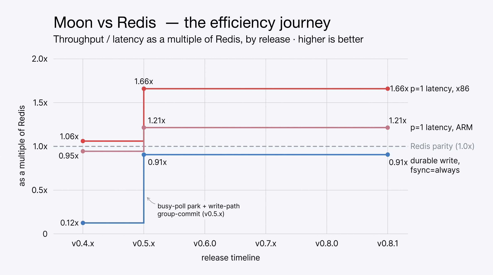
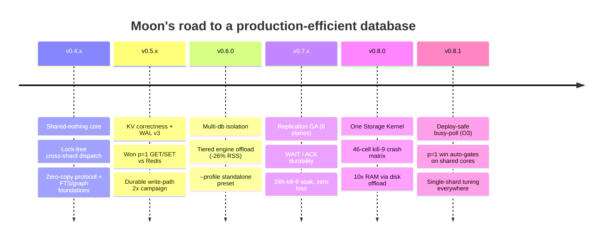
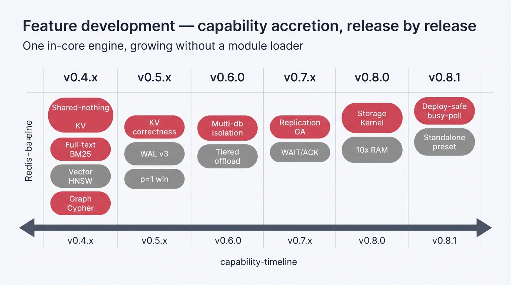
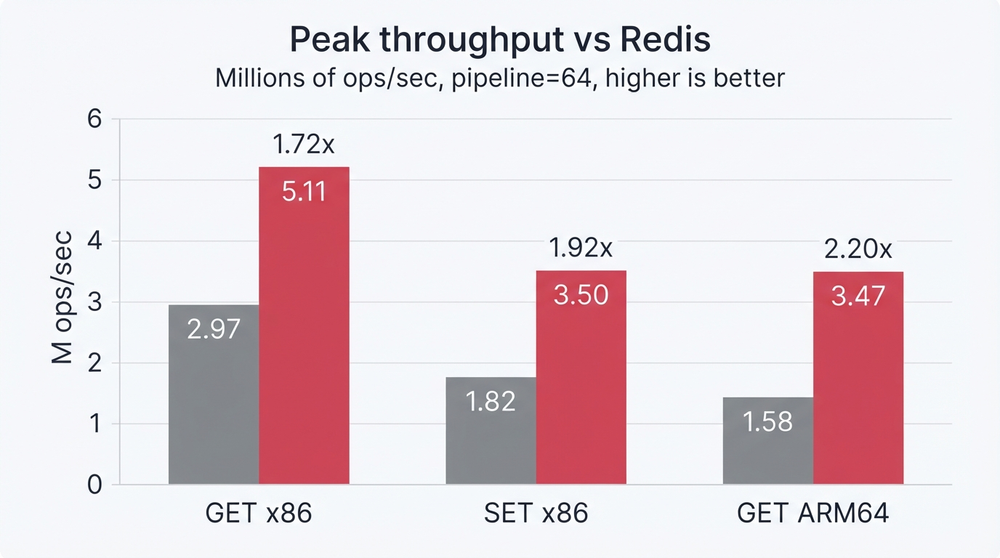
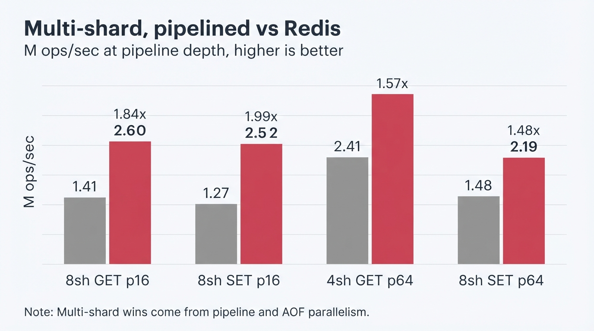
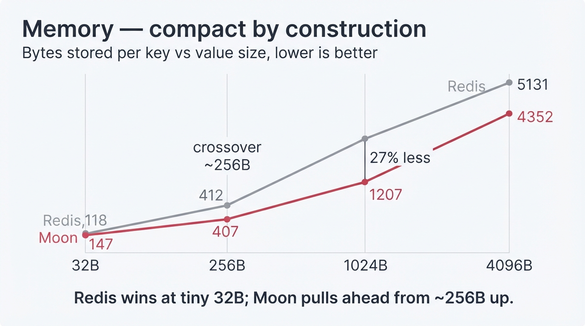
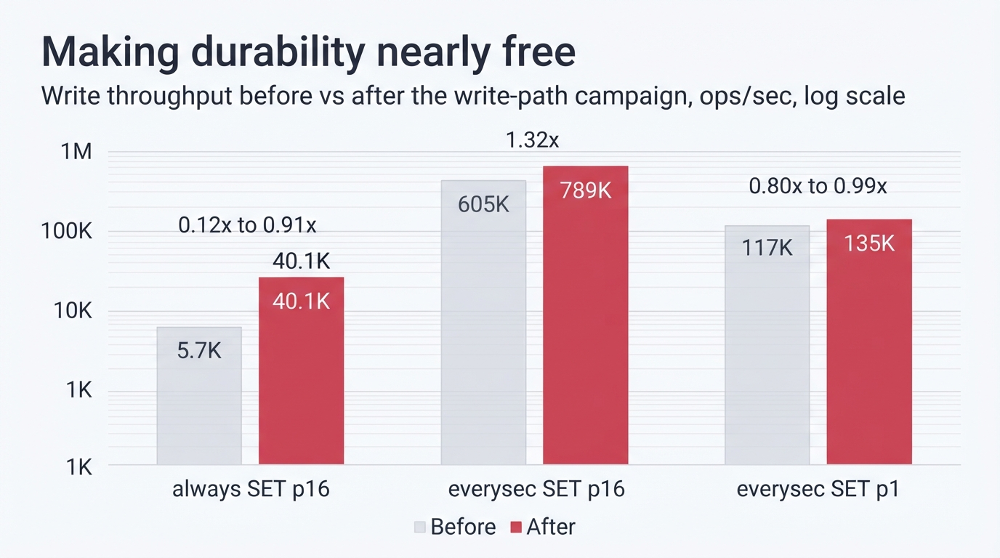
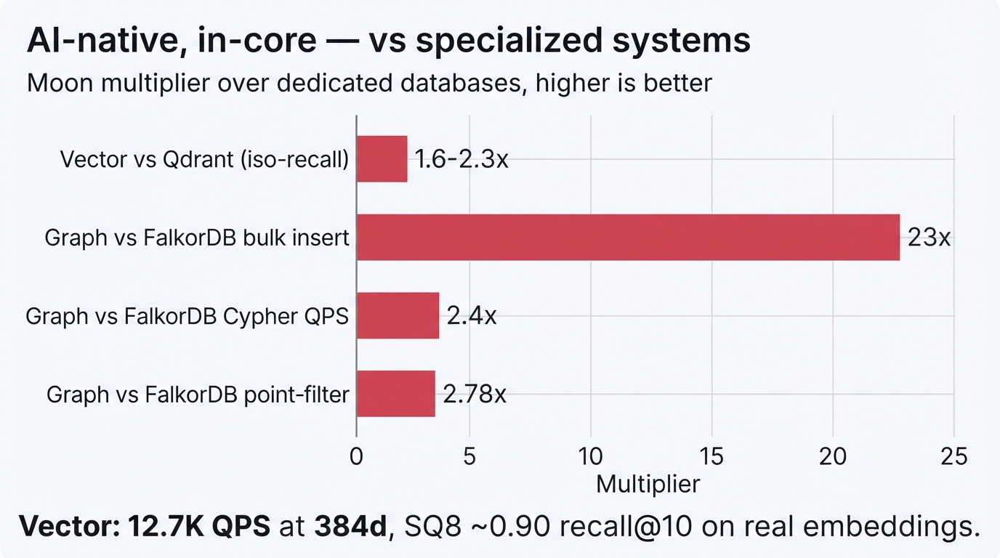

# The Moon Journey

**The goal, from day one:** a Redis-compatible server whose thread-per-core
architecture *measurably* out-scales Redis on multi-core hardware — without
sacrificing protocol compatibility or durability semantics.

Not "faster in a microbenchmark." Faster where it counts, proven on real
hardware, with the durability and correctness a production datastore is
required to keep. This page is the story of how Moon got there — and, just as
importantly, the ideas it **measured and threw away** along the road, because
"real efficiency" is what survives a benchmark, not what sounds fast.

Every number below is a measured result, and **every one of them names the host
it was measured on.** Figures marked *Linux* come from the production reference
(GCloud `c3-standard-8` x86_64 and `t2a-standard-8` ARM64); figures marked
*macOS dev reference* were measured on an Apple M4 Pro and are development
records only — `CLAUDE.md` forbids publishing them as production results, and
where Linux has since disagreed with one, this page says so instead of quietly
keeping the flattering number. The [Benchmarks](benchmarks.md) page and
[`BENCHMARK.md`](https://github.com/pilotspace/moon/blob/main/BENCHMARK.md)
carry the full methodology and raw data.

<figure markdown="span">
  { loading=lazy }
  <figcaption>
    Three efficiency curves that each crossed Redis parity, shown as a
    multiple of Redis by release. The single-connection (p=1) latency win —
    Redis's historical home turf — and the <code>fsync=always</code> durable
    write throughput both landed with the v0.5.x busy-poll + group-commit work
    and held through v0.8.1, where the O3 governor made the p=1 spin safe to
    deploy on any host. Same-instance A/B vs Redis 8.6.1.
  </figcaption>
</figure>

---

## The thesis: efficiency is a shared-nothing problem

Redis is single-threaded by design. On a modern many-core box that leaves
throughput on the table, and its one global AOF file serializes every durable
write. Moon's bet was that a **thread-per-core, shared-nothing** design — each
shard owning its slice of the keyspace, its own event loop, and its own
write-ahead log — could turn those cores into linear throughput and durable
writes into a parallel, not a serial, operation.

The bet paid off, but only after the hard parts were solved: cross-shard
dispatch overhead, the single-connection latency floor, allocator pressure,
and making durability *free* instead of an 11× tax. The releases below are
that work.

---

## Milestone arc

| Release | Headline | The efficiency it bought |
|---|---|---|
| **v0.4.x** | Shared-nothing core + performance + FTS/graph foundations | Per-shard keyspace, lock-free cross-shard `flume` dispatch, zero-copy protocol parsing |
| **v0.5.x** | KV correctness + the p=1 win + WAL v3 | Beat Redis at single-connection GET/SET (its historical best case); durability write-path 2× campaign |
| **v0.6.0** | Multi-db isolation + tiered engine offload | db-scoped indexes + per-db quotas; vector segments demote HOT→WARM→COLD for **−26% RSS**; `--profile standalone` |
| **v0.7.x** | Replication GA for multi-shard masters | `WAIT`/`ACK` across all six data planes; **24 h kill-9 soak, zero acked-write loss** |
| **v0.8.0** | One Storage Kernel — kill-9-lossless + 10× RAM | Every plane crash-durable (46-cell matrix); datasets 10× RAM via disk offload with truthful accounting |
| **v0.8.1** | Deploy-safe busy-poll + single-shard preset | The p=1 latency win auto-gates on shared cores — safe on *any* host, not just pinned ones |

Full detail per release: [RELEASES.md](https://github.com/pilotspace/moon/blob/main/RELEASES.md)
· [CHANGELOG.md](changelog.md).

Capabilities accreted without a module loader — every engine compiles into the
one binary and shares the keyspace, durability, and crash matrix:

{ loading=lazy }

*From a shared-nothing KV core with FTS/vector/graph foundations to a
crash-lossless storage kernel with replication — one binary, growing.*

---

## What was achieved — by dimension

### Throughput: turning cores into ops/sec

| Metric | Moon | vs Redis | Conditions |
|---|---:|:---:|---|
| Peak GET (v0.1.6) | **5.11M ops/sec** | **1.72×** | **Linux**, GCloud c3-standard-8 x86_64, p=64. Redis `io-threads` setting and payload size not recorded — BENCHMARK.md §2.1 |
| Peak SET (v0.1.6) | **3.50M ops/sec** | **1.92×** | same run — §2.1 |
| Peak GET (ARM64, v0.1.6) | **3.47M ops/sec** | **2.20×** | **Linux**, GCloud t2a-standard-8 Neoverse-N1, p=64 — §2.1 |
| Peak GET (v0.8.7, current tree) | ratio only | **2.40× x86 / 2.29× ARM** | **Linux**, GCE c3/t2a, Redis 7.0.15, `--shards 1`, c=50, p=64 — §2.12 |
| 8-shard SET p=16 | 2.52M ops/sec | **1.99×** | **macOS dev reference** (Apple M4 Pro), c=50 — §4.2 |

!!! warning "Scope: this is the GET/SET inline path, not the whole command surface"
    On Linux, v0.8.7 measures **every non-inlined command family — INCR, LPUSH,
    SPOP, HSET — at 0.40–0.67× Redis at p≥8** (BENCHMARK.md §2.12). `SET k v`
    runs 2.08× Redis; `SET k v EX 100`, the same work with one disqualifying
    option, runs 0.87×. The boundary is the fast path, not the engine.

{ loading=lazy }

*Peak throughput vs Redis 8.6.1 on the GCloud production reference (pipeline=64).*

Sharding does scale, and an earlier version of this page said otherwise. The
claim that "1→8 shards is flat-to-slightly negative" was a **harness artifact**:
`redis-benchmark -t lpush|sadd|hset|zadd` drives ONE literal key and `-r`
randomises the *element*, not the key — so eight of twelve command families were
being asked to parallelise a single key, and 0.97× was the tautological answer.
Re-run on Linux with explicit `__rand_int__` keys under a `DBSIZE ≥ 50000` guard
proven to fire, moon's real 8-shard-over-1-shard scaling is **1.42× at p=1,
2.14× at p=8, and 3.79× at p=64** (BENCHMARK.md §2.14; Redis `io-threads` 8-over-1
over the same matrix is 1.19× / 1.23× / 1.08×). A genuinely single-hot-key
workload still cannot be sharded — that part was always true — and the
multi-shard win is amplified further by the per-shard WAL and independent event
loops parallelizing *pipelined* and durable work, plus hash-tag co-location:

{ loading=lazy }

*At pipeline depth, the per-shard WAL parallelizes work that Redis's single
event loop serializes — 1.48–1.99× across multi-shard configs. Apple M4 Pro
development reference (BENCHMARK.md §4.2); not reproduced on Linux.*

### CPU efficiency: a tie on cost, a win on stability

**On Linux, CPU per operation is a tie.** Moon `--shards 8` costs 10.55 µs/op
against Redis `--io-threads 8`'s 11.33 µs/op (GCE t2a-standard-8,
`utime+stime` from `/proc/<pid>/stat`, 5 reps, BENCHMARK.md §2.14). Moon's 6.9%
edge sits inside Redis's own 11.9% run-to-run spread, so it is not a win. What
*is* durable is stability: moon's CPU cost varies 2.0% run to run against
Redis's 11.9%, the latter being `stopThreadedIOIfNeeded` engaging and
disengaging io-threads under steady load.

This page previously claimed "23× less CPU" here. That figure has been
**withdrawn**: it came from an Apple M4 Pro table, its CPU column was sampled
with `ps -o %cpu=` (a process-lifetime average, not steady-state load), and its
CPU and RPS columns were not taken in the same run. Three independent reasons
not to publish it, and it was published under a Linux heading.

The engineering behind the cost that *is* measured is real, not incidental: lock-free oneshot channels
removed ~12% CPU of `pthread_mutex` contention, the cached shard clock removed
~4% of `clock_gettime` syscalls, and zero-copy parsing keeps the hot path
allocation-free. Idle cost was hunted just as hard — the adaptive idle-park and
an O(1) page-cache resident counter trimmed idle-shard CPU from **3.1% to
~0.5–0.9%**, and the O3 contention governor makes the busy-poll spin
*self-disengaging* on contended cores. Efficiency that shows up on the
electricity bill, not just the benchmark. Those component figures are profile
deltas from the optimisation work, not a Moon-vs-Redis ratio.

### The p=1 conquest — Redis's home turf

Unpipelined, single-connection request/response was historically Redis's best
case and Moon's weakest. The `--io-busy-poll-us` poll-mode park closed it:

- **1.19–1.21× Redis on ARM** (c4a Axion), **1.65–1.66× on x86** (c3) — Linux,
  same-instance A/B, n=3, **on dedicated cores**.

Re-measured on ordinary shared-tenant GCE instances (v0.8.7, BENCHMARK.md §2.12)
the same flag yields **1.06–1.08× on x86 and nothing outside the noise floor on
ARM**, because the contention governor correctly self-gates there. Quote the
dedicated-core figures only with that word attached.

The honest catch was that the spin regressed on shared cores. **v0.8.1's O3
governor removed the catch**: each shard samples its own involuntary-preemption
rate and gates the spin automatically, so the win is safe on any host. One
flag — `--profile standalone` (or [`conf/moon-standalone.conf`](https://github.com/pilotspace/moon/blob/main/conf/moon-standalone.conf)) —
now delivers the best single-shard tuning everywhere.

### Latency: lower queue depth, unmeasured on Linux

Multi-core parallelism reduces per-shard queue depth, so the median request
should wait less. **That has not been measured on a Linux host**, and the
"8–10× lower p50" figure this page used to carry has been withdrawn: it was an
Apple M4 Pro development reference published under a Linux heading, and it came
from `redis-benchmark`, a closed-loop tool that under-reports latency once the
server saturates. The raw macOS numbers are kept, correctly labelled, in
BENCHMARK.md §9.1.

### Memory: a macOS win that Linux did not reproduce

!!! danger "Provenance — these two rows are a macOS development reference"
    They were measured on an Apple M4 Pro, not on Linux, and the Linux
    measurement reaches the opposite conclusion. **BENCHMARK.md §2.14**
    (GCE t2a-standard-8, moon `--shards 8` vs Redis
    `--io-threads 8 --io-threads-do-reads yes`, `-r 200000`, 3 reps) puts moon at
    0.94× at 8-byte values, **1.16× *worse* at 64-byte values**, 0.97× at
    256-byte, and **1.26× *worse* on idle RSS** — and it retracts an earlier
    per-key memory win as an artifact of `redis-benchmark`'s default 3-byte
    value, where both legs measured below their own arithmetic floor. Per-key
    memory at 1 KB+ values has **not** been re-measured on Linux, so the rows
    below have no Linux backing.

| Value size (1M keys) | Redis/key | Moon/key | Result | Host |
|---|:---:|:---:|:---:|:---:|
| 1,024 B | 1,571 B | **1,153 B** | **27% less** | macOS dev reference |
| 1,024 B (63K keys) | 1,879 B | **1,207 B** | **1.56×** | macOS dev reference |

{ loading=lazy }

*Per-key memory vs value size on the Apple M4 Pro development rig: Redis wins at
tiny 32 B values, the lines cross near 256 B, and Moon pulls ahead from there.
The Linux measurement (BENCHMARK.md §2.14) does not reproduce this shape — there
the crossover runs the other way and Moon loses at 64 B.*

`CompactKey` stores keys up to 23 bytes inline and `CompactValue` up to 12
bytes; larger payloads use `HeapString(Vec<u8>)` (48 B overhead) versus Redis's
`robj` + SDS chain (64–80 B). TTL packs as a 4-byte delta inside the entry at
zero extra cost, where Redis allocates a separate 24-byte `dictEntry` per
expiring key. (At tiny 32 B values Redis still wins on per-key overhead — Moon
is honest about that; the crossover is ~256 B.) Baseline RSS measured identical
on the same macOS rig (7.0 MB empty) — on Linux, §2.14 puts moon's 8-shard idle
RSS **1.26× above** Redis's, roughly 520 KB per extra shard, four threads per
shard. Tuned jemalloc decay (1 s dirty, background reclaim) returns
freed pages to the OS instead of hoarding them.

### Durability: making it free

The per-shard WAL turns durable writes from a global serialization point into a
parallel one. A 2026-07 write-path campaign closed the remaining gaps:

| Policy / workload | Before | After | vs Redis |
|---|---:|---:|:---:|
| `always` SET p16 | 5.7K (0.12×) | **40.1K** | **0.91×** |
| `everysec` SET p16 | 605K | **789K** | **1.32×** |
| `everysec` SET p1 | 117K (0.80×) | **135K** | **0.99× parity** |
| Pub/sub fan-out | 438 msg/s (with drops) | **5.09M msg/s** | **1.04×, zero drops** |

{ loading=lazy }

*The write-path campaign turned the fsync tax into near-parity: `always` p16
climbed 0.12×→0.91× of Redis, `everysec` p16 to a 1.32× win.*

Per-batch group commit (one `fsync` per pipeline batch, not per command), a
single coalesced `write_all`, and a park-free AOF writer that deleted a
~150K/sec futex-wake storm. Durability semantics are unchanged (`always` = RPO
0, `everysec` = RPO ≤ 1s) and verified by the SIGKILL crash-recovery matrix.

---

## AI-native — in-core, not bolted on

Vector search, full-text (BM25), and a property graph are compiled into the
same binary, sharing the keyspace and durability — no module loader.

- **Vector:** **12.7K search QPS at 384d** (HNSW + TurboQuant, COSINE), and
  bulk load → searchable at target recall **beats Qdrant 1.6–2.3×** via the
  parallel HNSW build. SQ8 quantization holds ~**0.90 R@10** on real MiniLM
  384-d embeddings across the full lifecycle (search / merge / persistence).
- **Graph:** **23× FalkorDB** on bulk insert, **~2.4× Cypher QPS**, and
  **2.78×** on point-filter queries after the mutable-property fast path.
- **Tiered engine offload:** idle vector-index segments demote
  HOT → WARM (mmap) → COLD (unloaded stub, reload-on-search), giving memory
  back — **−26% process RSS** on a 40K × 768d corpus with identical search
  results after reload.

{ loading=lazy }

*In-core vector and graph engines measured against the dedicated systems they
replace — Moon's multiplier on each.*

---

## Production hardening — the part that makes it a database

Efficiency means nothing if a `kill -9` loses data. The **v0.8.0 Storage
Kernel** made durability a verifiable claim across every plane:

- **Cross-plane kill-9 crash matrix:** a **46-cell** matrix (KV / vector /
  graph / FTS / workspaces / MQ / temporal / txn × persistence mode ×
  disk-offload × shard count), all green — wired into scheduled CI (nightly
  full matrix + weekly `ITERS=20` soak).
- **10× RAM datasets under disk offload:** 2.6 GB of 10 KB values against a
  256 MB cap — truthful `used_memory` at **1.00× cap** steady-state, spill
  files cut from ~236,000 (one per key) to **840** (**~280× fewer**), worst
  cold-GET tail during an active spill flood **1,910 ms → 205 ms (9.3× better)**,
  and **500/500 kill-9 integrity**.
- **Replication GA:** real async replication with `WAIT`/`ACK` across all six
  data planes, validated by a **24-hour kill-9 soak** — 114 alternating
  master/replica kills, **82,044 `WAIT`-acked writes, zero lost**.

---

## The discipline: efficiency is what survives measurement

The reason the numbers above hold up is a rule the project keeps: **no measured
win → no hot-path change.** That rule is only credible because of what it
*rejected*. A representative sample of ideas that sounded fast and were thrown
out on the evidence:

- **Value-line prefetch** — measured "3–6% faster" until disassembly showed the
  benchmark's `black_box` never dereferenced the value; a forced-load harness
  showed it was **1–2% slower**. Cut, and a cache-exceeding probe bench shipped
  so the trap can't recur.
- **A lock-free `Notify`** replacing the `flume` channel — fully validated
  (loom lost-wake model, consistency suites, both-impl A/B) but **neutral** on
  the wall clock, because the wake is syscall-dominated. The `flume` channel
  stayed.
- **Transparent huge pages by default** — real PMU gains (+12–24% GET), but a
  45-minute RSS-drift soak showed idle khugepaged re-collapse drifts RSS
  **+31%**. Kept permanently **opt-in**, not the default.
- **Per-segment `ef/√G` beam splitting** for vector search — silently cost
  recall (0.9915 → 0.9295). Rejected; a recall-certified adaptive scheme
  shipped instead.

None of these are failures — they're the cost of knowing the wins are real.
The efficiency Moon ships is the efficiency that survived.

Backing that discipline: **~4,980 tests**, 11+ `cargo-fuzz` targets, loom
models for every lock-free structure, `unsafe`/`unwrap` ratchets that block new
unannotated uses, an RSS-regression CI gate, and the crash matrix above.

---

## Where it's going

Moon is on a path to a **v1.0 GA** with every
[Production Contract](PRODUCTION-CONTRACT.md) box ticked. Next up: horizontal
scale — cluster-on-monoio hardening and multi-shard replicas — then the
enterprise foundation. The method won't change: measure, ship what wins, and
say so honestly when it doesn't.

*See the live numbers on the [Benchmarks](benchmarks.md) page, the full
per-release history in [RELEASES.md](https://github.com/pilotspace/moon/blob/main/RELEASES.md),
and the GA scorecard in the [Production Contract](PRODUCTION-CONTRACT.md).*
