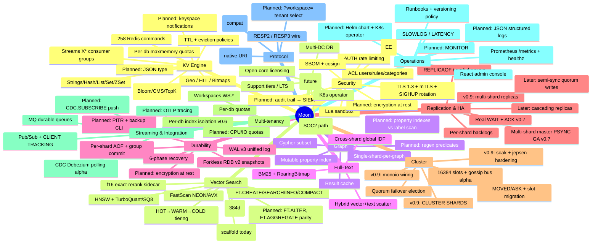

# Moon Product Roadmap — v0.7 → v1.0 → Enterprise

**Status:** Owner-approved · **Rev 2:** 2026-07-15 (post-v0.7.1; v0.8 re-slotted to Storage Kernel GA) · **Current release:** v0.7.1 (2026-07-15, PR #336)
**Companion docs:** [Scale & HA architecture](scale-ha-architecture.md) · [Standalone horizontal scale](standalone-horizontal-scale.md)
*(The commercial Enterprise Edition plan is maintained privately.)*

---

## 1. Where Moon stands today (honest state of the project)

Moon is a single-binary, Redis-compatible, multi-model data engine in Rust: **KV (258 commands)
+ Vector search + Property graph (Cypher subset) + Full-text (BM25) + Streams + Pub/Sub + CDC
+ Transactions + Workspaces (multi-tenancy)**, on a thread-per-core, shared-nothing shard
architecture with a unified WAL v3 log and 6-phase crash recovery.

### Proven strengths (evidence-cited)

| Area | Standing | Source |
|---|---|---|
| Pipelined KV throughput | 1.7–2.6× Redis at P=64 across x86/ARM/macOS | BENCHMARK.md §1 |
| p=1 single-op | Wins x86 +4.7% (n=3); loses ~8% on ARM — arch-split, needs `--io-busy-poll-us` | tmp/KV-FULLPROOF.md |
| Vector vs Qdrant | 8.9–10.9× ingest, 2.5–3.4× search QPS at iso-recall ≥0.999 | BENCHMARK.md §10.7–10.9 |
| Graph vs FalkorDB | 21–26× build; wins/ties point queries after P1+P2 waves | BENCHMARK.md §11 |
| Durability engineering | WAL v3 unified log, group commit, crash-matrix + jepsen-lite CI, kill-9 suites | integration-tests.yml |
| Replication (v0.7 GA) | Multi-shard master → streaming replica across all 6 data planes, real WAIT/ACK; 24h kill-9 soak, zero acked-write loss | RELEASES.md v0.7.0 |
| Storage kernel | Typed WAL plane, per-plane durable floors + min-across-planes recycle, atomic-write util, per-plane memory accounting; 42-cell cross-plane crash matrix | PRs #286–#301 (kernel M0–M3) |
| Tiered storage (10× RAM) | 2.6GB dataset on 256MB cap: 95% hot-hit p99 1.84× in-RAM, kill-9 restart-to-PONG 3.7s | G2 acceptance 2026-07-13 |
| Quality posture | ~4,980 tests, 11 fuzz targets, loom models, unsafe/unwrap ratchets, RSS-regression CI gate | ci.yml, fuzz/ |
| Release engineering | Docker/musl/deb/rpm/systemd/Homebrew, CycloneDX SBOM, cosign signing | release.yml |
| Hidden assets | React admin console (RedisInsight-class, embedded), CLIENT TRACKING fully wired, Debezium CDC (alpha) | console/, src/tracking/, src/cdc/ |

### Reality check — what is capped or missing

*(Rev 2 note: the v0.6.1/v0.7.0 cycle closed the original top gaps — multi-shard master PSYNC,
real WAIT/ACK, cold-tier TTL leak, ACL early-intercept hole, shardslice waiver (retired at
v0.7.0), and the hygiene ledger. Remaining gaps below.)*

*(2026-07-16 correction: this Rev 2 pass had re-listed "atomic-write stragglers (task #49)" as
an open v0.8 gap below and as v0.8 item 1 in §4. Verified against the code during v0.8 close-out
work: all 7 sites (ACL SAVE, nodes.conf, CONFIG REWRITE, replication state, native BGSAVE,
clog, kv_page) were already converted to `atomic_write_durable` in PR #304 — merged 2026-07-13,
*before* this Rev 2 pass, and its CHANGELOG entry landed under the v0.7.0 release section, not
Unreleased. Task #49 was never actually an open v0.8 item; the row below and the item in §4 have
been removed/struck accordingly.)*

| Gap | Detail | Impact |
|---|---|---|
| **Streaming replica is single-shard only** | Multi-shard work in v0.7 is master-side (merged N-shard PSYNC feed); replicas run `--shards 1` | Disclosed v0.7 limitation; replica can't use thread-per-core — slotted v0.9 |
| **Cluster mode is alpha, tokio-only** | Bus/gossip spawn only in the tokio startup block; monoio (production) startup omits it (`main.rs`) | Cluster mode does not run on the production runtime — slotted v0.9 |
| `used_memory` accounting under offload (task #56) | Reports 406–762MB against a 256MB cap during 10×-RAM runs (worse post-restart) | Undermines the 10×-RAM claim's operator story — v0.8 close-out |
| Spill format scale | One-file-per-key heap spill → O(keys) file counts; sweep/manifest scale with it | v0.8 close-out (batch into segments) |
| No encryption at rest | WAL/AOF/RDB plaintext | Blocks regulated buyers — v0.10 |
| No keyspace notifications, no MONITOR | Slipped from v0.7 (R5) | Common SRE/integration expectations — re-rank at v0.9 planning |
| `moon://` URI implementation | Spec doc shipped (H-7); `src/uri.rs` implementation (R6) slipped | Re-rank at v0.9 planning |
| Vector 384d recall/QPS | Trails RediSearch ~16× QPS at 384d (quantization codebook mis-fit at low d) | Diagnosed; TQ⁺ per-coordinate calibration is the candidate fix — v0.10 |
| Client ecosystem | Only redis-py/go-redis/redis-rs CI-tested; Java/Node/.NET "planned" | Enterprise adoption friction — v0.10 |

---

## 2. Vision & positioning

**Moon is the multi-model Redis replacement for the AI era**: one binary that serves cache,
vectors, graph, text, and streams at thread-per-core speed, with database-grade durability
(unified WAL, real crash recovery) that Redis never had.

Positioning axes:
- **vs Redis/Valkey** — same protocol, more models, real durability, faster pipelined/vector paths.
- **vs Dragonfly** — comparable modern architecture; Moon differentiates on multi-model (vector/graph/FTS/CDC) and unified WAL durability.
- **vs Qdrant/RediSearch** — vector engine embedded in the cache tier, iso-recall wins vs Qdrant already measured.
- **vs Redis Enterprise** — the open, single-binary path to HA + tiering, then a commercial enterprise layer (planned separately).

---

## 3. Features mindmap



---

## 4. Release train

Observed velocity: 19 releases in ~3.5 months; ~4-day point-release cycle. The train below is
deliberately aggressive but each release has a **single headline** and hard exit criteria.

| Release | Target | Headline | Theme |
|---|---|---|---|
| ~~v0.6.1~~ | *folded into v0.7.0* | Hygiene + reliability hotfix | Shipped inside the v0.7.0 train (tag hygiene, TTL leak, ACL audit, doc reconciliation) |
| **v0.7.0** | ✅ **shipped 2026-07-14** | **Replication GA for multi-shard masters** | The HA unblock; also absorbed storage-kernel M0–M4 |
| **v0.7.1** | ✅ **shipped 2026-07-15** | SQ8 CPU-storm fix + deterministic replica TTL | Patch |
| **v0.8.0** | 2026-08 | **One Storage Kernel: kill-9-lossless on every plane + 10× RAM datasets** | Close-out + verification of the already-built kernel (owner decision 2026-07-15) |
| **v0.9.0** | 2026-10 | **Horizontal scale: cluster GA-hardened on monoio + multi-shard replicas** | Re-slotted from v0.8; adds the replica-side shard gap |
| **v0.10.0** | 2026-12 | **Enterprise foundation** | Encryption at rest, audit, ecosystem (re-slotted from v0.9) |
| **v1.0.0** | 2027-Q1 | **GA / production contract fulfilled** | Stability promise, LTS |
| **Moon EE 1.0** | 2027-Q2 | Commercial enterprise layer EA→GA | Planned privately (open-core: CE never loses features) |

### v0.6.1 + v0.7.0 — SHIPPED (2026-07-14) · v0.7.1 (2026-07-15)

The v0.6.1 hygiene scope was folded into the v0.7.0 train and shipped with it. v0.7.0's exit
criterion was met with one disclosed narrowing: a `--shards N` master replicates to a
**single-shard** streaming replica (multi-shard replicas re-slotted to v0.9), survives kill-9 on
either side with zero `WAIT`-acked loss, validated by a 24h soak (run dir
`moon-dev:~/moon-soak/runs/20260714-141946`). The cycle also absorbed the entire storage-kernel
build-out (M0–M4, PRs #286–#301/#313/#319/#323) originally proposed for v0.8.

Slipped from the v0.7 plan (unscheduled; re-rank at v0.9 planning): keyspace notifications +
MONITOR (R5), `moon://` URI implementation (R6 — spec doc H-7 shipped). v0.7.1 added the
master-side absolute-TTL rewrite + role-gated replica expiry (task #71b) and the SQ8/TQ
CPU-error-storm fix (task #73).

### v0.8.0 — One Storage Kernel GA (close-out + verification)

Exit criterion: *the 42-cell cross-plane kill-9 crash matrix runs green in scheduled CI on both
shard configs; the 10×-RAM acceptance re-passes on real disk with truthful `used_memory`; the
benchmark report and PRODUCTION-CONTRACT rows are published.* The kernel itself is built — this
release converts it into a verifiable public claim.

1. ~~**Task #49 — atomic-write straggler sweep**~~: ✅ already shipped (PR #304, merged
   2026-07-13, released as part of v0.7.0) — all 7 bare-write sites (ACL SAVE, nodes.conf,
   CONFIG REWRITE, replication state, native BGSAVE, clog, kv_page) route through
   `atomic_write_durable`. Verified against HEAD during v0.8 close-out (2026-07-16): no
   regression, no new bare-write site introduced since. No v0.8 action needed.
2. **Task #56 — `used_memory` truth under offload**: reconcile accounting so a 256MB-cap
   10×-RAM run reports ≤ cap (or documents exactly what the overage is); fix the post-restart
   regression.
3. **Spill-file batching**: one-file-per-key heap spill → segment files (≤N keys/file already
   exists for batches; make it the only shape), shrinking orphan-sweep and manifest scale.
4. **Crash-matrix CI**: wire `tests/crash_matrix_cross_plane.rs` (+ `MOON_CRASH_MATRIX_ITERS`
   soak) into a scheduled workflow; confirmation run proving all former RED cells stay green.
5. **G2 re-run on real disk** (post-#323 async cold-read fix): re-measure the cold-GET-during-
   spill tail that previously hit 1.91s; publish the 10×-RAM benchmark report.
6. PRODUCTION-CONTRACT: tick CRASH-02 / MEM-10X rows with evidence links.

### v0.9.0 — Horizontal scale: cluster hardening + multi-shard replicas

Exit criterion: *3-master × 3-replica cluster on monoio survives node kill (auto-failover < node_timeout×2),
live slot migration under load with zero lost acknowledged writes, 72h soak, jepsen-lite green.*

1. **Wire cluster bus + gossip into the monoio startup path** (today tokio-only) — the single
   highest-leverage cluster task.
2. Slot-migration atomicity soak: MIGRATING/IMPORTING under write load, ASK correctness,
   per-key transfer loop verification (arch review flagged this as possibly incomplete).
3. Failover safety: epoch fencing end-to-end; promoted replica continues PSYNC2 offsets; add
   `CLUSTER SHARDS` (Redis 7 clients probe it).
4. Cluster-aware client CI: redis-py-cluster, go-redis cluster, redis-rs cluster against a real 3×3.
5. `cluster-announce-ip/port`, `cluster-config-file` config parity for real deployments (NAT/k8s).
6. **Helm chart + StatefulSet manifests** (operator alpha can follow in v0.9) — k8s is where
   clusters get deployed.
7. Graph/vector cluster semantics: a named graph migrates as one unit (hash-tag routed); FT
   indexes are keyspace-global — define and test their slot-migration story.
8. **Multi-shard replicas** — close v0.7's disclosed limitation: a `--shards N` master
   replicates to `--shards M` replicas (replica-side demux of the merged PSYNC feed through
   `key_to_shard` routing); kill-9 matrix extended to s∈{1,4}×s∈{1,4}.
9. Re-rank the v0.7 slips here: keyspace notifications + MONITOR (R5), `moon://` URI
   implementation (R6).

### v0.10.0 — Enterprise foundation

Exit criterion: *a security-conscious enterprise can run Moon and pass an infosec review.*

1. **Encryption at rest** — WAL/AOF/RDB block encryption (AES-256-GCM, key file/KMS hook),
   format-versioned per docs/versioning.md.
2. **Audit trail** — full command audit stream (who/what/when) with syslog/file/SIEM export;
   extend `ACL LOG` beyond in-memory ring.
3. Backup/restore CLI + PITR (WAL replay to LSN/timestamp — recovery machinery already supports it).
4. Client ecosystem CI: jedis/lettuce, ioredis, StackExchange.Redis, hiredis.
5. OTLP trace export (feature namespace already reserved in Cargo.toml) + `--log-format json`.
6. FT.ALTER + FT.AGGREGATE parity closure; TQ⁺ low-d calibration for the 384d recall gap.
7. Kubernetes operator alpha (backup schedules, failover orchestration, rolling upgrade).

### v1.0.0 — GA

- PRODUCTION-CONTRACT.md all boxes ticked, in CI as a release gate.
- LTS policy: v1.0 supported 18 months; security backports.
- Performance regression suite pinned (bench-compare in CI against recorded baselines).
- Public benchmark report refresh (KV/vector/graph/FTS, iso-recall, multi-arch) with methodology.
- Redis 8.x compat statement finalized; documented non-goals (MODULE, SENTINEL, PFDEBUG) stand.

---

## 5. Debt & hygiene register (standing, review each release)

| Item | Deadline / trigger | Owner action |
|---|---|---|
| ~~shardslice cross-shard-read waiver~~ | ✅ retired at v0.7.0 (L4 validated, PR #325) | done |
| ~~v0.6.0 tag + RELEASES.md · PRODUCTION-CONTRACT refresh · cold-tier TTL leak · ACL registry bypass · doc contradictions~~ | ✅ closed in the v0.6.1/v0.7.0 cycle | done |
| ~~Task #49 bare-write sites (ACL SAVE et al.)~~ | ✅ shipped v0.7.0 (PR #304, merged 2026-07-13) | done — mis-listed as open in Rev 2, corrected 2026-07-16 |
| Task #56 `used_memory` under offload | v0.8 | accounting reconcile (v0.8 item 2) |
| Spill one-file-per-key scale | v0.8 | segment batching (v0.8 item 3) |
| rustls-pemfile → rustls-pki-types (task #66, RUSTSEC ignore) | in flight 2026-07-15 | Wave-0 PR |
| clippy `--tests` debt (task #39) | in flight 2026-07-15 | Wave-0 PR |
| GitHub issue backlog (~40 open, Mar–Jun era) | in flight 2026-07-15 | Wave-0 triage sweep with commit evidence |
| BGREWRITEAOF multi-shard gate (`--experimental-per-shard-rewrite`) | v0.8 | replication soak passed — promote to default |
| Keyspace notifications + MONITOR (R5) · `moon://` impl (R6) | v0.9 planning | re-rank |
| Offload perf deferrals (PageCache dormant, <256B never compressed; cold-read blocking ✅ fixed #323) | v0.9+ | re-rank after v0.8 |

---

## 6. Risks

1. **Scope gravity** — five engines (KV/vector/graph/FTS/streams) all want attention. Mitigation:
   each release has exactly one headline; vector/graph get maintenance-only slots in v0.7/v0.8.
2. **Cluster complexity underestimation** — gossip/failover code exists but is unsoaked; jepsen-style
   testing historically finds design bugs, not just implementation bugs. Budget slack in v0.8.
3. **Apache-2.0 exposure** — anything shipped in core is free for cloud vendors to host. Decide the
   enterprise licensing line **before** building E@R/audit/operator (decided: open-core — the
   Apache-2.0 core never loses features; commercial work is additive and lives outside this repo).
4. **Benchmark credibility** — keep the practice of publishing losses (ARM p=1, 384d recall) with
   diagnoses; it is the project's strongest trust asset.
5. **Bus factor** — single-maintainer velocity is extraordinary but fragile; EE revenue should fund
   a second maintainer before v1.0.

## 7. Non-goals (unchanged, deliberate)

- C module ABI (`MODULE *`) — native multi-model instead.
- Sentinel protocol — HA is cluster mode + orchestrator (k8s/systemd).
- Redis dense/sparse HLL internals (`PFDEBUG`/`PFSELFTEST`).
- Decode+re-encode vector segment merging (recall collapse; GraphUnion only).

---

## 8. Detailed execution plans (task-level)

Sizing: S ≤ 1 day · M ≤ 1 week · L ≤ 3 weeks · XL = milestone-sized. Every task lands with its
verification artifact (test/CI job/bench) in the same PR — no "tests later".

### 8.1 v0.6.1 — Hygiene & reliability hotfix *(✅ shipped inside the v0.7.0 train)*

| ID | Task | Anchor | Verification | Size |
|---|---|---|---|---|
| H-1 | Tag v0.6.0 + RELEASES.md evidence entry; add CI check: release tag requires a RELEASES.md entry | `.github/workflows/release.yml` | CI job red on missing entry | S |
| H-2 | **Cold-tier TTL reclaim (R1)**: sweep TTL-expired cold entries from ColdIndex (RAM) and cold files (disk); wire into autovacuum tick | `tmp/OFFLOAD-COMPRESSION-REVIEW.md` R1; `src/shard/autovacuum.rs` | New test: expire 100k cold entries → RSS+disk return to baseline; 24h soak counter `cold_expired_reclaimed` > 0 | M |
| H-3 | ACL audit for early-intercept families (`TXN/WS/MQ/TEMPORAL/CDC`): add entries to the phf metadata table (arity/flags/ACL category) or enforce ACL at the intercept site | `src/workspace/mod.rs:145`; `src/command/metadata.rs` | Test: restricted ACL user denied `WS CREATE`/`CDC.READ`; `COMMAND INFO TXN` returns metadata | M |
| H-4 | Doc reconciliation: FT.AGGREGATE (verify against registry, fix `redis-compat.md:92`), hash-field TTL (`comparison-valkey.md`), SECURITY.md supported-versions | docs/ | Doc CI link check; grep-based consistency script | S |
| H-5 | PRODUCTION-CONTRACT.md refresh: retick against v0.6.0 reality; convert to a checked table with evidence links; wire `scripts/check-production-contract.sh` (grep-based) into release workflow | `docs/PRODUCTION-CONTRACT.md` | Script exits non-zero on unticked GA-blocking rows at v1.0 tag | M |
| H-6 | gitignore/relocate `replication.state` root artifact | repo root | clean `git status` | S |
| H-7 | **`moon://` / `moons://` URI spec** (doc-only): write `docs/protocol/moon-uri.md` — ABNF grammar, `redis(s)://` parity table, TLS/downgrade failure semantics; implementation is v0.7.0 R6 | [§8.5](#85-cross-cutting-native-moon--moons-connection-uri-scheme) | Doc CI link check; grammar block present | S |

### 8.2 v0.7.0 — Replication GA *(✅ shipped 2026-07-14; R5 + R6 implementation slipped, replica side capped at `--shards 1` — both re-slotted to v0.9)*

Workstream R1 — multi-shard PSYNC (XL, the release):
- R1a: wire format — extend PSYNC2 payload frames with `(shard_id: u16, shard_lsn: u64)` header;
  version-gate via `REPLCONF CAPA moon-multishard` so single-shard wire stays Redis-shaped.
- R1b: full-sync — `ShardMessage::PrepareReplicaSync` fan-out; per-shard cooperative snapshot
  (existing forkless RDB v2); stream `N × RRDSHARD` segments with a manifest header; replica
  loads by routing each key through its own `key_to_shard`.
- R1c: steady-state — per-shard `wal_append_and_fanout` already feeds per-shard backlogs; add the
  mux task on the listener runtime consuming N backlog cursors, interleaving by global LSN.
- R1d: partial resync — extend `evaluate_psync` (`src/replication/handshake.rs`) to a vector of
  per-shard offsets carried in `PSYNC <replid> <offset>` reply metadata.
- Verification: new `tests/replication_multishard_matrix.rs` — masters s∈{1,2,4} × replicas
  s∈{1,4}; kill -9 each side mid-load; assert zero WAIT-acked loss; 24h GCE soak.

Workstream R2 — WAIT/ACK truth (M):
- Master post-PSYNC loop becomes read+write (`select!` on socket); parse `REPLCONF ACK`, store to
  `ReplicaInfo.ack_offsets` (`src/replication/master.rs:717,728`).
- Thread `replica_id` through `handler_monoio`/`handler_sharded` conn state; route `WAIT` to
  `wait_for_replicas` (`master.rs:757`) instead of the hardcoded-0 arm (`command/mod.rs:1461`).
- Verification: `WAIT 1 100` returns 1 only after replica genuinely applied; chaos test with
  stalled replica returns 0.

Workstream R3 — promotion correctness (M): `REPLICAOF NO ONE` rolls `repl_id→repl_id2`, keeps
offset; old-master rejoin achieves partial resync. Test: promote → old master rejoins as replica
→ assert `+CONTINUE`, not full sync.

Workstream R4 — L4 lock-free cross-shard reads (L): per `tmp/MULTISHARD-REDESIGN.md`; retire the
shardslice waiver (deadline 2026-08-01) or re-issue with fresh evidence before the date.

Workstream R5 — keyspace notifications + MONITOR (M): notifications publish through the existing
per-shard pubsub registry on write commit (flag-gated, off by default — measure overhead ≤2% when off);
MONITOR taps dispatch with a fan-in channel, `SKIP_MONITOR` ACL flag already exists.

Workstream R6 — native `moon://` / `moons://` URI scheme (M): implement the spec in §8.5.
- R6a: `--announce-url moon(s)://host:port` config; the server advertises this canonical URL in
  `INFO replication` (`master_announce_url`), cluster redirects, and replica handshakes.
- R6b: `REPLICAOF` / `CLUSTER MEET`-adjacent inputs accept `moon(s)://…` in addition to `host port`;
  `moons://` selects the TLS connector, `moon://` the plaintext one — **no opportunistic downgrade**
  (a `moons://` target that answers plaintext is a hard connection error, not a silent fallback).
- R6c: `moon-cli -u moon(s)://…` parsing (parity with `redis-cli -u`), shared parser in a new
  `src/uri.rs` reused by client, replication, and cluster code paths.
- Verification: `tests/uri_scheme.rs` parse matrix (valid/invalid/round-trip vs `redis(s)://`
  equivalence), TLS-required enforcement test (`moons://` → non-TLS port fails fast with a
  diagnostic, never hangs, never downgrades), workspace-selection test (`?workspace=t1` lands the
  session in tenant `t1` pre-first-command).

### 8.3 v0.9.0 — Cluster hardening *(re-slotted from v0.8; add multi-shard replicas + R5/R6 slips at v0.9 planning)*

| ID | Task | Anchor | Verification | Size |
|---|---|---|---|---|
| C-1 | Cluster control plane under monoio: run bus+gossip+election on a dedicated std thread with a current-thread tokio runtime (control plane is not latency-critical; do NOT port to monoio yet) | `src/main.rs:1617,1655-1693` | 3-node monoio cluster forms, gossips, elects | M |
| C-2 | Slot-migration completion + soak: verify per-key MIGRATE loop end-to-end; crash mid-migration both directions | `src/cluster/migration.rs`, `command.rs` SETSLOT | New `tests/cluster_slot_migration_chaos.rs`; zero acked loss under load | L |
| C-3 | Failover ↔ PSYNC2 continuity: election win updates `ReplicationRole`, repl ids; replicas of failed master re-attach with partial resync | `src/cluster/failover.rs` + `src/replication/state.rs` | Partition test: promote, heal, `+CONTINUE` observed | L |
| C-4 | `CLUSTER SHARDS`, `cluster-announce-ip/port`, `cluster-config-file` | `src/cluster/command.rs`, `config.rs` | redis-cli 7.x + go-redis cluster CI green | M |
| C-5 | Jepsen-lite cluster suite in CI (partition, kill, migrate churn; 72h scheduled soak on GCE) | `.github/workflows/integration-tests.yml` | weekly green + failure artifacts uploaded | L |
| C-6 | Helm chart + StatefulSet, readiness = `/readyz` + `CLUSTER INFO ok` | new `deploy/helm/` | kind-based CI install test | M |
| C-7 | Multi-engine slot semantics: graph-unit migration test (hash-tagged), FT index entries follow their hash's slot | `src/vector/`, `src/graph/` | migration test with live FT.SEARCH during move | L |

### 8.4 v0.10.0 — Enterprise foundation *(re-slotted from v0.9)*

| ID | Task | Verification | Size |
|---|---|---|---|
| E-1 | Encryption at rest: AES-256-GCM page/segment encryption for WAL/AOF/RDB, key file + env; format-version bump per docs/versioning.md; KMS/HSM hooks reserved for EE | crash-matrix green with encryption on; upgrade test plaintext→encrypted | XL |
| E-2 | Audit stream: structured audit events (conn, auth, ACL-denied, admin/write commands selectable) → file/syslog sinks; rate-limited, never blocks the event loop (bounded channel, drop-counted) | SIEM ingest test; overhead bench ≤3% at P16 | L |
| E-3 | `moon-backup` CLI: scheduled BGSAVE + WAL archival to dir/S3, `restore --to-lsn/--to-time` (PITR) | kill-9 + PITR-to-timestamp test | L |
| E-4 | Client ecosystem CI: jedis/lettuce/ioredis/StackExchange.Redis/hiredis matrix | new workflow, weekly | M |
| E-5 | OTLP traces + `--log-format json` | trace visible in Jaeger CI container | M |
| E-6 | FT.ALTER + FT.AGGREGATE closure; TQ⁺ low-d calibration (384d recall) | ANN bench: ≥0.95 R@10 at 384d SQ8-comparable QPS | L |
| E-7 | K8s operator alpha (CRDs: MoonCluster, MoonBackup; reconcile: rolling upgrade, failover assist) | kind e2e: kill pod → operator-driven recovery | XL |

### 8.5 Cross-cutting: native `moon://` / `moons://` connection URI scheme

**Motivation.** Moon is Redis-wire-compatible, so `redis://` / `rediss://` connection strings work
today and MUST keep working. But Moon is a multi-model engine with first-class multi-tenancy, TLS,
and (soon) multi-shard replication — it deserves a native, self-branding URL just as Redis has its
own. `moon://` / `moons://` are that scheme: a superset of the Redis URI that clients, replication,
cluster redirects, and `--announce-url` all speak. `moons://` is the TLS variant (the trailing `s`,
exactly like `rediss://` and `https://`).

**Grammar (ABNF, canonical doc `docs/protocol/moon-uri.md`):**

```
moon-uri   = scheme "://" [ userinfo "@" ] host [ ":" port ] [ "/" db-index ] [ "?" query ]
scheme     = "moon" / "moons"                 ; moons = TLS 1.3 transport
userinfo   = [ username ] [ ":" password ]    ; maps to AUTH / AUTH <user> <pass>
host       = IP-literal / IPv4 / reg-name / unix-path-encoded
port       = 1*DIGIT                           ; default 6379 (moon) — moons has NO implicit
                                               ;   port: it MUST be the configured --tls-port
db-index   = 1*DIGIT                            ; SELECT <db> on connect
query      = param *( "&" param )
param      = key "=" value
```

**Semantics — parity + Moon-native extensions:**

| Concern | `redis(s)://` behavior | `moon(s)://` behavior |
|---|---|---|
| Transport | `redis` plaintext / `rediss` TLS | `moon` plaintext / `moons` TLS 1.3 (rustls) — identical selection rule |
| Auth | userinfo → `AUTH [user] pass` | same |
| DB select | `/N` → `SELECT N` | same |
| TLS options | `?ssl_cert_reqs=`, `?ssl_ca_certs=` | same keys accepted (alias) |
| Timeouts | `?socket_timeout=`, `?socket_connect_timeout=` | same |
| **Workspace** | *(none — needs post-connect `WS USE`)* | `?workspace=<tenant>` selects the Moon workspace **before the first command** (multi-tenancy is a shipped guarantee) |
| **Announce** | *(n/a)* | server emits `moon(s)://` in `INFO replication`, cluster redirects, `REPLICAOF` |

**Backward compatibility (non-negotiable):** the scheme is a *client-side transport + routing*
convention only — **zero wire-protocol change**. `redis://` / `rediss://` remain fully accepted and
semantically identical for the overlapping fields; `moon(s)://` is a strict superset. Any client that
allows a scheme override already works; the native `moon-cli` and the Moon connection helper accept
both families.

**Design-for-failure (per CLAUDE.md IO-failure rules):**
- **No opportunistic downgrade.** A `moons://` target that only answers plaintext is a *hard* error,
  never a silent fallback to `moon://` — this closes the STARTTLS-strip downgrade vector. Symmetric:
  `moon://` never auto-upgrades.
- **Fail fast, never hang.** `moons://` against a server with no `--tls-port` returns a clear
  `TLS required by scheme but server has no TLS listener` diagnostic within the connect timeout, not
  a stalled handshake.
- **Unknown scheme → immediate parse error**, no guessing.
- **Bounded connect** — the URI's `?socket_connect_timeout=` (default from client config) bounds the
  dial; retries/backoff are the client's existing policy, unchanged by the scheme.

**Deliverables:**
- Spec doc `docs/protocol/moon-uri.md` (ABNF + parity table + failure semantics) — lands in v0.6.1
  as **H-7** (doc-only, S), ahead of the v0.7.0 implementation (Workstream **R6**).
- Shared parser `src/uri.rs` (one impl reused by client, replication, cluster) with a fuzz target
  (any new parser MUST have one — CLAUDE.md) and the `tests/uri_scheme.rs` conformance matrix.
- `--announce-url moon(s)://host:port` config surfaced in `INFO` + redirects + replica handshake.

## 9. Measures of success (tracked per release)

- **Performance**: bench-compare vs Redis (pinned GCE, both arches, n≥3) — no regression >3% on
  KV headline rows; vector iso-recall table refreshed per release.
- **Reliability**: crash-matrix + jepsen-lite + replication-matrix green streak; zero
  acked-write-loss invariant in every soak report.
- **Compat**: redis-compat.md coverage ratio; cluster-client CI matrix green.
- **Adoption** (post-v0.8): Docker pulls, GitHub stars/issues ratio, design-partner count (target
  3–5 by v0.9), time-to-first-production story.
- **Hygiene**: release ledger lag = 0; PRODUCTION-CONTRACT drift = 0 (CI-checked).
