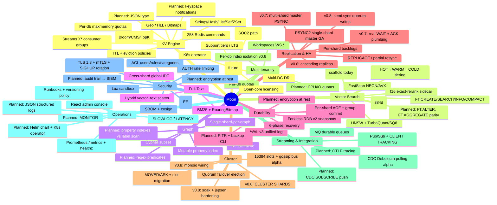

# Moon Product Roadmap — v0.7 → v1.0 → Enterprise

**Status:** Owner-approved draft · **Date:** 2026-07-09 · **Current release:** v0.6.0 (2026-07-08, PR #249)
**Companion docs:** [Scale & HA architecture](scale-ha-architecture.md) · [Standalone horizontal scale](standalone-horizontal-scale.md)
*(The commercial Enterprise Edition plan is maintained privately.)*

---

## 1. Where Moon stands today (honest state of the project)

Moon is a single-binary, Redis-compatible, multi-model data engine in Rust: **KV (258 commands)
+ Vector search + Property graph (Cypher subset) + Full-text (BM25) + Streams + Pub/Sub + CDC
+ Transactions + Workspaces (multi-tenancy)**, on a thread-per-core, shared-nothing shard
architecture with a unified WAL v3 log and 6-phase crash recovery.

### Proven strengths (evidence-cited)

| Area | Standing | Source |
|---|---|---|
| Pipelined KV throughput | 1.7–2.6× Redis at P=64 across x86/ARM/macOS | BENCHMARK.md §1 |
| p=1 single-op | Wins x86 +4.7% (n=3); loses ~8% on ARM — arch-split, needs `--io-busy-poll-us` | tmp/KV-FULLPROOF.md |
| Vector vs Qdrant | 8.9–10.9× ingest, 2.5–3.4× search QPS at iso-recall ≥0.999 | BENCHMARK.md §10.7–10.9 |
| Graph vs FalkorDB | 21–26× build; wins/ties point queries after P1+P2 waves | BENCHMARK.md §11 |
| Durability engineering | WAL v3 unified log, group commit, crash-matrix + jepsen-lite CI, kill-9 suites | integration-tests.yml |
| Quality posture | ~4,980 tests, 11 fuzz targets, loom models, unsafe/unwrap ratchets, RSS-regression CI gate | ci.yml, fuzz/ |
| Release engineering | Docker/musl/deb/rpm/systemd/Homebrew, CycloneDX SBOM, cosign signing | release.yml |
| Hidden assets | React admin console (RedisInsight-class, embedded), CLIENT TRACKING fully wired, Debezium CDC (alpha) | console/, src/tracking/, src/cdc/ |

### Reality check — what is capped or missing

| Gap | Detail | Impact |
|---|---|---|
| **Replication capped at `--shards 1` masters** | `PSYNC across multiple shards is not yet supported` (`handler_monoio/dispatch.rs:564`) | Moon's headline (thread-per-core) cannot be replicated for HA — the #1 roadmap item |
| **WAIT is a stub** | Returns 0 always on the sharded path (`command/mod.rs:1461`); `REPLCONF ACK` parsed but discarded | No client-visible durable-replication confirmation |
| **Cluster mode is alpha, tokio-only** | Bus/gossip spawn only in the tokio startup block (`main.rs:1655-1693`); monoio (production) startup omits it (`main.rs:1617`) | Cluster mode does not run on the production runtime |
| Cold-tier TTL leak (R1) | TTL-expired cold entries never reclaimed — unbounded RAM+disk growth | Real reliability bug for the flagship cache/session use case (tmp/OFFLOAD-COMPRESSION-REVIEW.md) |
| Cross-shard read residual | shardslice waiver **expires 2026-08-01**; L4 lock-free cross-shard reads unstarted | Hard near-term deadline |
| No encryption at rest | WAL/AOF/RDB plaintext | Blocks regulated buyers |
| No keyspace notifications, no MONITOR | Zero implementation found | Common SRE/integration expectations |
| ACL coverage hole | `TXN.*`/`WS.*`/`MQ.*`/`TEMPORAL.*`/`CDC.*` bypass the phf metadata/ACL registry (`workspace/mod.rs:145`) | Must audit before any enterprise security claim |
| Vector 384d recall/QPS | Trails RediSearch ~16× QPS at 384d (quantization codebook mis-fit at low d) | Diagnosed; TQ⁺ per-coordinate calibration is the candidate fix |
| Client ecosystem | Only redis-py/go-redis/redis-rs CI-tested; Java/Node/.NET "planned" | Enterprise adoption friction |
| Hygiene debt | v0.6.0 untagged + missing RELEASES.md entry; PRODUCTION-CONTRACT.md stale (v0.1.3-era); FT.AGGREGATE + hash-TTL doc contradictions; SECURITY.md says "0.1.x supported" | Credibility risk; cheap to fix |

---

## 2. Vision & positioning

**Moon is the multi-model Redis replacement for the AI era**: one binary that serves cache,
vectors, graph, text, and streams at thread-per-core speed, with database-grade durability
(unified WAL, real crash recovery) that Redis never had.

Positioning axes:
- **vs Redis/Valkey** — same protocol, more models, real durability, faster pipelined/vector paths.
- **vs Dragonfly** — comparable modern architecture; Moon differentiates on multi-model (vector/graph/FTS/CDC) and unified WAL durability.
- **vs Qdrant/RediSearch** — vector engine embedded in the cache tier, iso-recall wins vs Qdrant already measured.
- **vs Redis Enterprise** — the open, single-binary path to HA + tiering, then a commercial enterprise layer (planned separately).

---

## 3. Features mindmap

---

## 4. Release train

Observed velocity: 19 releases in ~3.5 months; ~4-day point-release cycle. The train below is
deliberately aggressive but each release has a **single headline** and hard exit criteria.

| Release | Target | Headline | Theme |
|---|---|---|---|
| **v0.6.1** | 2026-07 (now) | Hygiene + reliability hotfix | Tag v0.6.0, RELEASES.md, cold-tier TTL leak, doc reconciliation |
| **v0.7.0** | 2026-08 | **Replication GA for multi-shard masters** | The HA unblock |
| **v0.8.0** | 2026-10 | **Cluster mode Beta→GA-hardened on monoio** | Horizontal scale |
| **v0.9.0** | 2026-12 | **Enterprise foundation** | Encryption at rest, audit, ecosystem |
| **v1.0.0** | 2027-Q1 | **GA / production contract fulfilled** | Stability promise, LTS |
| **Moon EE 1.0** | 2027-Q2 | Commercial enterprise layer EA→GA | Planned privately (open-core: CE never loses features) |

### v0.6.1 — Hygiene & reliability hotfix (1–2 weeks)

- Tag `v0.6.0`, write the RELEASES.md evidence entry (release ledger must never lag again — add a CI check).
- **Fix R1: cold-tier TTL reclaim** (expired cold entries leak RAM in ColdIndex + disk forever).
- Reconcile doc contradictions: FT.AGGREGATE status, hash-field TTL, SECURITY.md supported versions.
- Refresh PRODUCTION-CONTRACT.md to v0.6.0 reality — tick what is actually done (Prometheus, SLOWLOG, SBOM, cosign, loom, fuzz); it becomes the living v1.0 gate.
- ACL coverage audit for `TXN.*`/`WS.*`/`MQ.*`/`TEMPORAL.*`/`CDC.*` early-intercept commands; register them in the metadata table or document the enforcement path.

### v0.7.0 — Replication GA (the HA unblock)

Exit criterion: *a `--shards N` master replicates to `--shards M` replicas, survives kill-9 on
either side with zero acknowledged-write loss under `WAIT`-confirmed semantics, soaked 24h.*

1. **Multi-shard master PSYNC** — implement `.planning/rfcs/multi-shard-replication-design.md`
   (per-shard WAL streams multiplexed behind one PSYNC2 wire view; `ShardMessage::PrepareReplicaSync`).
   LSN space is already global (`master_repl_offset` = Σ per-shard offsets) — the gap is wire packaging.
2. **Real WAIT/ACK plumbing** — consume `REPLCONF ACK` on the master's replica socket (today
   write-only loop, `master.rs:728`), thread `replica_id` through `handler_monoio`/`handler_sharded`,
   wire `wait_for_replicas` into the production dispatch path.
3. **Replica promotion correctness** — `REPLICAOF NO ONE` must roll `repl_id`/`repl_id2` per PSYNC2
   so demoted-master partial resync works after failover.
4. **L4 cross-shard read redesign** (waiver expires 2026-08-01) — lock-free cross-shard reads;
   retire the shardslice waiver or explicitly re-scope it with new evidence.
5. Keyspace notifications (`notify-keyspace-events`) + MONITOR — both are replication-adjacent
   observability the ecosystem expects; cheap wins with existing pub/sub + dispatch hooks.
6. New CI job: replication crash matrix (master kill, replica kill, partial resync, promote) on
   both runtimes.

### v0.8.0 — Cluster hardening (horizontal scale)

Exit criterion: *3-master × 3-replica cluster on monoio survives node kill (auto-failover < node_timeout×2),
live slot migration under load with zero lost acknowledged writes, 72h soak, jepsen-lite green.*

1. **Wire cluster bus + gossip into the monoio startup path** (today tokio-only) — the single
   highest-leverage cluster task.
2. Slot-migration atomicity soak: MIGRATING/IMPORTING under write load, ASK correctness,
   per-key transfer loop verification (arch review flagged this as possibly incomplete).
3. Failover safety: epoch fencing end-to-end; promoted replica continues PSYNC2 offsets; add
   `CLUSTER SHARDS` (Redis 7 clients probe it).
4. Cluster-aware client CI: redis-py-cluster, go-redis cluster, redis-rs cluster against a real 3×3.
5. `cluster-announce-ip/port`, `cluster-config-file` config parity for real deployments (NAT/k8s).
6. **Helm chart + StatefulSet manifests** (operator alpha can follow in v0.9) — k8s is where
   clusters get deployed.
7. Graph/vector cluster semantics: a named graph migrates as one unit (hash-tag routed); FT
   indexes are keyspace-global — define and test their slot-migration story.

### v0.9.0 — Enterprise foundation

Exit criterion: *a security-conscious enterprise can run Moon and pass an infosec review.*

1. **Encryption at rest** — WAL/AOF/RDB block encryption (AES-256-GCM, key file/KMS hook),
   format-versioned per docs/versioning.md.
2. **Audit trail** — full command audit stream (who/what/when) with syslog/file/SIEM export;
   extend `ACL LOG` beyond in-memory ring.
3. Backup/restore CLI + PITR (WAL replay to LSN/timestamp — recovery machinery already supports it).
4. Client ecosystem CI: jedis/lettuce, ioredis, StackExchange.Redis, hiredis.
5. OTLP trace export (feature namespace already reserved in Cargo.toml) + `--log-format json`.
6. FT.ALTER + FT.AGGREGATE parity closure; TQ⁺ low-d calibration for the 384d recall gap.
7. Kubernetes operator alpha (backup schedules, failover orchestration, rolling upgrade).

### v1.0.0 — GA

- PRODUCTION-CONTRACT.md all boxes ticked, in CI as a release gate.
- LTS policy: v1.0 supported 18 months; security backports.
- Performance regression suite pinned (bench-compare in CI against recorded baselines).
- Public benchmark report refresh (KV/vector/graph/FTS, iso-recall, multi-arch) with methodology.
- Redis 8.x compat statement finalized; documented non-goals (MODULE, SENTINEL, PFDEBUG) stand.

---

## 5. Debt & hygiene register (standing, review each release)

| Item | Deadline / trigger | Owner action |
|---|---|---|
| shardslice cross-shard-read waiver | **2026-08-01** | Close via L4 in v0.7 or re-issue with evidence |
| v0.6.0 tag + RELEASES.md | immediate | v0.6.1 |
| PRODUCTION-CONTRACT refresh | immediate | v0.6.1, then living doc |
| Cold-tier TTL leak (R1) | immediate | v0.6.1 |
| ACL registry bypass (TXN/WS/MQ/TEMPORAL/CDC) | before any security claim | v0.6.1 audit |
| Doc contradictions (FT.AGGREGATE, hash-TTL, SECURITY.md) | immediate | v0.6.1 |
| `replication.state` file at repo root | next PR | gitignore or relocate |
| BGREWRITEAOF multi-shard gate (`--experimental-per-shard-rewrite`) | v0.7 | promote to default after replication soak |
| Offload perf deferrals (PageCache dormant, cold reads block event loop, <256B never compressed) | v0.8+ | re-rank after replication ships |

---

## 6. Risks

1. **Scope gravity** — five engines (KV/vector/graph/FTS/streams) all want attention. Mitigation:
   each release has exactly one headline; vector/graph get maintenance-only slots in v0.7/v0.8.
2. **Cluster complexity underestimation** — gossip/failover code exists but is unsoaked; jepsen-style
   testing historically finds design bugs, not just implementation bugs. Budget slack in v0.8.
3. **Apache-2.0 exposure** — anything shipped in core is free for cloud vendors to host. Decide the
   enterprise licensing line **before** building E@R/audit/operator (decided: open-core — the
   Apache-2.0 core never loses features; commercial work is additive and lives outside this repo).
4. **Benchmark credibility** — keep the practice of publishing losses (ARM p=1, 384d recall) with
   diagnoses; it is the project's strongest trust asset.
5. **Bus factor** — single-maintainer velocity is extraordinary but fragile; EE revenue should fund
   a second maintainer before v1.0.

## 7. Non-goals (unchanged, deliberate)

- C module ABI (`MODULE *`) — native multi-model instead.
- Sentinel protocol — HA is cluster mode + orchestrator (k8s/systemd).
- Redis dense/sparse HLL internals (`PFDEBUG`/`PFSELFTEST`).
- Decode+re-encode vector segment merging (recall collapse; GraphUnion only).

---

## 8. Detailed execution plans (task-level)

Sizing: S ≤ 1 day · M ≤ 1 week · L ≤ 3 weeks · XL = milestone-sized. Every task lands with its
verification artifact (test/CI job/bench) in the same PR — no "tests later".

### 8.1 v0.6.1 — Hygiene & reliability hotfix

| ID | Task | Anchor | Verification | Size |
|---|---|---|---|---|
| H-1 | Tag v0.6.0 + RELEASES.md evidence entry; add CI check: release tag requires a RELEASES.md entry | `.github/workflows/release.yml` | CI job red on missing entry | S |
| H-2 | **Cold-tier TTL reclaim (R1)**: sweep TTL-expired cold entries from ColdIndex (RAM) and cold files (disk); wire into autovacuum tick | `tmp/OFFLOAD-COMPRESSION-REVIEW.md` R1; `src/shard/autovacuum.rs` | New test: expire 100k cold entries → RSS+disk return to baseline; 24h soak counter `cold_expired_reclaimed` > 0 | M |
| H-3 | ACL audit for early-intercept families (`TXN/WS/MQ/TEMPORAL/CDC`): add entries to the phf metadata table (arity/flags/ACL category) or enforce ACL at the intercept site | `src/workspace/mod.rs:145`; `src/command/metadata.rs` | Test: restricted ACL user denied `WS CREATE`/`CDC.READ`; `COMMAND INFO TXN` returns metadata | M |
| H-4 | Doc reconciliation: FT.AGGREGATE (verify against registry, fix `redis-compat.md:92`), hash-field TTL (`comparison-valkey.md`), SECURITY.md supported-versions | docs/ | Doc CI link check; grep-based consistency script | S |
| H-5 | PRODUCTION-CONTRACT.md refresh: retick against v0.6.0 reality; convert to a checked table with evidence links; wire `scripts/check-production-contract.sh` (grep-based) into release workflow | `docs/PRODUCTION-CONTRACT.md` | Script exits non-zero on unticked GA-blocking rows at v1.0 tag | M |
| H-6 | gitignore/relocate `replication.state` root artifact | repo root | clean `git status` | S |

### 8.2 v0.7.0 — Replication GA

Workstream R1 — multi-shard PSYNC (XL, the release):
- R1a: wire format — extend PSYNC2 payload frames with `(shard_id: u16, shard_lsn: u64)` header;
  version-gate via `REPLCONF CAPA moon-multishard` so single-shard wire stays Redis-shaped.
- R1b: full-sync — `ShardMessage::PrepareReplicaSync` fan-out; per-shard cooperative snapshot
  (existing forkless RDB v2); stream `N × RRDSHARD` segments with a manifest header; replica
  loads by routing each key through its own `key_to_shard`.
- R1c: steady-state — per-shard `wal_append_and_fanout` already feeds per-shard backlogs; add the
  mux task on the listener runtime consuming N backlog cursors, interleaving by global LSN.
- R1d: partial resync — extend `evaluate_psync` (`src/replication/handshake.rs`) to a vector of
  per-shard offsets carried in `PSYNC <replid> <offset>` reply metadata.
- Verification: new `tests/replication_multishard_matrix.rs` — masters s∈{1,2,4} × replicas
  s∈{1,4}; kill -9 each side mid-load; assert zero WAIT-acked loss; 24h GCE soak.

Workstream R2 — WAIT/ACK truth (M):
- Master post-PSYNC loop becomes read+write (`select!` on socket); parse `REPLCONF ACK`, store to
  `ReplicaInfo.ack_offsets` (`src/replication/master.rs:717,728`).
- Thread `replica_id` through `handler_monoio`/`handler_sharded` conn state; route `WAIT` to
  `wait_for_replicas` (`master.rs:757`) instead of the hardcoded-0 arm (`command/mod.rs:1461`).
- Verification: `WAIT 1 100` returns 1 only after replica genuinely applied; chaos test with
  stalled replica returns 0.

Workstream R3 — promotion correctness (M): `REPLICAOF NO ONE` rolls `repl_id→repl_id2`, keeps
offset; old-master rejoin achieves partial resync. Test: promote → old master rejoins as replica
→ assert `+CONTINUE`, not full sync.

Workstream R4 — L4 lock-free cross-shard reads (L): per `tmp/MULTISHARD-REDESIGN.md`; retire the
shardslice waiver (deadline 2026-08-01) or re-issue with fresh evidence before the date.

Workstream R5 — keyspace notifications + MONITOR (M): notifications publish through the existing
per-shard pubsub registry on write commit (flag-gated, off by default — measure overhead ≤2% when off);
MONITOR taps dispatch with a fan-in channel, `SKIP_MONITOR` ACL flag already exists.

### 8.3 v0.8.0 — Cluster hardening

| ID | Task | Anchor | Verification | Size |
|---|---|---|---|---|
| C-1 | Cluster control plane under monoio: run bus+gossip+election on a dedicated std thread with a current-thread tokio runtime (control plane is not latency-critical; do NOT port to monoio yet) | `src/main.rs:1617,1655-1693` | 3-node monoio cluster forms, gossips, elects | M |
| C-2 | Slot-migration completion + soak: verify per-key MIGRATE loop end-to-end; crash mid-migration both directions | `src/cluster/migration.rs`, `command.rs` SETSLOT | New `tests/cluster_slot_migration_chaos.rs`; zero acked loss under load | L |
| C-3 | Failover ↔ PSYNC2 continuity: election win updates `ReplicationRole`, repl ids; replicas of failed master re-attach with partial resync | `src/cluster/failover.rs` + `src/replication/state.rs` | Partition test: promote, heal, `+CONTINUE` observed | L |
| C-4 | `CLUSTER SHARDS`, `cluster-announce-ip/port`, `cluster-config-file` | `src/cluster/command.rs`, `config.rs` | redis-cli 7.x + go-redis cluster CI green | M |
| C-5 | Jepsen-lite cluster suite in CI (partition, kill, migrate churn; 72h scheduled soak on GCE) | `.github/workflows/integration-tests.yml` | weekly green + failure artifacts uploaded | L |
| C-6 | Helm chart + StatefulSet, readiness = `/readyz` + `CLUSTER INFO ok` | new `deploy/helm/` | kind-based CI install test | M |
| C-7 | Multi-engine slot semantics: graph-unit migration test (hash-tagged), FT index entries follow their hash's slot | `src/vector/`, `src/graph/` | migration test with live FT.SEARCH during move | L |

### 8.4 v0.9.0 — Enterprise foundation

| ID | Task | Verification | Size |
|---|---|---|---|
| E-1 | Encryption at rest: AES-256-GCM page/segment encryption for WAL/AOF/RDB, key file + env; format-version bump per docs/versioning.md; KMS/HSM hooks reserved for EE | crash-matrix green with encryption on; upgrade test plaintext→encrypted | XL |
| E-2 | Audit stream: structured audit events (conn, auth, ACL-denied, admin/write commands selectable) → file/syslog sinks; rate-limited, never blocks the event loop (bounded channel, drop-counted) | SIEM ingest test; overhead bench ≤3% at P16 | L |
| E-3 | `moon-backup` CLI: scheduled BGSAVE + WAL archival to dir/S3, `restore --to-lsn/--to-time` (PITR) | kill-9 + PITR-to-timestamp test | L |
| E-4 | Client ecosystem CI: jedis/lettuce/ioredis/StackExchange.Redis/hiredis matrix | new workflow, weekly | M |
| E-5 | OTLP traces + `--log-format json` | trace visible in Jaeger CI container | M |
| E-6 | FT.ALTER + FT.AGGREGATE closure; TQ⁺ low-d calibration (384d recall) | ANN bench: ≥0.95 R@10 at 384d SQ8-comparable QPS | L |
| E-7 | K8s operator alpha (CRDs: MoonCluster, MoonBackup; reconcile: rolling upgrade, failover assist) | kind e2e: kill pod → operator-driven recovery | XL |

## 9. Measures of success (tracked per release)

- **Performance**: bench-compare vs Redis (pinned GCE, both arches, n≥3) — no regression >3% on
  KV headline rows; vector iso-recall table refreshed per release.
- **Reliability**: crash-matrix + jepsen-lite + replication-matrix green streak; zero
  acked-write-loss invariant in every soak report.
- **Compat**: redis-compat.md coverage ratio; cluster-client CI matrix green.
- **Adoption** (post-v0.8): Docker pulls, GitHub stars/issues ratio, design-partner count (target
  3–5 by v0.9), time-to-first-production story.
- **Hygiene**: release ledger lag = 0; PRODUCTION-CONTRACT drift = 0 (CI-checked).
